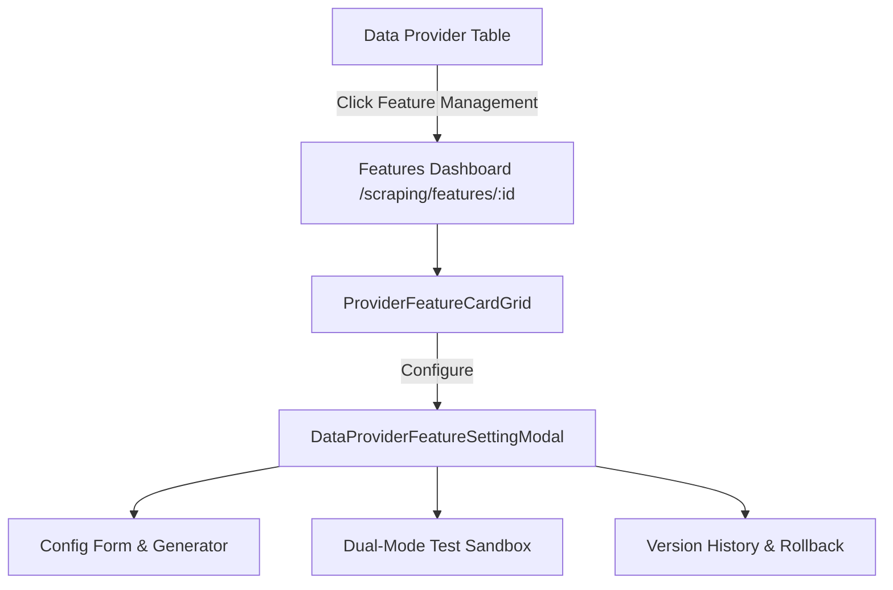

# Archive: Data Provider Features Dashboard with Interactive Cards & Setting Modals

## 1. Problem & Core Value
- **Problem**: Feature configuration for scraping and search was previously trapped in legacy modals on the Data Provider list table without health metrics, error counters, or decoupled testing playgrounds.
- **Value**: Built a dedicated, modern management dashboard at `/scraping/features/:dataProviderId` integrating all 10 RESTful endpoints of `DataProviderFeatureController` with live test sandboxes and version history inspection.

## 2. Key Architecture & Decisions
- **Card Grid Layout**: 2-column responsive layout rendering `ProviderFeatureCard` with status pulse, failure counter, service engine badges, and fast toggles.
- **Modal Playground**: 3-tab configuration modal containing form editor (`functionGenerator`), dual-mode testing (`Stateless` sandbox & `Contextual` test), and version history rollback table.
- **Data Architecture**: Decoupled feature state management via `useDataProviderFeaturesPage` hook.

## 3. Scope & Key Changes
- [`src/enums/data-provider.enum.ts`](file:///Users/kiem/Sources/Personal/only-one-fe/src/enums/data-provider.enum.ts): Added feature types and status enums.
- [`src/interfaces/data-provider.d.ts`](file:///Users/kiem/Sources/Personal/only-one-fe/src/interfaces/data-provider.d.ts): Added feature and config DTO interfaces.
- [`src/app/(root)/scraping/features/[dataProviderId]/`](file:///Users/kiem/Sources/Personal/only-one-fe/src/app/(root)/scraping/features/[dataProviderId]): Created page layout, hooks, header, cards, and modal subcomponents.
- [`src/app/(root)/scraping/data-providers/page.tsx`](file:///Users/kiem/Sources/Personal/only-one-fe/src/app/(root)/scraping/data-providers/page.tsx): Connected list table rows to the features dashboard.

## 4. Verification Evidence & PR
- **Test Status**: 100% Passed (`tsc --noEmit` clean, ESLint clean).
- **PR URL**: ~
