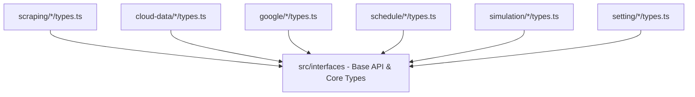

# Archive: Decompose Monolithic Interfaces to Page-Level Modules

## 1. Problem & Core Value
- **Problem**: Types were centralized into global ambient namespaces in `src/interfaces/*.d.ts`, causing cross-domain coupling, namespace verbosity (`NDataProvider.*`), and dead type accumulation.
- **Value**: Colocated domain-specific TypeScript interfaces directly into page-level `types.ts` files across all application routes, leaving only shared base types in `src/interfaces/`.

## 2. Key Architecture & Decisions
- **Colocation Pattern**: Page-level `types.ts` directly defines and exports domain interfaces and UI form types.
- **Canonical Ownership**: Cross-referenced entities are owned by their primary managing page and cleanly imported by secondary pages.
- **Core Abstraction Preservation**: Preserved `Abstract`, `NBaseApi`, `auth`, and `custom-component` in `src/interfaces/` as shared infrastructure.

## 3. Scope & Key Changes
- [`src/interfaces/`](file:///Users/kiem/Sources/Personal/only-one-fe/src/interfaces): Cleaned up domain ambient namespaces, maintaining only base contracts.
- [`src/app/(root)/scraping/*/types.ts`](file:///Users/kiem/Sources/Personal/only-one-fe/src/app/(root)/scraping): Colocated data providers, features, items, provider-items, and scraping-data interfaces.
- [`src/app/(root)/cloud-data/*/types.ts`](file:///Users/kiem/Sources/Personal/only-one-fe/src/app/(root)/cloud-data): Colocated cloud providers and cloud items interfaces.
- [`src/app/(root)/google/*/types.ts`](file:///Users/kiem/Sources/Personal/only-one-fe/src/app/(root)/google): Colocated Google drive folders and photos interfaces.
- [`src/app/(root)/schedule/*/types.ts`](file:///Users/kiem/Sources/Personal/only-one-fe/src/app/(root)/schedule): Colocated executions and job events interfaces.
- [`src/app/(root)/simulation/*/types.ts`](file:///Users/kiem/Sources/Personal/only-one-fe/src/app/(root)/simulation): Colocated simulation contexts and items interfaces.
- [`src/app/(root)/setting/*/types.ts`](file:///Users/kiem/Sources/Personal/only-one-fe/src/app/(root)/setting): Colocated user interfaces.

## 4. Verification Evidence & PR
- **Test Status**: 100% Passed (`tsc --noEmit` clean, production build succeeded).
- **PR URL**: ~
