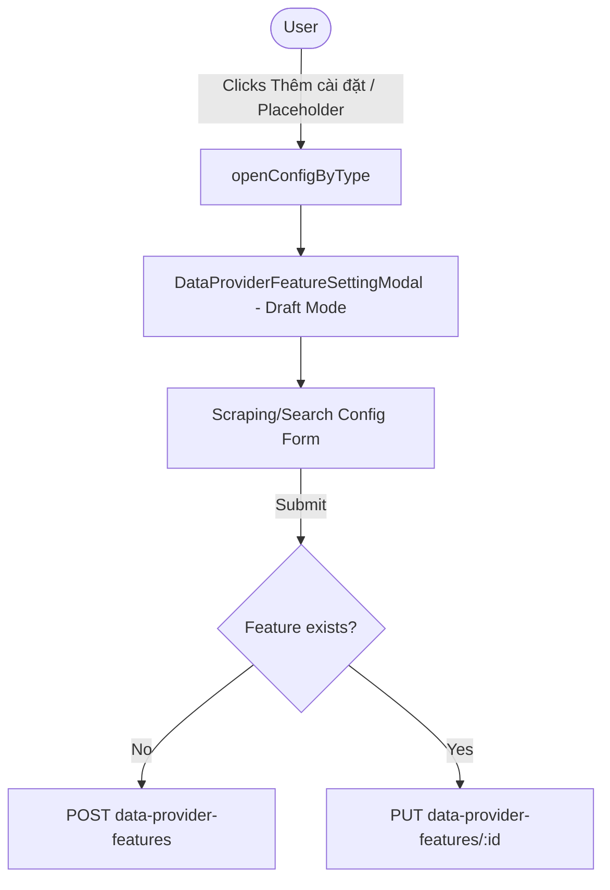

# Archive: Refactor Data Provider List and Enhance Feature Settings Dropdown UI

## 1. Problem & Core Value
- **Problem**: The Data Provider list table was cluttered with 4 obsolete feature columns and redundant modal triggers, while adding a new feature configuration on the features page required a clunky 2-step create-then-configure flow.
- **Value**: Streamlined the Data Provider table down to core identity fields, and upgraded the Features dashboard with a 1-step dropdown action ("Thêm cài đặt") supporting instant draft configuration with automatic creation on submit.

## 2. Key Architecture & Decisions
- **Streamlined Provider Table**: Cleaned up legacy action buttons and removed obsolete modal components (`DataProviderSettingModal`, `DataProviderTargetModal`, etc.).
- **1-Step Feature Configuration**: Integrated draft mode into `DataProviderFeatureSettingModal` where submitting automatically issues `POST` for unpersisted features and `PUT` for existing ones.
- **Dropdown & Placeholder Triggers**: "Thêm cài đặt" dropdown and placeholder card click directly open the draft form for unconfigured feature types.

## 3. Scope & Key Changes
- [`src/app/(root)/scraping/data-providers/`](file:///Users/kiem/Sources/Personal/only-one-fe/src/app/(root)/scraping/data-providers): Cleaned table columns, deleted 4 legacy modal files, and pruned state handlers.
- [`src/app/(root)/scraping/features/[dataProviderId]/`](file:///Users/kiem/Sources/Personal/only-one-fe/src/app/(root)/scraping/features/[dataProviderId]): Added "Thêm cài đặt" dropdown, removed `CreateFeatureModal.tsx`, and updated `ScrapingConfigForm.tsx` / `SearchConfigForm.tsx` with unified draft submit logic.

## 4. Verification Evidence & PR
- **Test Status**: 100% Passed (Production build `next build` compiled with exit code 0).
- **PR URL**: ~
