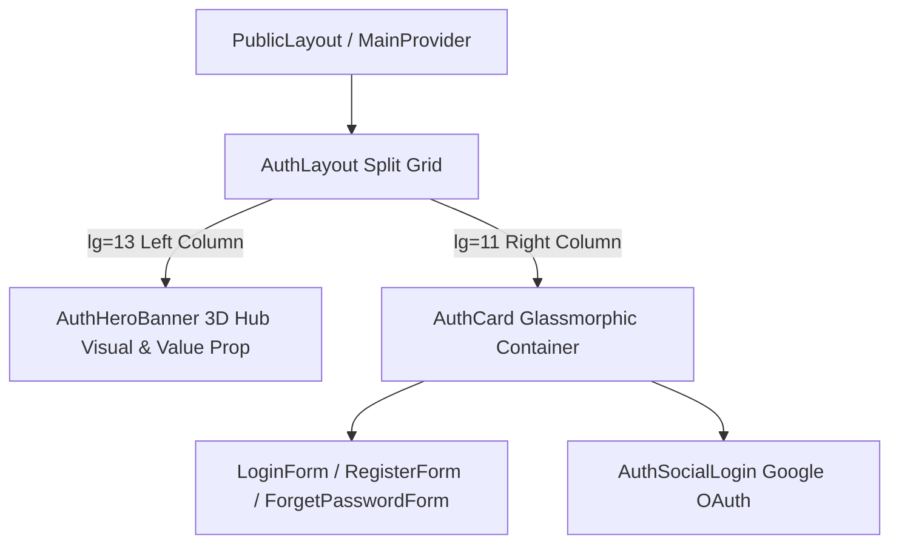

# Archive: Public Auth Portal Split-Screen Redesign

## 1. Problem & Core Value
- **Problem**: Public authentication views (`/login`, `/register`, `/forget-password`) were constrained in a single, narrow vertical column layout without strong brand identity or high-tech visual engagement.
- **Value**: Modernized public auth into a responsive 12-column split-screen layout featuring a 3D futuristic operations hub hero banner on desktop and Ant Design component architecture.

## 2. Key Architecture & Decisions
- **Split-Screen Grid**: Uses `<CustomRow>` and `<CustomCol>` (`lg={13}` hero visual, `lg={11}` form card) with graceful mobile collapse.
- **Ant Design Primitives**: Replaced ad-hoc HTML/Tailwind wrappers with `<CustomFlex>`, `<CustomSpace>`, `<CustomTag>`, `<CustomTypography>`, `<CustomCard>`, and `<CustomButton>`.
- **Lightweight Asset Integration**: Leveraged a single high-resolution hero visual asset with gradient overlays rather than heavy client-side canvas animations.

## 3. Scope & Key Changes
- [`public/images/auth-banner.jpg`](file:///d:/Sources/Personal/only-one-fe/public/images/auth-banner.jpg): 3D infinity hub brand visual.
- [`src/app/(public)/_components/auth/AuthHeroBanner.tsx`](file:///d:/Sources/Personal/only-one-fe/src/app/(public)/_components/auth/AuthHeroBanner.tsx): Left-column hero banner with dynamic typography and branding tags.
- [`src/app/(public)/_components/auth/AuthLayout.tsx`](file:///d:/Sources/Personal/only-one-fe/src/app/(public)/_components/auth/AuthLayout.tsx): Responsive split-screen container.
- [`src/app/(public)/_components/auth/AuthCard.tsx`](file:///d:/Sources/Personal/only-one-fe/src/app/(public)/_components/auth/AuthCard.tsx): Standardized card wrapper using `<CustomCard>`.
- [`src/app/(public)/_components/auth/AuthSocialLogin.tsx`](file:///d:/Sources/Personal/only-one-fe/src/app/(public)/_components/auth/AuthSocialLogin.tsx): Updated social login buttons.
- [`src/app/(public)/login/page.tsx`](file:///d:/Sources/Personal/only-one-fe/src/app/(public)/login/page.tsx), [`register/page.tsx`](file:///d:/Sources/Personal/only-one-fe/src/app/(public)/register/page.tsx), [`forget-password/page.tsx`](file:///d:/Sources/Personal/only-one-fe/src/app/(public)/forget-password/page.tsx): Updated public routes.

## 4. Verification Evidence & PR
- **Test Status**: 100% Passed (`npm run lint:fix`, `npm run build` static generation clean).
- **PR URL**: ~
