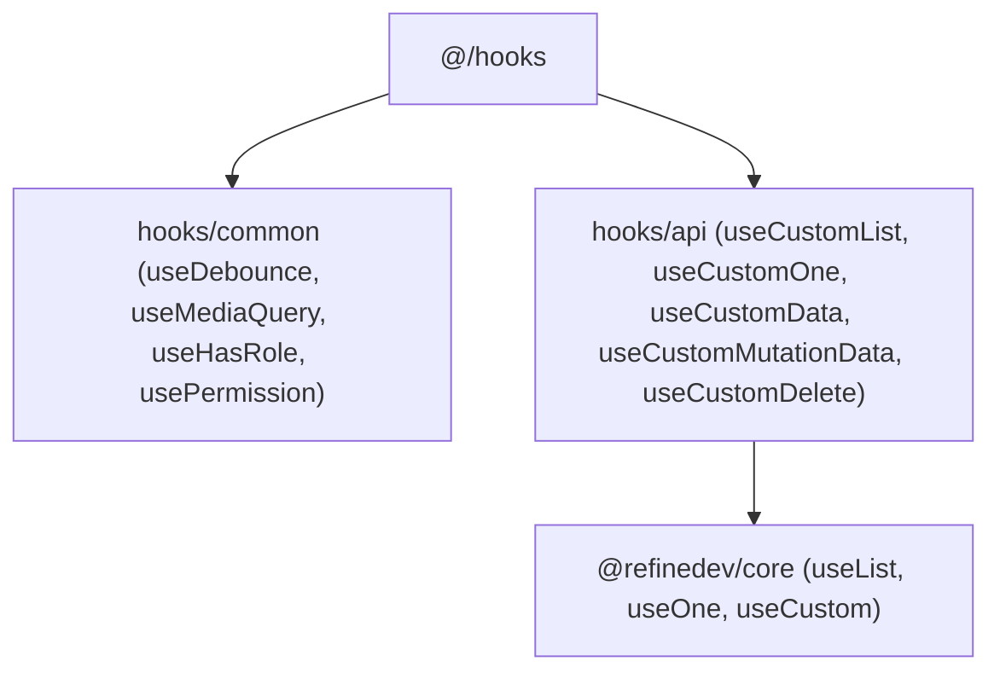

# Archive: Standardized Custom React & Refine Data Hooks Suite

## 1. Problem & Core Value
- **Problem**: Inconsistent hook utilities, duplicated data fetching logic, and lack of typed error/notification propagation across Refine data operations.
- **Value**: Ported and standardized a suite of reusable common hooks (`useDebounce`, `useMediaQuery`, `useHasRole`, `usePermission`) and Refine API hooks (`useCustomList`, `useCustomOne`, `useCustomMutationData`, `useCustomData`, `useCustomDelete`) with full SSR safety and backward compatibility.

## 2. Key Architecture & Decisions
- **Strict Layering**: Separated general React utilities in `src/hooks/common/` from Refine/data-fetching hooks in `src/hooks/api/`.
- **SSR-Safe Guards**: Enforced `typeof window === 'undefined'` guards across browser API hooks (`useMediaQuery`).
- **Polymorphic Delete Signature**: Supported both `handleDelete(ids)` and `handleDelete({ id, ids, successMessage })` for seamless backward compatibility.

## 3. Scope & Key Changes
- [`src/constants/common.constant.ts`](file:///d:/Sources/Personal/only-one-fe/src/constants/common.constant.ts): Added pagination and sorter defaults.
- [`src/hooks/common/`](file:///d:/Sources/Personal/only-one-fe/src/hooks/common): Created `useDebounce`, `useMediaQuery`, `useHasRole`, `usePermission`.
- [`src/hooks/api/`](file:///d:/Sources/Personal/only-one-fe/src/hooks/api): Created `useCustomList`, `useCustomOne`, `useCustomMutationData`, upgraded `useCustomData` and `useCustomDelete`.

## 4. Verification Evidence & PR
- **Test Status**: 100% Passed (`tsc --noEmit` clean, ESLint clean).
- **PR URL**: ~
