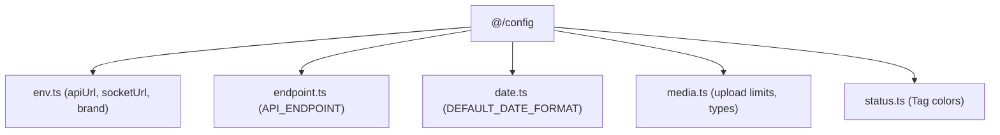

# Archive: Centralized System Configuration Architecture

## 1. Problem & Core Value
- **Problem**: Configuration constants, API endpoint strings, environment variables, date formats, and status color mappings were scattered across components and hooks without centralized types or single sources of truth.
- **Value**: Established a type-safe `@/config` module providing centralized dictionaries for endpoints (`API_ENDPOINT`), environment access (`env`), date/time formatting, media filters, and tag colors.

## 2. Key Architecture & Decisions
- **Domain-Grouped Modules**: Decomposed configuration into `api.ts`, `date.ts`, `endpoint.ts`, `env.ts`, `media.ts`, and `status.ts`.
- **Dynamic Endpoint Builders**: Standardized parameterized endpoint URLs (e.g. `API_ENDPOINT.DATA_PROVIDER_FEATURES.BY_PROVIDER(providerId)`).
- **Sanitized Environment Reader**: Sanitized runtime `apiUrl` by trimming trailing slashes to prevent malformed URL requests.

## 3. Scope & Key Changes
- [`src/config/api.ts`](file:///d:/Sources/Personal/only-one-fe/src/config/api.ts): Pagination & sorter defaults.
- [`src/config/date.ts`](file:///d:/Sources/Personal/only-one-fe/src/config/date.ts): Unified date-time formatting tokens.
- [`src/config/endpoint.ts`](file:///d:/Sources/Personal/only-one-fe/src/config/endpoint.ts): Comprehensive REST endpoint map.
- [`src/config/env.ts`](file:///d:/Sources/Personal/only-one-fe/src/config/env.ts): Safe environment variable reader & brand definitions.
- [`src/config/media.ts`](file:///d:/Sources/Personal/only-one-fe/src/config/media.ts): Media constraints and fallback SVGs.
- [`src/config/status.ts`](file:///d:/Sources/Personal/only-one-fe/src/config/status.ts): Ant Design tag and status color mappings.
- [`src/config/index.ts`](file:///d:/Sources/Personal/only-one-fe/src/config/index.ts): Centralized barrel export.

## 4. Verification Evidence & PR
- **Test Status**: 100% Passed (`tsc --noEmit` clean, ESLint clean).
- **PR URL**: ~
