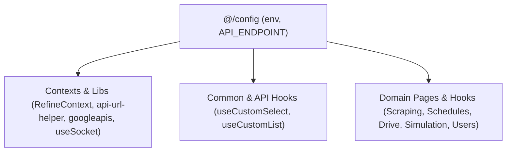

# Archive: Comprehensive Adoption of Centralized Config Across App

## 1. Problem & Core Value
- **Problem**: Raw strings for API endpoints, magic numbers, and raw `process.env.NEXT_PUBLIC_*` references were scattered across context providers, libraries, hooks, and page components.
- **Value**: Systematically migrated all resource endpoints, context initializations, and domain hooks across the entire codebase to consume typed `@/config` exports.

## 2. Key Architecture & Decisions
- **Full Endpoint Standardization**: Replaced raw string endpoints across Scraping (`data-providers`, `features`, `items`, `provider-items`, `scraping-data`), Schedule (`executions`, `job-events`), Google Drive (`folders`, `photos`), Simulation, and Settings (`users`) with `API_ENDPOINT.*`.
- **Infrastructure Migration**: Migrated `RefineContext`, `api-url-helper`, `googleapis`, `useSocket`, and layout components to read from `env`.

## 3. Scope & Key Changes
- [`src/config/endpoint.ts`](file:///d:/Sources/Personal/only-one-fe/src/config/endpoint.ts): Added missing sub-resource endpoints (cloud data providers, versions, rollbacks, triggers).
- [`src/contexts/RefineContext.tsx`](file:///d:/Sources/Personal/only-one-fe/src/contexts/RefineContext.tsx), [`src/libs/`](file:///d:/Sources/Personal/only-one-fe/src/libs): Replaced raw `process.env` with `env.apiUrl` and `env.google*`.
- [`src/app/(root)/`](file:///d:/Sources/Personal/only-one-fe/src/app/(root)): Updated domain feature hooks across all routes to import `API_ENDPOINT`.

## 4. Verification Evidence & PR
- **Test Status**: 100% Passed (`tsc --noEmit` clean, ESLint clean).
- **PR URL**: ~
