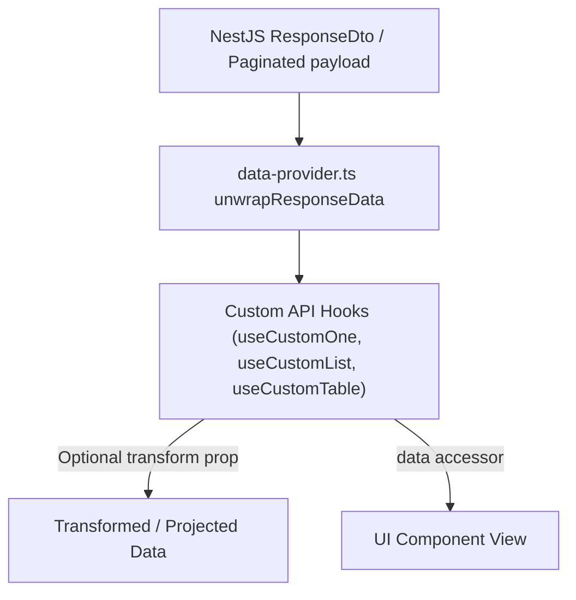

# Archive: Standardized Response Transformer & Custom Mapping Pipeline

## 1. Problem & Core Value
- **Problem**: NestJS backend wraps payloads inside `ResponseDto<T>` (`{ data, isSuccess }`) and `Paginated<T>` structures, forcing UI hooks to perform defensive nested unwrap chains (e.g. `res?.data?.data`).
- **Value**: Built a two-tier response unwrapping and transformation pipeline: low-level envelope unwrapping in `RestServer` data provider and high-level typed `transform` callback hooks in `useCustomOne`, `useCustomList`, `useCustomData`, and `useCustomTable`.

## 2. Key Architecture & Decisions
- **Transport-Level Normalization**: `unwrapResponseData` in `src/providers/data-provider.ts` safely extracts inner arrays/objects across `getList`, `getOne`, and `getMany`.
- **Declarative Hook Projection**: Added `transform?: (data: TData) => TTransformed` prop across custom API hooks, exposing directly unwrapped and transformed `data` alongside raw `result` / `query`.

## 3. Scope & Key Changes
- [`src/providers/data-provider.ts`](file:///d:/Sources/Personal/only-one-fe/src/providers/data-provider.ts): Added `unwrapResponseData` for automatic envelope unwrapping.
- [`src/hooks/api/useCustomOne.ts`](file:///d:/Sources/Personal/only-one-fe/src/hooks/api/useCustomOne.ts), [`useCustomList.ts`](file:///d:/Sources/Personal/only-one-fe/src/hooks/api/useCustomList.ts), [`useCustomData.ts`](file:///d:/Sources/Personal/only-one-fe/src/hooks/api/useCustomData.ts), [`useCustomTable.ts`](file:///d:/Sources/Personal/only-one-fe/src/hooks/api/useCustomTable.ts), [`useCustomSelect.ts`](file:///d:/Sources/Personal/only-one-fe/src/hooks/api/useCustomSelect.ts): Added generic type parameters and `transform` callback prop.
- [`src/app/(root)/scraping/features/[dataProviderId]/hooks.ts`](file:///d:/Sources/Personal/only-one-fe/src/app/(root)/scraping/features/[dataProviderId]/hooks.ts): Refactored `useDataProviderFeaturesPage` to use declarative transforms.

## 4. Verification Evidence & PR
- **Test Status**: 100% Passed (`tsc --noEmit` clean).
- **PR URL**: ~
