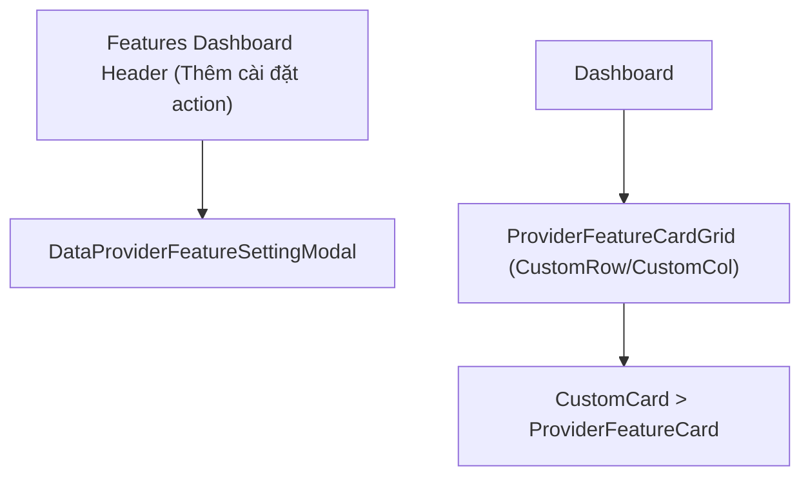

# Archive: Simplified ProviderFeatureCardGrid & CustomCard Integration

## 1. Problem & Core Value
- **Problem**: Feature card grid included an unnecessary dashed placeholder card that duplicated header action buttons, and lacked consistent styling encapsulation.
- **Value**: Simplified `ProviderFeatureCardGrid` to focus purely on active feature cards and encapsulated individual cards in `<CustomCard>` with hover effects and 100% `custom-antd` components.

## 2. Key Architecture & Decisions
- **Clean Action Segregation**: Removed the dashed create placeholder card, delegating feature addition exclusively to the header action dropdown.
- **Standardized Grid & Card**: Standardized `<CustomRow gutter={[24, 24]}>` layout with `<CustomCol xs={24} lg={12}>` containing `<CustomCard>` items.

## 3. Scope & Key Changes
- [`src/app/(root)/scraping/features/[dataProviderId]/components/ProviderFeatureCardGrid.tsx`](file:///d:/Sources/Personal/only-one-fe/src/app/(root)/scraping/features/[dataProviderId]/components/ProviderFeatureCardGrid.tsx): Cleaned props, removed placeholder card, standardized `CustomCard` wrapping.

## 4. Verification Evidence & PR
- **Test Status**: 100% Passed (`tsc --noEmit` clean, ESLint clean).
- **PR URL**: ~
