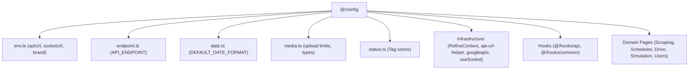

# Archive: Centralized System Configuration Architecture & Comprehensive Adoption

## 1. Problem & Core Value
- **Problem**: Configuration constants, raw string API endpoints, magic numbers, date formats, media filters, tag color mappings, and un-sanitized `process.env.NEXT_PUBLIC_*` references were scattered across components, contexts, and hooks without centralized types or single sources of truth.
- **Value**: Established a type-safe `@/config` module providing centralized dictionaries for endpoints (`API_ENDPOINT`), environment access (`env`), date/time formatting, media filters, and tag colors, and systematically migrated the entire application codebase to consume these typed exports.

## 2. Key Architecture & Decisions
- **Domain-Grouped Config Modules**: Decomposed configuration into single-responsibility modules: `api.ts`, `date.ts`, `endpoint.ts`, `env.ts`, `media.ts`, and `status.ts`, exported through `@/config` barrel.
- **Dynamic Parameterized Endpoint Builders**: Standardized parameterized endpoint URLs (e.g. `API_ENDPOINT.DATA_PROVIDER_FEATURES.BY_PROVIDER(providerId)`).
- **Sanitized Environment Reader**: Sanitized runtime `apiUrl` by trimming trailing slashes to prevent malformed URL requests.
- **System-Wide Adoption**: Replaced raw string endpoints and `process.env` calls across infrastructure (`RefineContext`, `api-url-helper`, `googleapis`, `useSocket`), custom API hooks, and domain pages (Scraping, Schedule, Google Drive, Simulation, Settings).

## 3. Scope & Key Changes
- [`src/config/api.ts`](file:///d:/Sources/Personal/only-one-fe/src/config/api.ts): Pagination & sorter default constants.
- [`src/config/date.ts`](file:///d:/Sources/Personal/only-one-fe/src/config/date.ts): Unified date-time formatting tokens.
- [`src/config/endpoint.ts`](file:///d:/Sources/Personal/only-one-fe/src/config/endpoint.ts): Comprehensive typed REST endpoint dictionary.
- [`src/config/env.ts`](file:///d:/Sources/Personal/only-one-fe/src/config/env.ts): Safe environment variable reader & brand definitions.
- [`src/config/media.ts`](file:///d:/Sources/Personal/only-one-fe/src/config/media.ts): Media constraints and fallback SVGs.
- [`src/config/status.ts`](file:///d:/Sources/Personal/only-one-fe/src/config/status.ts): Ant Design tag and status color mappings.
- [`src/config/index.ts`](file:///d:/Sources/Personal/only-one-fe/src/config/index.ts): Centralized barrel export.
- [`src/contexts/RefineContext.tsx`](file:///d:/Sources/Personal/only-one-fe/src/contexts/RefineContext.tsx), [`src/libs/`](file:///d:/Sources/Personal/only-one-fe/src/libs): Refactored to consume `env`.
- [`src/app/(root)/`](file:///d:/Sources/Personal/only-one-fe/src/app/(root)): Updated domain feature hooks across all routes to import `API_ENDPOINT`.

## 4. Verification Evidence & PR
- **Test Status**: 100% Passed (`tsc --noEmit` clean, ESLint clean).
- **PR URL**: ~
