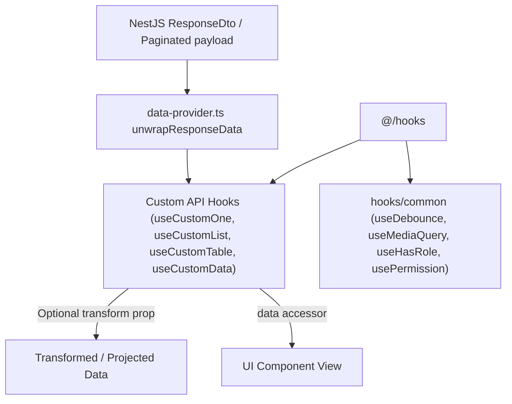

# Archive: Standardized Custom React & Refine Data Hooks Suite with Response Transformation

## 1. Problem & Core Value
- **Problem**: Inconsistent hook utilities, duplicated data fetching logic, lack of typed error/notification propagation, and NestJS backend envelopes (`ResponseDto<T>`, `Paginated<T>`) forced UI components into defensive nested unwrap chains (e.g. `res?.data?.data`).
- **Value**: Standardized a suite of reusable React utilities and Refine API hooks (`useCustomList`, `useCustomOne`, `useCustomMutationData`, `useCustomData`, `useCustomDelete`, `useCustomTable`, `useCustomSelect`), integrated with a two-tier response unwrapping and typed transformation pipeline.

## 2. Key Architecture & Decisions
- **Strict Layering**: Separated general React utilities in `src/hooks/common/` (`useDebounce`, `useMediaQuery`, `useHasRole`, `usePermission`) from Refine data-fetching hooks in `src/hooks/api/`.
- **SSR-Safe Guards**: Enforced `typeof window === 'undefined'` guards across browser API hooks.
- **Two-Tier Response Pipeline**:
  - **Tier 1 (Transport-Level Normalization)**: `unwrapResponseData` in `src/providers/data-provider.ts` automatically extracts inner payloads across `getList`, `getOne`, and `getMany`.
  - **Tier 2 (Declarative Hook Transformation)**: Optional `transform?: (data: TData) => TTransformed` prop across custom API hooks enables inline projection while exposing unwrapped and transformed `data` alongside raw `result` / `query`.
- **Polymorphic Delete Signature**: Supported both `handleDelete(ids)` and `handleDelete({ id, ids, successMessage })` for seamless backward compatibility.

## 3. Scope & Key Changes
- [`src/constants/common.constant.ts`](file:///d:/Sources/Personal/only-one-fe/src/constants/common.constant.ts): Added pagination and sorter defaults.
- [`src/providers/data-provider.ts`](file:///d:/Sources/Personal/only-one-fe/src/providers/data-provider.ts): Added `unwrapResponseData` for automatic envelope unwrapping.
- [`src/hooks/common/`](file:///d:/Sources/Personal/only-one-fe/src/hooks/common): Standardized `useDebounce`, `useMediaQuery`, `useHasRole`, `usePermission`, `useTableChange`.
- [`src/hooks/api/`](file:///d:/Sources/Personal/only-one-fe/src/hooks/api): Standardized `useCustomList`, `useCustomOne`, `useCustomMutationData`, `useCustomData`, `useCustomDelete`, `useCustomTable`, `useCustomSelect` with `transform` callback prop and typed responses.

## 4. Verification Evidence & PR
- **Test Status**: 100% Passed (`tsc --noEmit` clean, ESLint clean).
- **PR URL**: ~
