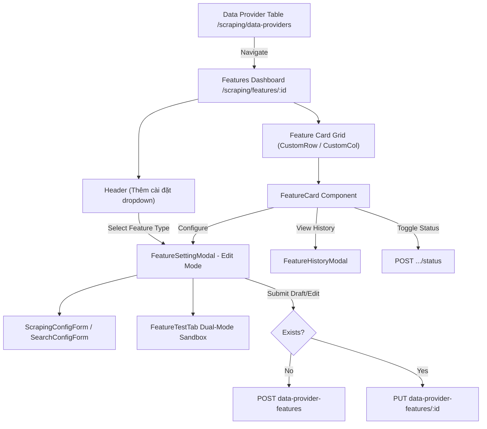

# Archive: Data Provider Features Dashboard & Interactive Configuration Management

## 1. Problem & Core Value
- **Problem**: Feature configuration for scraping and search was previously trapped in legacy modals on the Data Provider list table without health metrics, error counters, decoupled testing playgrounds, or streamlined draft creation workflows.
- **Value**: Built a dedicated, modern management dashboard at `/scraping/features/:dataProviderId` integrating all RESTful endpoints of `DataProviderFeatureController` with live test sandboxes, version history inspection, 1-step draft configuration with automatic POST/PUT switching, and decoupled state management.

## 2. Key Architecture & Decisions
- **Streamlined Provider Entry**: Data Provider table rows link directly to the features dashboard, eliminating obsolete inline modal components (`DataProviderSettingModal`, `DataProviderTargetModal`).
- **Card Grid Layout**: Responsive 2-column `<CustomRow gutter={[24, 24]}>` rendering `<FeatureCard>` with status pulse, failure counter, service engine badges, fast toggle switches, and history modal triggers.
- **1-Step Draft Configuration & Header Action**: "Thêm cài đặt" dropdown enables instant draft configuration for unconfigured feature types, while `FeatureSettingModal` handles automatic creation (`POST`) or modification (`PUT`) upon submit.
- **Interactive Multi-Tab Sandbox**: `FeatureSettingModal` provides form generation (`ScrapingConfigForm`, `SearchConfigForm`), dual-mode testing sandbox (`FeatureTestTab`), and version history rollback capabilities.
- **Decoupled State Hook**: State, modal toggles, and Refine API actions are orchestrated cleanly in `useDataProviderFeaturesPage`.

## 3. Scope & Key Changes
- [`src/enums/data-provider.enum.ts`](file:///d:/Sources/Personal/only-one-fe/src/enums/data-provider.enum.ts): Added feature types and status enums (`DataProviderFeatureType`, `DataProviderFeatureStatus`).
- [`src/app/(root)/scraping/data-providers/page.tsx`](file:///d:/Sources/Personal/only-one-fe/src/app/(root)/scraping/data-providers/page.tsx): Streamlined table columns and connected rows to features dashboard.
- [`src/app/(root)/scraping/features/[dataProviderId]/page.tsx`](file:///d:/Sources/Personal/only-one-fe/src/app/(root)/scraping/features/[dataProviderId]/page.tsx): Main dashboard layout with ListWrapper, breadcrumb navigation, and responsive card grid.
- [`src/app/(root)/scraping/features/[dataProviderId]/hooks.ts`](file:///d:/Sources/Personal/only-one-fe/src/app/(root)/scraping/features/[dataProviderId]/hooks.ts): Unified hook `useDataProviderFeaturesPage` for CRUD, status toggling, and modal states.
- [`src/app/(root)/scraping/features/[dataProviderId]/components/FeatureCard.tsx`](file:///d:/Sources/Personal/only-one-fe/src/app/(root)/scraping/features/[dataProviderId]/components/FeatureCard.tsx): Feature card with status badges, metric chips, and action buttons.
- [`src/app/(root)/scraping/features/[dataProviderId]/components/FeatureSettingModal.tsx`](file:///d:/Sources/Personal/only-one-fe/src/app/(root)/scraping/features/[dataProviderId]/components/FeatureSettingModal.tsx): Tabbed modal hosting configuration form and test sandbox.
- [`src/app/(root)/scraping/features/[dataProviderId]/components/FeatureHistoryModal.tsx`](file:///d:/Sources/Personal/only-one-fe/src/app/(root)/scraping/features/[dataProviderId]/components/FeatureHistoryModal.tsx): Modal for viewing execution history and version rollbacks.
- [`src/app/(root)/scraping/features/[dataProviderId]/components/FeatureTestTab.tsx`](file:///d:/Sources/Personal/only-one-fe/src/app/(root)/scraping/features/[dataProviderId]/components/FeatureTestTab.tsx): Interactive test sandbox for feature execution validation.

## 4. Verification Evidence & PR
- **Test Status**: 100% Passed (`tsc --noEmit` clean, ESLint clean, `next build` static export succeeded).
- **PR URL**: ~
