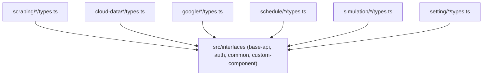

# Archive: Page-Level TypeScript Architecture & Domain Type Colocation

## 1. Problem & Core Value
- **Problem**: Types were centralized into global ambient namespaces in `src/interfaces/*.d.ts`, causing cross-domain coupling, namespace verbosity (`NDataProvider.*`), and dead type accumulation.
- **Value**: Colocated domain-specific TypeScript interfaces directly into page-level `types.ts` files across all application routes, preserving only shared base infrastructure types in `src/interfaces/`.

## 2. Key Architecture & Decisions
- **Colocation Pattern**: Page-level `types.ts` directly defines and exports domain interfaces and UI form types.
- **Canonical Ownership**: Cross-referenced entities are owned by their primary managing page and cleanly imported by secondary pages.
- **Core Abstraction Preservation**: Preserved `auth`, `base-api`, `common`, and `custom-component` in `src/interfaces/` as shared infrastructure contracts.

## 3. Scope & Key Changes
- [`src/interfaces/`](file:///d:/Sources/Personal/only-one-fe/src/interfaces): Cleaned up domain ambient namespaces, maintaining only base contracts.
- [`src/app/(root)/scraping/data-providers/types.ts`](file:///d:/Sources/Personal/only-one-fe/src/app/(root)/scraping/data-providers/types.ts), [`features/[dataProviderId]/types.ts`](file:///d:/Sources/Personal/only-one-fe/src/app/(root)/scraping/features/[dataProviderId]/types.ts): Colocated data providers, features, items, and provider-items interfaces.
- [`src/app/(root)/cloud-data/`](file:///d:/Sources/Personal/only-one-fe/src/app/(root)/cloud-data): Colocated cloud providers and cloud items interfaces.
- [`src/app/(root)/google/`](file:///d:/Sources/Personal/only-one-fe/src/app/(root)/google): Colocated Google drive folders and photos interfaces.
- [`src/app/(root)/schedule/`](file:///d:/Sources/Personal/only-one-fe/src/app/(root)/schedule): Colocated executions and job events interfaces.
- [`src/app/(root)/simulation/`](file:///d:/Sources/Personal/only-one-fe/src/app/(root)/simulation): Colocated simulation contexts and items interfaces.
- [`src/app/(root)/setting/`](file:///d:/Sources/Personal/only-one-fe/src/app/(root)/setting): Colocated user interfaces.

## 4. Verification Evidence & PR
- **Test Status**: 100% Passed (`tsc --noEmit` clean, production build succeeded).
- **PR URL**: ~
