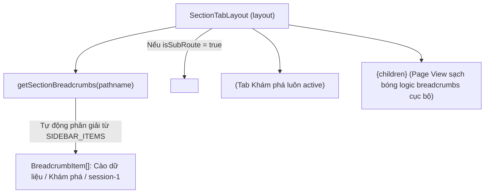

# Archive: Quản lý Điều hướng Phân hệ & Breadcrumbs Tập trung (Global Section Tabs & Breadcrumbs)

## 1. Problem & Core Value (Bối cảnh & Vấn đề Cốt lõi)
- **Problem**: Các trang con và trang chi tiết (ví dụ `/scraping/discovery/[id]`, `/scraping/features/[dataProviderId]`) phải tự quản lý breadcrumbs hoặc tạo các nút quay lại cục bộ rời rạc, làm phân mảnh trải nghiệm người dùng và trùng lặp code điều hướng.
- **Value**: Nâng cấp `SectionTabLayout` và `layout-helper.ts` để tự động phân giải cấu trúc cây thư mục menu (`SIDEBAR_ITEMS`) thành danh sách Breadcrumb phân cấp toàn cục (`Nhóm phân hệ / Tab tính năng / Chi tiết tài nguyên`), hiển thị `<BreadcrumbNav />` tự động khi người dùng duyệt vào các trang con sâu.

---

## 2. Key Architecture & Decisions (Kiến trúc & Quyết định Kỹ thuật)

### 2.1 Cơ chế Phân giải Tuyến đường (Route Breadcrumbs Resolution)
- **`getSectionBreadcrumbs(pathname)`**: Duyệt cây `SIDEBAR_ITEMS`, xác định nhóm phân hệ cha và tab con đang active (`matchedChild`). Nếu URL có thêm các phân đoạn phía sau (`pathname !== matchedChild.href`), helper tự động bóc tách các sub-segments để tạo breadcrumb động (ví dụ: `session-1`).
- **Prefix Matching trong `SectionTabLayout`**: Giữ tab cha luôn được highlight active khi người dùng đang ở các tuyến đường con sâu hơn (`pathname.startsWith(tab.href + '/')`).
- **Conditional Breadcrumbs Rendering**: Khi `isSubRoute` là `true` (người dùng đang ở trang con sâu), component render `<BreadcrumbNav items={breadcrumbs} className="mb-2 px-1" />` ngay phía trên thanh `CustomTabs`.

---

## 3. Scope & Key Changes (Phạm vi & Tệp Nguồn Trọng tâm)
- [layout-helper.ts](file:///d:/Sources/Personal/only-one-fe/src/libs/layout-helper.ts):
  - `getSectionBreadcrumbs(pathname: string): BreadcrumbItem[] | null`: Phân tách pathname thành cây breadcrumb chuẩn hóa.
- [section-tabs/index.tsx](file:///d:/Sources/Personal/only-one-fe/src/components/layout/section-tabs/index.tsx):
  - Tích hợp `BreadcrumbNav` hiển thị dải breadcrumb khi `isSubRoute` thỏa mãn.

---

## 4. Verification Evidence & Status (Bằng chứng Nghiệm thu)
- **TypeScript**: `npx tsc --noEmit` $\rightarrow$ **Pass (0 errors)**.
- **ESLint**: `npx eslint "src/components/layout/section-tabs" "src/libs"` $\rightarrow$ **Pass (0 errors, 0 warnings)**.
- **Prettier**: `npm run prettier` $\rightarrow$ **Pass (0 errors)**.
- **Functional Validation**: Truy cập `/scraping/discovery/session-1` $\rightarrow$ Breadcrumb `Cào dữ liệu / Khám phá / session-1` hiển thị chuẩn xác $\rightarrow$ Tab "Khám phá" active $\rightarrow$ Bấm "Khám phá" quay về trang danh sách.
