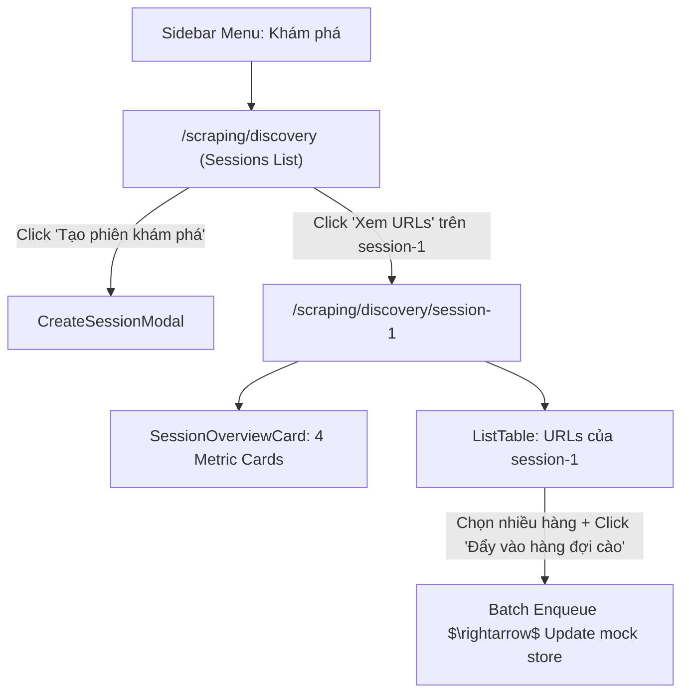

# Archive: Phân hệ Khám phá Dữ liệu Cào (Scraping Discovery Module & RESTful Sub-routes)

## 1. Problem & Core Value (Bối cảnh & Vấn đề Cốt lõi)
- **Problem**: Nhu cầu khám phá danh sách sản phẩm (Seed URLs $\rightarrow$ Discovered URLs) cần một giao diện quản lý phiên độc lập, lọc theo Data Provider, duyệt danh sách URLs theo từng phiên cụ thể, và đẩy các URL được chọn vào hàng đợi cào dữ liệu (Batch Enqueue). Cấu trúc ban đầu bị dư thừa tầng `/sessions` và trang chi tiết bị nguyên khối (monolithic).
- **Value**: Xây dựng phân hệ Discovery hoàn chỉnh với định tuyến RESTful phẳng (`/scraping/discovery` cho danh sách phiên và `/scraping/discovery/[id]` cho chi tiết phiên), kiến trúc component module hóa 100% bằng `custom-antd`, và in-memory mock store phục vụ kiểm thử UI/UX tức thì.

---

## 2. Key Architecture & Decisions (Kiến trúc & Quyết định Kỹ thuật)

### 2.1 Cấu trúc Thư mục Module Chuẩn Hóa
```text
src/app/(root)/scraping/discovery/
├── page.tsx                                # Main Discovery List Page (/scraping/discovery)
├── hooks.ts                                # Discovery List State & Filtering Hook
├── types.ts                                # Domain Interfaces & Form Contract
├── mocks/
│   └── mock-data.ts                        # In-memory Mock Store & Single Source of Truth
├── components/
│   ├── CreateSessionModal.tsx              # Modal khởi tạo phiên khám phá
│   └── index.ts                            # Barrel export
└── [id]/
    ├── page.tsx                            # Thin View Orchestrator (< 50 dòng)
    ├── hooks.tsx                           # Hook quản lý bảng URLs, actions, filters theo session ID
    └── components/
        ├── SessionMetricCard.tsx           # Reusable KPI metric card (100% custom-antd)
        ├── SessionOverviewCard.tsx         # Hero overview card bao bọc nhận diện phiên & metric grid
        └── index.ts                        # Barrel export
```

### 2.2 Sơ đồ Luồng Tương tác (Mermaid Flow)



### 2.3 Nguyên tắc Thiết kế & Ràng buộc (Design System & Rules)
- **Flattened RESTful Routing**: Danh sách phiên nằm trực tiếp tại cấp gốc `/scraping/discovery`, chi tiết tài nguyên nằm tại `[id]`.
- **Custom Antd First**: Loại bỏ hoàn toàn HTML thô lồng nhau (`div`, `span`, `a`); sử dụng các primitives `CustomFlex`, `CustomSpace`, `CustomCard`, `CustomTypography.Text`, `CustomDivider`, `CustomTag`.
- **Thin View Orchestrator**: `page.tsx` chỉ đóng vai trò điều phối layout, toàn bộ logic lọc, tìm kiếm, cấu hình cột và actions được đóng gói trong `hooks.tsx`.

---

## 3. Scope & Key Changes (Phạm vi & Tệp Nguồn Trọng tâm)
- [types.ts](file:///d:/Sources/Personal/only-one-fe/src/app/(root)/scraping/discovery/types.ts): Định nghĩa `IDiscoverySession`, `IDiscoveryUrl`, enums `DiscoverySessionStatus`, `DiscoveryUrlStatus`, form types.
- [mock-data.ts](file:///d:/Sources/Personal/only-one-fe/src/app/(root)/scraping/discovery/mocks/mock-data.ts): Mock store in-memory kèm các helper functions (`getMockSessions`, `getMockSessionById`, `getMockUrlsBySessionId`, `addMockSession`, `enqueueMockUrls`).
- [discovery/page.tsx](file:///d:/Sources/Personal/only-one-fe/src/app/(root)/scraping/discovery/page.tsx) & [discovery/hooks.ts](file:///d:/Sources/Personal/only-one-fe/src/app/(root)/scraping/discovery/hooks.ts): Trang chính hiển thị danh sách phiên, lọc theo Data Provider và tìm kiếm.
- [components/CreateSessionModal.tsx](file:///d:/Sources/Personal/only-one-fe/src/app/(root)/scraping/discovery/components/CreateSessionModal.tsx): Modal form tạo phiên mới.
- [[id]/page.tsx](file:///d:/Sources/Personal/only-one-fe/src/app/(root)/scraping/discovery/%5Bid%5D/page.tsx) & [[id]/hooks.tsx](file:///d:/Sources/Personal/only-one-fe/src/app/(root)/scraping/discovery/%5Bid%5D/hooks.tsx): Trang chi tiết phiên và bảng URLs.
- [[id]/components/SessionOverviewCard.tsx](file:///d:/Sources/Personal/only-one-fe/src/app/(root)/scraping/discovery/%5Bid%5D/components/SessionOverviewCard.tsx) & [SessionMetricCard.tsx](file:///d:/Sources/Personal/only-one-fe/src/app/(root)/scraping/discovery/%5Bid%5D/components/SessionMetricCard.tsx): Các khối hiển thị thông tin phiên và chỉ số KPI.
- [sidebar.constant.ts](file:///d:/Sources/Personal/only-one-fe/src/constants/sidebar.constant.ts): Đăng ký menu "Khám phá" trỏ tới `/scraping/discovery`.

---

## 4. Verification Evidence & Status (Bằng chứng Nghiệm thu)
- **TypeScript**: `npx tsc --noEmit` $\rightarrow$ **Pass (0 errors)**.
- **ESLint**: `npx eslint "src/app/(root)/scraping/discovery"` $\rightarrow$ **Pass (0 errors, 0 warnings)**.
- **Prettier**: `npm run prettier` $\rightarrow$ **100% formatted (Code 0)**.
- **Manual Flow**: Truy cập `/scraping/discovery` $\rightarrow$ lọc Data Provider $\rightarrow$ Xem URLs `session-1` $\rightarrow$ Chọn URLs & Batch Enqueue $\rightarrow$ Cập nhật trạng thái tức thì.
