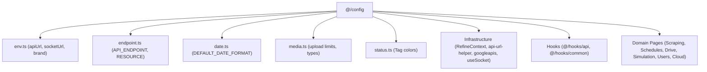

# Archive: Kiến trúc Cấu hình Hệ thống & Hằng số Resource Tập trung

## 1. Problem & Core Value (Bài toán & Giá trị Cốt lõi)
- **Vấn đề (Problem)**: Các hằng số cấu hình, chuỗi endpoint thô, magic numbers, date format, tên resource Refine (`deleteResource`, `resource`), và `process.env.NEXT_PUBLIC_*` nằm rải rác trong components, contexts và hooks dẫn đến thiếu type-safety và nguy cơ typo endpoint.
- **Giá trị (Value)**: Xây dựng module `@/config` tập trung toàn bộ dictionary cho endpoints (`API_ENDPOINT`), resource keys (`RESOURCE`), biến môi trường an toàn (`env`), date format, media constraints và tag status colors, đồng bộ hóa 100% trên toàn bộ codebase.

## 2. Key Architecture & Decisions (Kiến trúc & Quyết định Then chốt)
- **Domain-Grouped Modules**: Phân tách cấu hình thành các module đơn trách nhiệm: `api.ts`, `date.ts`, `endpoint.ts`, `env.ts`, `media.ts`, `status.ts`, export qua barrel `@/config`.
- **Hằng số `RESOURCE`**: Gom nhóm và export hằng số `RESOURCE` (`as const`) từ `API_ENDPOINT.<MODULE>.BASE`, dùng chung cho `ListTable (deleteResource)` và các hooks Refine (`useCustomTable`, `useCustomModalForm`).
- **Dynamic Parameterized Endpoint Builders**: Chuẩn hóa hàm sinh endpoint động có tham số (ví dụ `API_ENDPOINT.DATA_PROVIDER_FEATURES.BY_PROVIDER(providerId)`).
- **Sanitized Environment Reader**: Tự động trim trailing slashes của `apiUrl` để phòng ngừa lỗi định tuyến mạng.

## 3. Scope & Key Changes (Phạm vi & Thay đổi Chính)
- [src/config/api.ts](file:///Users/kiem/Sources/PERSONAL/only-one-fe/src/config/api.ts): Pagination & sorter default constants.
- [src/config/date.ts](file:///Users/kiem/Sources/PERSONAL/only-one-fe/src/config/date.ts): Date-time formatting tokens.
- [src/config/endpoint.ts](file:///Users/kiem/Sources/PERSONAL/only-one-fe/src/config/endpoint.ts): Typed REST endpoint dictionary & `RESOURCE` dictionary.
- [src/config/env.ts](file:///Users/kiem/Sources/PERSONAL/only-one-fe/src/config/env.ts): Safe environment variable reader.
- [src/config/media.ts](file:///Users/kiem/Sources/PERSONAL/only-one-fe/src/config/media.ts): Media constraints và fallback SVGs.
- [src/config/status.ts](file:///Users/kiem/Sources/PERSONAL/only-one-fe/src/config/status.ts): Ant Design status color mappings.
- [src/config/index.ts](file:///Users/kiem/Sources/PERSONAL/only-one-fe/src/config/index.ts): Barrel export tập trung.
- [src/app/(root)/](file:///Users/kiem/Sources/PERSONAL/only-one-fe/src/app/(root)): 11 trang danh sách (`data-providers`, `items`, `provider-items`, `scraping-data`, `cloud-data/*`, `simulation/*`, `schedule/*`, `google/*`, `setting/users`) đã chuyển toàn bộ `deleteResource` sang `RESOURCE.<NAME>`.

## 4. Verification Evidence & PR (Bằng chứng Nghiệm thu)
- **Trạng thái Test**: 100% Passed (`npx eslint src && npx tsc --noEmit` exit code 0).
- **Audit Hardcode**: 0 chuỗi resource hardcode còn sót lại trong các bảng danh sách.
