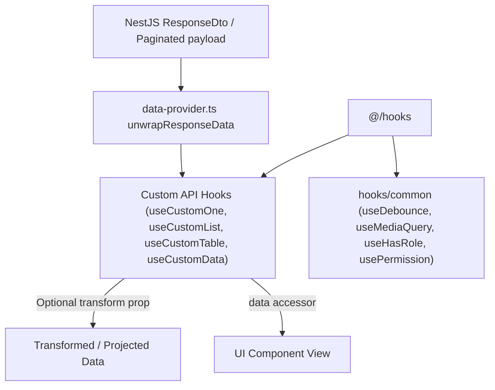

# Archive: Bộ Custom Hooks React & Refine Chuẩn hóa

## 1. Problem & Core Value (Bài toán & Giá trị Cốt lõi)
- **Vấn đề (Problem)**: Hook tiện ích không đồng bộ, trùng lặp logic gọi dữ liệu, thiếu cơ chế lan truyền lỗi/thông báo chuẩn, và cấu trúc phong bì phản hồi NestJS (`ResponseDto<T>`, `Paginated<T>`) buộc UI component phải unwrap thủ công (`res?.data?.data`).
- **Giá trị (Value)**: Chuẩn hóa hệ thống hook React và Refine (`useCustomList`, `useCustomOne`, `useCustomMutationData`, `useCustomData`, `useCustomDelete`, `useCustomTable`, `useCustomSelect`), tích hợp luồng unwrap dữ liệu 2 tầng (Two-Tier Response Pipeline) và hỗ trợ hàm `transform` trực tiếp.

## 2. Key Architecture & Decisions (Kiến trúc & Quyết định Then chốt)
- **Phân tầng Rõ ràng**: Tách biệt hook React tiện ích chung trong `src/hooks/common/` (`useDebounce`, `useMediaQuery`, `useHasRole`, `usePermission`) khỏi hook Refine gọi dữ liệu trong `src/hooks/api/`.
- **Bảo vệ SSR**: Kiểm tra `typeof window !== 'undefined'` trong các hook liên quan tới trình duyệt (`window.matchMedia`, `localStorage`).
- **Two-Tier Response Pipeline**:
  - **Tier 1 (Chuẩn hóa tầng Transport)**: `unwrapResponseData` trong `src/providers/data-provider.ts` tự động bóc tách envelope cho `getList`, `getOne`, và `getMany`.
  - **Tier 2 (Hook Transformation)**: Thuộc tính `transform?: (data: TData) => TTransformed` cho phép chuyển đổi/chiếu dữ liệu linh hoạt ngay tại hook.
- **Polymorphic Delete Signature**: `useCustomDelete` hỗ trợ cả 2 dạng tham số `handleDelete(ids)` và `handleDelete({ id, ids, successMessage })`.

## 3. Scope & Key Changes (Phạm vi & Thay đổi Chính)
- [src/constants/common.constant.ts](file:///Users/kiem/Sources/PERSONAL/only-one-fe/src/constants/common.constant.ts): Pagination và sorter defaults.
- [src/providers/data-provider.ts](file:///Users/kiem/Sources/PERSONAL/only-one-fe/src/providers/data-provider.ts): Hàm `unwrapResponseData` tự động unwrap dữ liệu API.
- [src/hooks/common/](file:///Users/kiem/Sources/PERSONAL/only-one-fe/src/hooks/common): `useDebounce`, `useMediaQuery`, `useHasRole`, `usePermission`, `useTableChange`.
- [src/hooks/api/](file:///Users/kiem/Sources/PERSONAL/only-one-fe/src/hooks/api): `useCustomList`, `useCustomOne`, `useCustomMutationData`, `useCustomData`, `useCustomDelete`, `useCustomTable`, `useCustomSelect`.

## 4. Verification Evidence & PR (Bằng chứng Nghiệm thu)
- **Trạng thái Test**: 100% Passed (`npx eslint src && npx tsc --noEmit` exit code 0).
