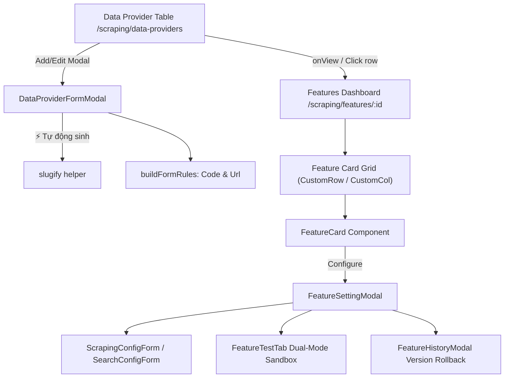

# Archive: Quản lý Nhà cung cấp Dữ liệu, Tính năng & Tiện ích Form Rules

## 1. Problem & Core Value (Bài toán & Giá trị Cốt lõi)
- **Vấn đề (Problem)**: Cấu hình tính năng (Scraping, Search) trước đây bị gộp trong modal trên bảng danh sách mà không có theo dõi chỉ số lỗi (error counter), sandbox kiểm thử, hoặc cơ chế draft cấu hình. Đồng thời, form nhập liệu Data Provider thiếu quy chuẩn validate tái sử dụng cho mã code (`identifier`) và đường dẫn gốc (`baseUrl`), cũng như thiếu tính năng tự động sinh mã từ tên.
- **Giá trị (Value)**: Xây dựng bảng điều khiển quản lý tính năng chuyên biệt tại `/scraping/features/:dataProviderId` với sandbox kiểm thử, hỗ trợ chuyển đổi linh hoạt draft POST/PUT, bổ sung tiện ích sinh mã `slugify`, và mở rộng bộ rule chuẩn hóa `FormRuleType.Code` & `FormRuleType.Url`.

## 2. Key Architecture & Decisions (Kiến trúc & Quyết định Then chốt)
- **Dedicated Features Dashboard**: Từ bảng Data Provider, người dùng điều hướng trực tiếp tới `/scraping/features/:dataProviderId`, loại bỏ modal cài đặt cồng kềnh.
- **Card Grid Layout & Status Badge**: Bố cục 2 cột `<CustomRow gutter={[24, 24]}>` hiển thị các `<FeatureCard>` kèm status pulse, failure counter, service engine badges và nút chuyển đổi trạng thái nhanh.
- **1-Step Draft Configuration**: Dropdown "Thêm cài đặt" cho phép cấu hình tức thì cho loại tính năng chưa tạo; form modal tự động nhận diện `POST` (nếu chưa có) hoặc `PUT` (nếu đã có).
- **Interactive Multi-Tab Sandbox**: `FeatureSettingModal` cung cấp form cấu hình (`ScrapingConfigForm`, `SearchConfigForm`), sandbox kiểm thử 2 chế độ (`FeatureTestTab`), và lịch sử phiên bản (`FeatureHistoryModal`).
- **Nút Tự động Sinh Mã Provider (`identifier`)**: Tích hợp nút `⚡ Tự động sinh` sử dụng helper `slugify(name, maxLength)` xử lý chuẩn tiếng Việt Unicode, loại bỏ ký tự lạ, cắt an toàn theo giới hạn.
- **Reusable Form Rule Types**: Bổ sung `FormRuleType.Code` (`/^[a-z0-9-]+$/`) và `FormRuleType.Url` (kiểm tra `noTrailingSlash`, `noWww`) vào `buildFormRules`.

## 3. Scope & Key Changes (Phạm vi & Thay đổi Chính)
- [src/libs/string-helper.ts](file:///Users/kiem/Sources/PERSONAL/only-one-fe/src/libs/string-helper.ts): Hàm `slugify(text, maxLength)` chuẩn hóa chuỗi tiếng Việt sang mã slug.
- [src/utilities/form-rules.ts](file:///Users/kiem/Sources/PERSONAL/only-one-fe/src/utilities/form-rules.ts): Mở rộng `FormRuleType.Code` và `FormRuleType.Url`.
- [src/app/(root)/scraping/data-providers/constants.ts](file:///Users/kiem/Sources/PERSONAL/only-one-fe/src/app/(root)/scraping/data-providers/constants.ts): `DATA_PROVIDER_INITIAL_VALUES`, `DATA_PROVIDER_LIMITS`, `DATA_PROVIDER_COLUMNS_WIDTH`.
- [src/app/(root)/scraping/data-providers/components/DataProviderFormModal.tsx](file:///Users/kiem/Sources/PERSONAL/only-one-fe/src/app/(root)/scraping/data-providers/components/DataProviderFormModal.tsx): Tích hợp nút tự động sinh mã và rules chuẩn hóa.
- [src/app/(root)/scraping/data-providers/page.tsx](file:///Users/kiem/Sources/PERSONAL/only-one-fe/src/app/(root)/scraping/data-providers/page.tsx): Bổ sung `onView` điều hướng tới `/scraping/features/:id`.
- [src/app/(root)/scraping/features/[dataProviderId]/](file:///Users/kiem/Sources/PERSONAL/only-one-fe/src/app/(root)/scraping/features/[dataProviderId]): Toàn bộ dashboard quản lý tính năng, cards, modal cấu hình, tab test sandbox và lịch sử.

## 4. Verification Evidence & PR (Bằng chứng Nghiệm thu)
- **Trạng thái Test**: 100% Passed (`npx eslint src && npx tsc --noEmit` exit code 0).
