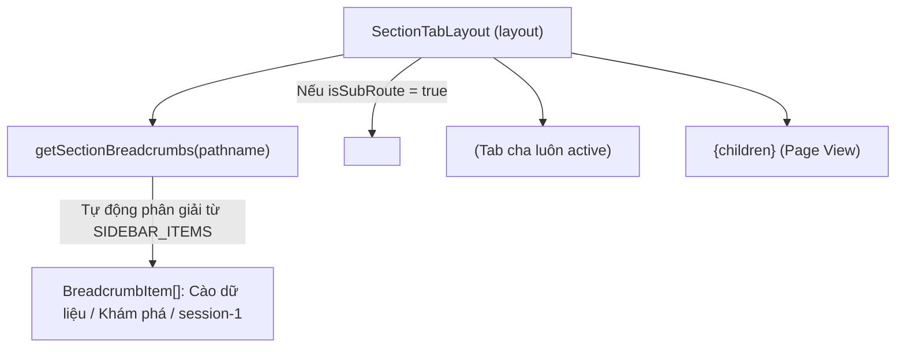

# Archive: Quản lý Điều hướng Phân hệ & Breadcrumbs Tập trung

## 1. Problem & Core Value (Bài toán & Giá trị Cốt lõi)
- **Vấn đề (Problem)**: Các trang con sâu và trang chi tiết (ví dụ `/scraping/discovery/[id]`, `/scraping/features/[dataProviderId]`) trước đây phải tự quản lý breadcrumbs hoặc tạo các nút quay lại cục bộ rời rạc, làm phân mảnh trải nghiệm người dùng và trùng lặp code điều hướng.
- **Giá trị (Value)**: Nâng cấp `SectionTabLayout` và `layout-helper.ts` để tự động phân giải cấu trúc cây thư mục menu (`SIDEBAR_ITEMS`) thành danh sách Breadcrumb phân cấp toàn cục (`Nhóm phân hệ / Tab tính năng / Chi tiết tài nguyên`), hiển thị `<BreadcrumbNav />` tự động khi người dùng duyệt vào các trang con sâu.

## 2. Key Architecture & Decisions (Kiến trúc & Quyết định Then chốt)
- **`getSectionBreadcrumbs(pathname)`**: Duyệt cây `SIDEBAR_ITEMS`, xác định nhóm phân hệ cha và tab con đang active (`matchedChild`). Nếu URL có thêm các phân đoạn phía sau (`pathname !== matchedChild.href`), helper tự động bóc tách các sub-segments để tạo breadcrumb động.
- **Prefix Matching trong `SectionTabLayout`**: Giữ tab cha luôn được highlight active khi người dùng đang ở các tuyến đường con sâu hơn (`pathname.startsWith(tab.href + '/')`).
- **Conditional Breadcrumbs Rendering**: Khi `isSubRoute` là `true` (người dùng đang ở trang con sâu), component tự động render `<BreadcrumbNav items={breadcrumbs} className="mb-2 px-1" />` ngay phía trên thanh `CustomTabs`.

## 3. Scope & Key Changes (Phạm vi & Thay đổi Chính)
- [src/libs/layout-helper.ts](file:///Users/kiem/Sources/PERSONAL/only-one-fe/src/libs/layout-helper.ts): `getSectionBreadcrumbs(pathname)` phân tách pathname thành cây breadcrumb chuẩn hóa.
- [src/components/layout/section-tabs/index.tsx](file:///Users/kiem/Sources/PERSONAL/only-one-fe/src/components/layout/section-tabs/index.tsx): Tích hợp `BreadcrumbNav` hiển thị dải breadcrumb khi `isSubRoute` thỏa mãn.

## 4. Verification Evidence & PR (Bằng chứng Nghiệm thu)
- **Trạng thái Test**: 100% Passed (`npx eslint src && npx tsc --noEmit` exit code 0).
