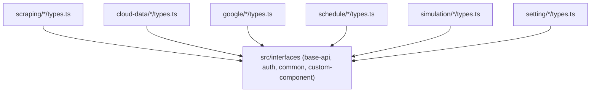

# Archive: Kiến trúc TypeScript Cấp Trang & Đồng vị Hóa Kiểu Dữ liệu

## 1. Problem & Core Value (Bài toán & Giá trị Cốt lõi)
- **Vấn đề (Problem)**: Types tập trung vào ambient namespaces toàn cục trong `src/interfaces/*.d.ts` gây khớp nối chéo giữa các phân hệ, dài dòng (`NDataProvider.*`), và tích tụ các kiểu dữ liệu không còn sử dụng.
- **Giá trị (Value)**: Đồng vị hóa (colocate) các interface TypeScript đặc thù miền trực tiếp tại file `types.ts` của từng trang trong `src/app/**`, chỉ giữ lại các hợp đồng trừu tượng hạ tầng cốt lõi trong `src/interfaces/`.

## 2. Key Architecture & Decisions (Kiến trúc & Quyết định Then chốt)
- **Colocation Pattern**: File `types.ts` tại từng route định nghĩa và export trực tiếp các domain interfaces và form types.
- **Canonical Ownership**: Thực thể được sở hữu chính bởi trang quản lý chính (`types.ts`), các trang phụ import trực tiếp từ trang chính.
- **Core Abstraction**: Giữ `auth`, `base-api`, `common`, và `custom-component` trong `src/interfaces/` như các hợp đồng hạ tầng dùng chung.

## 3. Scope & Key Changes (Phạm vi & Thay đổi Chính)
- [src/interfaces/](file:///Users/kiem/Sources/PERSONAL/only-one-fe/src/interfaces): Loại bỏ ambient domain namespaces, chỉ duy trì base contracts.
- [src/app/(root)/scraping/data-providers/types.ts](file:///Users/kiem/Sources/PERSONAL/only-one-fe/src/app/(root)/scraping/data-providers/types.ts): Colocated data providers interfaces.
- [src/app/(root)/scraping/features/[dataProviderId]/types.ts](file:///Users/kiem/Sources/PERSONAL/only-one-fe/src/app/(root)/scraping/features/[dataProviderId]/types.ts): Colocated feature interfaces.
- [src/app/(root)/cloud-data/](file:///Users/kiem/Sources/PERSONAL/only-one-fe/src/app/(root)/cloud-data): Colocated cloud providers & items interfaces.
- [src/app/(root)/google/](file:///Users/kiem/Sources/PERSONAL/only-one-fe/src/app/(root)/google): Colocated Google drive folders & files interfaces.
- [src/app/(root)/schedule/](file:///Users/kiem/Sources/PERSONAL/only-one-fe/src/app/(root)/schedule): Colocated executions & jobs interfaces.
- [src/app/(root)/simulation/](file:///Users/kiem/Sources/PERSONAL/only-one-fe/src/app/(root)/simulation): Colocated simulation contexts & items interfaces.
- [src/app/(root)/setting/](file:///Users/kiem/Sources/PERSONAL/only-one-fe/src/app/(root)/setting): Colocated user & settings interfaces.

## 4. Verification Evidence & PR (Bằng chứng Nghiệm thu)
- **Trạng thái Test**: 100% Passed (`npx eslint src && npx tsc --noEmit` exit code 0).
