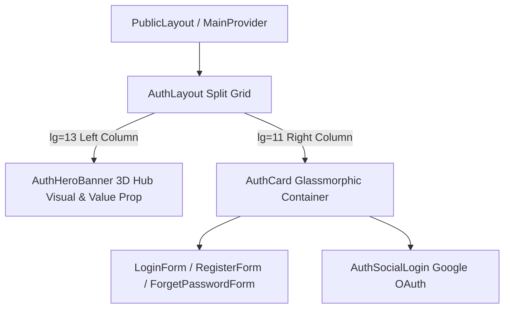

# Archive: Giao diện Cổng Đăng nhập Phân đôi & Custom AntD UI

## 1. Problem & Core Value (Bài toán & Giá trị Cốt lõi)
- **Vấn đề (Problem)**: Các trang xác thực công khai (`/login`, `/register`, `/forget-password`) trước đây nằm trong một khung dọc đơn điệu, thiếu tính nhận diện thương hiệu và thiếu trải nghiệm thị giác ấn tượng.
- **Giá trị (Value)**: Hiện đại hóa giao diện xác thực thành layout chia đôi màn hình 12 cột (Split-Screen Grid) với hero banner 3D công nghệ cao trên desktop và kiến trúc component chuẩn Ant Design.

## 2. Key Architecture & Decisions (Kiến trúc & Quyết định Then chốt)
- **Split-Screen Grid**: Sử dụng `<CustomRow>` và `<CustomCol>` (`lg={13}` hero visual, `lg={11}` form card) tự động thu gọn mượt mà trên thiết bị di động.
- **Ant Design Primitives**: Thay thế các wrapper HTML/Tailwind tùy tiện bằng `<CustomFlex>`, `<CustomSpace>`, `<CustomTag>`, `<CustomTypography>`, `<CustomCard>`, `<CustomButton>`.
- **Lightweight Asset Integration**: Tối ưu hóa dung lượng với hình ảnh visual chất lượng cao và gradient overlays.

## 3. Scope & Key Changes (Phạm vi & Thay đổi Chính)
- [src/app/(public)/_components/auth/AuthHeroBanner.tsx](file:///Users/kiem/Sources/PERSONAL/only-one-fe/src/app/(public)/_components/auth/AuthHeroBanner.tsx): Left-column hero banner với typography và tags động.
- [src/app/(public)/_components/auth/AuthLayout.tsx](file:///Users/kiem/Sources/PERSONAL/only-one-fe/src/app/(public)/_components/auth/AuthLayout.tsx): Responsive split-screen container.
- [src/app/(public)/_components/auth/AuthCard.tsx](file:///Users/kiem/Sources/PERSONAL/only-one-fe/src/app/(public)/_components/auth/AuthCard.tsx): Container thẻ chuẩn hóa qua `<CustomCard>`.
- [src/app/(public)/_components/auth/AuthSocialLogin.tsx](file:///Users/kiem/Sources/PERSONAL/only-one-fe/src/app/(public)/_components/auth/AuthSocialLogin.tsx): Nút đăng nhập Google OAuth.
- [src/app/(public)/login/page.tsx](file:///Users/kiem/Sources/PERSONAL/only-one-fe/src/app/(public)/login/page.tsx), [`register/page.tsx`](file:///Users/kiem/Sources/PERSONAL/only-one-fe/src/app/(public)/register/page.tsx), [`forget-password/page.tsx`](file:///Users/kiem/Sources/PERSONAL/only-one-fe/src/app/(public)/forget-password/page.tsx): Cập nhật các routes xác thực.

## 4. Verification Evidence & PR (Bằng chứng Nghiệm thu)
- **Trạng thái Test**: 100% Passed (`npx eslint src && npx tsc --noEmit` exit code 0).
