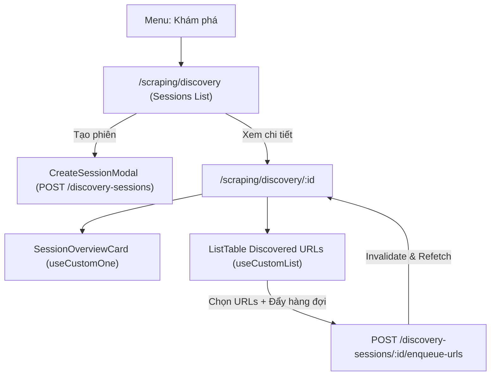

# Archive: Phân hệ Khám phá Dữ liệu Cào & Tích hợp REST API

## 1. Problem & Core Value (Bài toán & Giá trị Cốt lõi)
- **Vấn đề (Problem)**: Khám phá sản phẩm (Seed URLs $\rightarrow$ Discovered URLs) cần giao diện quản lý phiên quét độc lập, lọc theo Data Provider, duyệt chi tiết URLs, kiểm tra độ tin cậy/giá phát hiện và đẩy vào hàng đợi cào (Batch Enqueue). Ban đầu module dùng mock data tạm thời, cần chuyển sang REST API thực tế từ backend.
- **Giá trị (Value)**: Hoàn thiện phân hệ Discovery kết nối 100% với REST API backend (`/v1/discovery-sessions`, `/v1/discovery-urls`) qua các hook chuẩn (`useCustomList`, `useCustomOne`, `useCustomMutationData`), hỗ trợ tạo phiên, lọc, chấm điểm URL và enqueue vào hàng đợi cào.

## 2. Key Architecture & Decisions (Kiến trúc & Quyết định Then chốt)
- **Định tuyến RESTful Phẳng**: Danh sách phiên nằm tại `/scraping/discovery`, chi tiết phiên nằm tại `/scraping/discovery/[id]`.
- **Loại bỏ Hoàn toàn Mock Data**: Đã xóa bỏ toàn bộ mock store, chuyển toàn bộ state và queries sang React Query / Refine hooks.
- **Tương tác Chi tiết Phiên & Đẩy Hàng đợi**:
  - `useCustomOne<IDiscoverySession>` tải thông tin và KPI metrics thời gian thực (`totalDiscovered`, `totalValidated`, `totalQueued`).
  - `useCustomList<IDiscoveryUrl>` phân trang và lọc URLs theo `sessionId`.
  - Batch action gọi `POST /v1/discovery-sessions/:id/enqueue-urls` tự động vô hiệu hóa cache (query invalidation) để cập nhật số lượng hàng đợi tức thì.
- **Custom Antd Primitives**: Sử dụng `CustomFlex`, `CustomSpace`, `CustomCard`, `CustomTypography.Text`, `CustomDivider`, `CustomTag`.

## 3. Scope & Key Changes (Phạm vi & Thay đổi Chính)
- [src/config/endpoint.ts](file:///Users/kiem/Sources/PERSONAL/only-one-fe/src/config/endpoint.ts): `API_ENDPOINT.DISCOVERY_SESSIONS` và `API_ENDPOINT.DISCOVERY_URLS`.
- [src/app/(root)/scraping/discovery/types.ts](file:///Users/kiem/Sources/PERSONAL/only-one-fe/src/app/(root)/scraping/discovery/types.ts): Enums validation status, interfaces `IDiscoverySession`, `IDiscoveryUrl`.
- [src/app/(root)/scraping/discovery/page.tsx](file:///Users/kiem/Sources/PERSONAL/only-one-fe/src/app/(root)/scraping/discovery/page.tsx) & [hooks.ts](file:///Users/kiem/Sources/PERSONAL/only-one-fe/src/app/(root)/scraping/discovery/hooks.ts): Danh sách phiên, bộ lọc provider và modal tạo phiên.
- [src/app/(root)/scraping/discovery/[id]/page.tsx](file:///Users/kiem/Sources/PERSONAL/only-one-fe/src/app/(root)/scraping/discovery/[id]/page.tsx) & [[id]/hooks.tsx](file:///Users/kiem/Sources/PERSONAL/only-one-fe/src/app/(root)/scraping/discovery/[id]/hooks.tsx): Trang chi tiết phiên, bảng URLs, action chấm điểm và batch enqueue.
- [src/app/(root)/scraping/discovery/[id]/components/SessionOverviewCard.tsx](file:///Users/kiem/Sources/PERSONAL/only-one-fe/src/app/(root)/scraping/discovery/[id]/components/SessionOverviewCard.tsx): Thẻ tổng quan chỉ số phiên.

## 4. Verification Evidence & PR (Bằng chứng Nghiệm thu)
- **Trạng thái Test**: 100% Passed (`npx eslint src && npx tsc --noEmit` exit code 0).
- **Mock Store**: Đã dọn dẹp sạch sẽ 100%.
