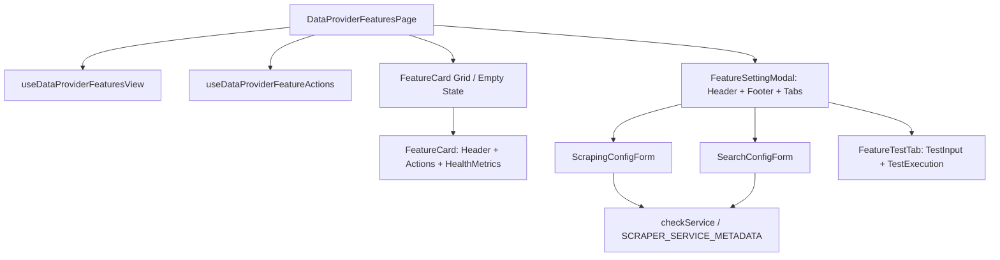

# Archive: Kiến trúc Toàn diện Dashboard Quản lý Tính năng Data Provider, Dynamic Forms & Modular Hooks

## 1. Problem & Core Value (Bài toán & Giá trị Cốt lõi)
- **Vấn đề (Problem)**: 
  - Trước đây, trang cấu hình tính năng `/scraping/features/:dataProviderId` chứa nhiều component monolithic lớn (modal > 400 lines, custom hook nguyên khối quản lý cả view state lẫn mutations), các enum domain bị đặt sai chỗ tại global `src/enums/`, options của `service` bị hardcode giá trị không hợp lệ (`puppeteer`), và form hiển thị tĩnh tất cả DOM selectors ngay cả với engine `API` hay `Local`.
  - Tồn tại nguy cơ lỗi Circular References do re-export chéo giữa `constants.ts` và `utils/`.
- **Giá trị (Value)**:
  - Tái cấu trúc toàn diện Dashboard theo nguyên lý Deep Modules & Seams Isolation: phân tách component < 150 lines, phân rã hook theo 2 trách nhiệm rõ ràng (`View` vs `Actions`).
  - Colocate domain enums về đúng trang `[dataProviderId]/enums/`, tách thành từng file đơn nhiệm (`*.enum.ts`).
  - Xây dựng **Metadata & Capability Registry (`SCRAPER_SERVICE_METADATA` & `checkService`)**: Ẩn/hiện trường form động theo năng lực engine, tự động nạp template code tương ứng.
  - Cắt đứt hoàn toàn circular reference giữa `constants.ts` và `utils/`.

---

## 2. Key Architecture & Decisions (Kiến trúc & Quyết định Then chốt)

### 2.1 Hook Split Pattern: View vs Actions
Tách biệt triệt để logic hiển thị và logic đột biến dữ liệu:
- **`useDataProviderFeaturesView`**: Quản lý query fetching (`useCustomOne`), tab active, trạng thái modal (Setting Modal, History Modal), selected feature cho drawer.
- **`useDataProviderFeatureActions`**: Quản lý các mutation (`onSwitchStatus`, `onAddFeature`, `onEditFeature`, `onDeleteFeature`).

### 2.2 Domain Enums Colocation
Chuyển toàn bộ domain enums về `[dataProviderId]/enums/`:
- `feature-type.enum.ts` (`DataProviderFeatureType`: `SCRAPING`, `SEARCH`)
- `feature-status.enum.ts` (`DataProviderFeatureStatus`: `ACTIVE`, `INACTIVE`, `UNCONFIGURED`, `FAILED`)
- `scraper-service.enum.ts` (`ScraperServiceEnum`: `API = 'api'`, `LOCAL = 'local'`, `GENERIC = 'generic'`)
- `version.enum.ts` (`FeatureVersionStatus`: `ACTIVE`, `INACTIVE`, `TESTING`, `FAILED`)

### 2.3 Capability-Driven Dynamic Form Engine
- **`SCRAPER_SERVICE_METADATA`**: Dictionary tập trung tại `constants.ts` chứa toàn bộ nhãn, templates, và flags năng lực (`hasDomSelectors`, `hasWaitForSelector`, `hasBrowserSettings`, `hasNetworkRetries`, `hasUrlPattern`, `hasSearchSelectors`).
- **`checkService(service)`**: Helper trích xuất capability flags và template tương thích cho form.
- **Loại bỏ so sánh enum trực tiếp trong JSX**: Các sub-components (`ScrapingBasicSection`, `ScrapingLimitsSection`, `ScrapingAdvancedSection`, `SearchUrlPatternSection`, `SearchSelectorsSection`, `SearchCodeSection`) hoàn toàn dựa vào capability flags.

### 2.4 Decoupled Architecture (No Circular Dependencies)
- `constants.ts` độc lập 100%, không re-export `utils`.
- `feature.registry.ts` trong `utils/` import Component từ `components/`.
- Các components và hooks import `constants` hoặc `utils` trực tiếp theo đường dẫn độc lập.

---

## 3. Scope & Key Files (Phạm vi & Tập tin Chính)
- [src/app/(root)/scraping/features/[dataProviderId]/constants.ts](file:///d:/Sources/Personal/only-one-fe/src/app/(root)/scraping/features/[dataProviderId]/constants.ts): `SCRAPER_SERVICE_METADATA`, `SCRAPER_SERVICE_OPTIONS`, `checkService`.
- [src/app/(root)/scraping/features/[dataProviderId]/enums/](file:///d:/Sources/Personal/only-one-fe/src/app/(root)/scraping/features/[dataProviderId]/enums/): Bộ enum domain đã tách nhỏ.
- [src/app/(root)/scraping/features/[dataProviderId]/hooks/](file:///d:/Sources/Personal/only-one-fe/src/app/(root)/scraping/features/[dataProviderId]/hooks/): `useDataProviderFeaturesView`, `useDataProviderFeatureActions`, `useFeatureHistoryManager`, `useFeatureVersionManager`.
- [src/app/(root)/scraping/features/[dataProviderId]/components/](file:///d:/Sources/Personal/only-one-fe/src/app/(root)/scraping/features/[dataProviderId]/components/): Các component modular hóa (`FeatureCard`, `FeatureSettingModal`, `FeatureHistoryModal`, `FeatureTestTab`, `ScrapingConfigForm`, `SearchConfigForm`).
- [src/app/(root)/scraping/features/[dataProviderId]/utils/](file:///d:/Sources/Personal/only-one-fe/src/app/(root)/scraping/features/[dataProviderId]/utils/): `feature.registry.ts`.

---

## 4. Verification Evidence & Quality Gates
- **Lint & Types**: `npx eslint "src/app/(root)/scraping/features"` $\rightarrow$ **0 errors, 0 warnings (Pass)**.
- **Runtime Integrity**: Loại bỏ hoàn toàn cảnh báo Circular References trong console Next.js.
