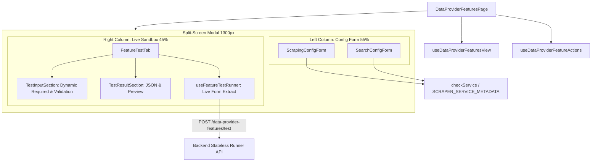

# Archive: Kiến trúc Toàn diện Dashboard Quản lý Tính năng Data Provider, Split-Screen Playground & Sandbox Engine

## 1. Problem & Core Value (Bài toán & Giá trị Cốt lõi)
- **Vấn đề (Problem)**: 
  - Trước đây, trang cấu hình tính năng `/scraping/features/:dataProviderId` bị phân mảnh giữa 2 tab "Cấu hình" và "Thử nghiệm", khiến người dùng phải chuyển tab liên tục để test khi chỉnh sửa script/selector.
  - Chế độ thử nghiệm bị chặn khi tạo mới (`isDraft`), runner chỉ đọc config tĩnh thay vì dữ liệu đang nhập trên form, đồng thời tồn tại chế độ Contextual Test lỗi thời gọi endpoint backend đã bị xóa.
  - Template hàm tìm kiếm mặc định cho API bị trỏ nhầm sang hàm scraping review, và template HTML tìm kiếm bị thừa các trường `price`/`currency` không khớp với Backend DTO `SearchResultItemDto`.
- **Giá trị (Value)**:
  - **Split-Screen 2-Column Playground Layout**: Hợp nhất form cấu hình (Cột trái 55%) và sandbox thử nghiệm (Cột phải 45%) trong cùng một viewport với thanh cuộn độc lập, giúp dev/tester chỉnh sửa và kiểm thử trực quan realtime.
  - **Live Form-Bound Testing & Cross-Form Validation**: Trích xuất trực tiếp giá trị form hiện thời (`configForm.getFieldsValue()`) khi chạy Stateless Test, tự động validate toàn bộ trường cấu hình bắt buộc trước khi bắn request test.
  - **Pure Stateless Sandbox**: Gỡ bỏ hoàn toàn `TestModeSelector` và chế độ contextual test cũ, đồng bộ cờ `required` của `testQuery` linh hoạt theo `queryPlaceholder`.
  - **Standardized Search Templates**: Cung cấp `DEFAULT_SEARCH_FUNCTION_GENERATOR` (HTML Cheerio) và `DEFAULT_SEARCH_API_FUNCTION_GENERATOR` (JSON Axios) chuẩn hóa theo schema `SearchResultItemDto` (`{ url, title, imageUrl, relativeUrl, metadata }`).

---

## 2. Key Architecture & Decisions (Kiến trúc & Quyết định Then chốt)

### 2.1 Hook Split Pattern: View vs Actions
Tách biệt triệt để logic hiển thị và logic đột biến dữ liệu:
- **`useDataProviderFeaturesView`**: Quản lý query fetching (`useCustomOne`), tab active, trạng thái modal (Setting Modal, History Modal), selected feature.
- **`useDataProviderFeatureActions`**: Quản lý các mutations (`onSwitchStatus`, `onAddFeature`, `onEditFeature`, `onDeleteFeature`).

### 2.2 Domain Enums Colocation
Colocate toàn bộ domain enums về `[dataProviderId]/enums/`:
- `feature-type.enum.ts` (`DataProviderFeatureType`: `SCRAPING`, `SEARCH`)
- `feature-status.enum.ts` (`DataProviderFeatureStatus`: `ACTIVE`, `INACTIVE`, `UNCONFIGURED`, `FAILED`)
- `scraper-service.enum.ts` (`ScraperServiceEnum`: `API = 'api'`, `LOCAL = 'local'`, `GENERIC = 'generic'`)
- `version.enum.ts` (`FeatureVersionStatus`: `ACTIVE`, `INACTIVE`, `TESTING`, `FAILED`)

### 2.3 Capability-Driven Dynamic Form Engine
- **`SCRAPER_SERVICE_METADATA`**: Registry tại `constants.ts` chứa nhãn chuẩn, templates (`defaultScrapingTemplate`, `defaultSearchTemplate`), và cờ năng lực (`hasDomSelectors`, `hasWaitForSelector`, `hasBrowserSettings`, `hasNetworkRetries`, `hasUrlPattern`, `hasSearchSelectors`).
- **`checkService(service)`**: Helper trích xuất capability flags và template tương thích cho form.

### 2.4 Split-Screen Playground & Sandbox Runner
- **`FeatureSettingModal`**: Bố cục lưới 2 cột `CustomRow` & `CustomCol` (`lg={13}` và `lg={11}`) với modal rộng `width={1300}`.
- **`useFeatureTestRunner`**: Lắng nghe `configForm`, gửi request `POST data-provider-features/test` với payload `{ type, service, config: currentValues, input }`.
- **`TestInputSection`**: Tự động disable nút "Chạy thử nghiệm" kèm `CustomTooltip` khi `functionGenerator` rỗng, đồng thời kiểm tra `isQueryRequired` dựa trên `queryPlaceholder`.

---

## 3. Scope & Key Files (Phạm vi & Tập tin Chính)
- [src/app/(root)/scraping/features/[dataProviderId]/constants.ts](file:///d:/Sources/Personal/only-one-fe/src/app/(root)/scraping/features/[dataProviderId]/constants.ts): Metadata dịch vụ, templates và `checkService`.
- [src/constants/data-provider.constant.ts](file:///d:/Sources/Personal/only-one-fe/src/constants/data-provider.constant.ts): Các template code mặc định (`DEFAULT_SEARCH_FUNCTION_GENERATOR`, `DEFAULT_SEARCH_API_FUNCTION_GENERATOR`).
- [src/app/(root)/scraping/features/[dataProviderId]/components/FeatureSettingModal/index.tsx](file:///d:/Sources/Personal/only-one-fe/src/app/(root)/scraping/features/[dataProviderId]/components/FeatureSettingModal/index.tsx): Modal 2 cột Split-Screen.
- [src/app/(root)/scraping/features/[dataProviderId]/components/FeatureSettingModal/FeatureModalHeader.tsx](file:///d:/Sources/Personal/only-one-fe/src/app/(root)/scraping/features/[dataProviderId]/components/FeatureSettingModal/FeatureModalHeader.tsx): Header hiển thị tag engine realtime qua `useWatch`.
- [src/app/(root)/scraping/features/[dataProviderId]/components/FeatureSettingModal/FeatureModalFooter.tsx](file:///d:/Sources/Personal/only-one-fe/src/app/(root)/scraping/features/[dataProviderId]/components/FeatureSettingModal/FeatureModalFooter.tsx): Footer căn lề phải cố định với danh sách version rollback.
- [src/app/(root)/scraping/features/[dataProviderId]/components/FeatureTestTab/index.tsx](file:///d:/Sources/Personal/only-one-fe/src/app/(root)/scraping/features/[dataProviderId]/components/FeatureTestTab/index.tsx): Sandbox thử nghiệm live form-bound.
- [src/app/(root)/scraping/features/[dataProviderId]/components/FeatureTestTab/TestInputSection.tsx](file:///d:/Sources/Personal/only-one-fe/src/app/(root)/scraping/features/[dataProviderId]/components/FeatureTestTab/TestInputSection.tsx): Form nhập liệu test với dynamic query validation.
- [src/app/(root)/scraping/features/[dataProviderId]/hooks/useFeatureTestRunner.ts](file:///d:/Sources/Personal/only-one-fe/src/app/(root)/scraping/features/[dataProviderId]/hooks/useFeatureTestRunner.ts): Hook thực thi test không trạng thái.

---

## 4. Verification Evidence & Quality Gates
- **TypeScript Compilation**: `npx tsc --noEmit` $\rightarrow$ **0 errors (Pass)**.
- **Lint Check**: `npx eslint "src/app/(root)/scraping/features"` $\rightarrow$ **0 errors, 0 warnings (Pass)**.
