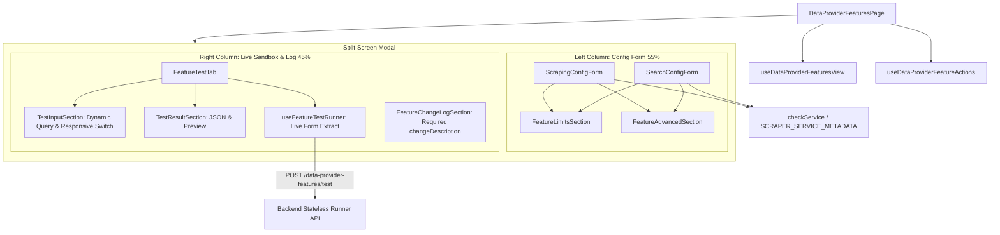

# Archive: Kiến trúc Toàn diện Dashboard Quản lý Tính năng Data Provider, Split-Screen Playground, Shared Forms & Sandbox Engine

## 1. Problem & Core Value (Bài toán & Giá trị Cốt lõi)
- **Vấn đề (Problem)**: 
  - Trước đây, trang cấu hình tính năng `/scraping/features/:dataProviderId` bị phân mảnh giữa các tab, khiến người dùng phải chuyển tab liên tục để test khi chỉnh sửa script/selector.
  - `ScrapingConfigForm` và `SearchConfigForm` từng bị trùng lặp nhiều section (Limits, Advanced, ChangeLog), trong khi Search Form thiếu các trường cấu hình nâng cao (`waitForSelector`, `userAgent`, `retryDelay`, `retryAttempts`, `stealthMode`, `cloudflareBypass`).
  - Nút switch "Test bằng HTML" bị co ép chiều rộng làm rớt từng ký tự chữ cái trên giao diện hẹp, và hiển thị không cần thiết cho API/Local scrapers.
  - Form thay đổi phiên bản (`FeatureChangeLogSection`) bị đặt sâu dưới đáy form dài và thiếu validation bắt buộc dù Backend yêu cầu.
  - Thiếu nút bật/tắt tính năng trực tiếp trên Header modal cấu hình.
- **Giá trị (Value)**:
  - **Split-Screen 2-Column Playground Layout**: Hợp nhất form cấu hình (Cột trái 55%) và sandbox thử nghiệm + change log (Cột phải 45%) trong modal rộng 1300px với thanh cuộn độc lập.
  - **Modular Shared Form Components**: Trích xuất các khối cấu hình dùng chung (`FeatureLimitsSection`, `FeatureAdvancedSection`, `FeatureChangeLogSection`) đặt tại `components/FeatureSettingModal/Shared/`.
  - **Clean Capability-Driven Selectors**: Gom `mainContentSelector`, `waitForSelector`, `userAgent` vào khối "Bộ chọn (Selectors) & Tùy chọn", tự động tối ưu giao diện 2 cột tinh gọn cho `LOCAL` engine.
  - **Live Form-Bound Testing & Responsive Sandbox**: Trích xuất trực tiếp giá trị form hiện thời khi chạy Stateless Test, tự động validate cross-form, sửa dứt điểm lỗi co ép layout nút switch HTML test và chỉ mở test HTML cho engine browser (`GENERIC`).
  - **Full Validation & Status Control**: Enforce validation bắt buộc cho `changeDescription`, chuyển ô nhập sang cột phải dưới Sandbox Test, và tích hợp Switch Bật/Tắt tính năng trực tiếp trên Header Modal.

---

## 2. Key Architecture & Decisions (Kiến trúc & Quyết định Then chốt)

### 2.1 Hook Split Pattern: View vs Actions
- **`useDataProviderFeaturesView`**: Quản lý query fetching (`useCustomOne`), tab active, trạng thái modal (Setting Modal, History Modal), selected feature.
- **`useDataProviderFeatureActions`**: Quản lý các mutations (`onSwitchStatus`, `onAddFeature`, `onEditFeature`, `onDeleteFeature`).
- **`useFeatureTestRunner`**: Lắng nghe form, trích xuất realtime input/config và dispatch test stateless endpoint.

### 2.2 Domain Enums Colocation
Colocate toàn bộ domain enums về `[dataProviderId]/enums/`:
- `feature-type.enum.ts` (`DataProviderFeatureType`: `SCRAPING`, `SEARCH`)
- `feature-status.enum.ts` (`DataProviderFeatureStatus`: `ACTIVE`, `INACTIVE`, `UNCONFIGURED`, `FAILED`)
- `scraper-service.enum.ts` (`ScraperServiceEnum`: `API = 'api'`, `LOCAL = 'local'`, `GENERIC = 'generic'`)
- `version.enum.ts` (`FeatureVersionStatus`: `ACTIVE`, `INACTIVE`, `TESTING`, `FAILED`)

### 2.3 Capability-Driven Dynamic Form Engine & Shared Components
- **`SCRAPER_SERVICE_METADATA`**: Registry tại `constants.ts` chứa nhãn chuẩn, templates (`defaultScrapingTemplate`, `defaultSearchTemplate`), và cờ năng lực (`hasDomSelectors`, `hasWaitForSelector`, `hasBrowserSettings`, `hasNetworkRetries`, `hasUrlPattern`, `hasSearchSelectors`).
- **`checkService(service)`**: Helper trích xuất capability flags tương thích cho form.
- **Shared Components**:
  - `FeatureLimitsSection`: Quản lý `maxResults`, `retryDelay`, `retryAttempts` mở rộng cho cả 3 engine.
  - `FeatureAdvancedSection`: Quản lý `stealthMode`, `cloudflareBypass`.
  - `FeatureChangeLogSection`: Quản lý `changeDescription` bắt buộc đặt tại cột phải dưới Test Tab.

### 2.4 Split-Screen Playground & Sandbox Runner
- **`FeatureSettingModal`**: Bố cục lưới 2 cột `CustomRow` & `CustomCol` (`lg={13}` và `lg={11}`) với modal rộng `width={1300}`.
- **`FeatureModalHeader`**: Hiển thị realtime engine tag và Switch Bật/Tắt trạng thái hoạt động của feature.
- **`TestInputSection`**: Giao diện responsive, tự động ẩn chế độ test HTML đối với `API` và `LOCAL` engines, căn lề và co dãn tối ưu chiều ngang.

---

## 3. Scope & Key Files (Phạm vi & Tập tin Chính)
- [constants.ts](file:///Users/kiem/Sources/PERSONAL/only-one-fe/src/app/(root)/scraping/features/[dataProviderId]/constants.ts): Metadata dịch vụ, templates và `checkService`.
- [data-provider.constant.ts](file:///Users/kiem/Sources/PERSONAL/only-one-fe/src/constants/data-provider.constant.ts): Các template code mặc định cho Scraping và Search.
- [FeatureSettingModal/index.tsx](file:///Users/kiem/Sources/PERSONAL/only-one-fe/src/app/(root)/scraping/features/[dataProviderId]/components/FeatureSettingModal/index.tsx): Modal 2 cột Split-Screen tích hợp Change Log bên phải.
- [FeatureModalHeader.tsx](file:///Users/kiem/Sources/PERSONAL/only-one-fe/src/app/(root)/scraping/features/[dataProviderId]/components/FeatureSettingModal/FeatureModalHeader.tsx): Header hiển thị tag engine và Switch Status.
- [FeatureModalFooter.tsx](file:///Users/kiem/Sources/PERSONAL/only-one-fe/src/app/(root)/scraping/features/[dataProviderId]/components/FeatureSettingModal/FeatureModalFooter.tsx): Footer căn lề với bộ chọn rollback version.
- [FeatureLimitsSection.tsx](file:///Users/kiem/Sources/PERSONAL/only-one-fe/src/app/(root)/scraping/features/[dataProviderId]/components/FeatureSettingModal/Shared/FeatureLimitsSection.tsx): Shared limits & retries section.
- [FeatureAdvancedSection.tsx](file:///Users/kiem/Sources/PERSONAL/only-one-fe/src/app/(root)/scraping/features/[dataProviderId]/components/FeatureSettingModal/Shared/FeatureAdvancedSection.tsx): Shared advanced options section.
- [FeatureChangeLogSection.tsx](file:///Users/kiem/Sources/PERSONAL/only-one-fe/src/app/(root)/scraping/features/[dataProviderId]/components/FeatureSettingModal/Shared/FeatureChangeLogSection.tsx): Shared change log section với validation rule bắt buộc.
- [FeatureTestTab/index.tsx](file:///Users/kiem/Sources/PERSONAL/only-one-fe/src/app/(root)/scraping/features/[dataProviderId]/components/FeatureTestTab/index.tsx): Sandbox thử nghiệm live form-bound.
- [TestInputSection.tsx](file:///Users/kiem/Sources/PERSONAL/only-one-fe/src/app/(root)/scraping/features/[dataProviderId]/components/FeatureTestTab/TestInputSection.tsx): Form nhập liệu test với responsive switch layout.
- [useFeatureTestRunner.ts](file:///Users/kiem/Sources/PERSONAL/only-one-fe/src/app/(root)/scraping/features/[dataProviderId]/hooks/useFeatureTestRunner.ts): Hook thực thi test không trạng thái.

---

## 4. Verification Evidence & Quality Gates
- **TypeScript Compilation**: `npx tsc --noEmit` $\rightarrow$ **0 errors (Pass)**.
- **Lint Check**: `npx eslint` $\rightarrow$ **0 errors, 0 warnings (Pass)**.
