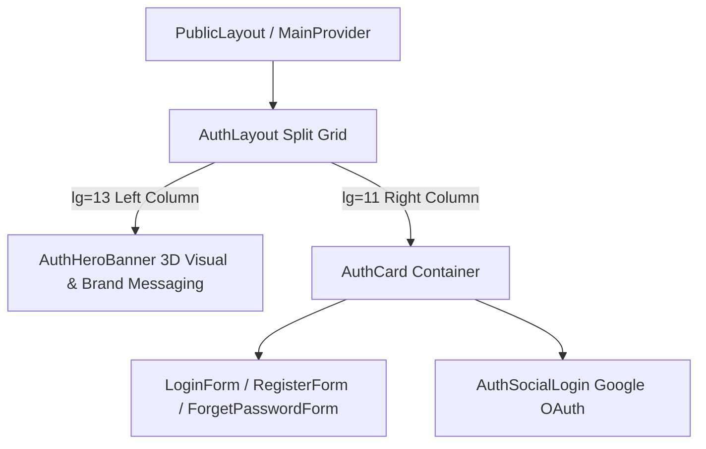
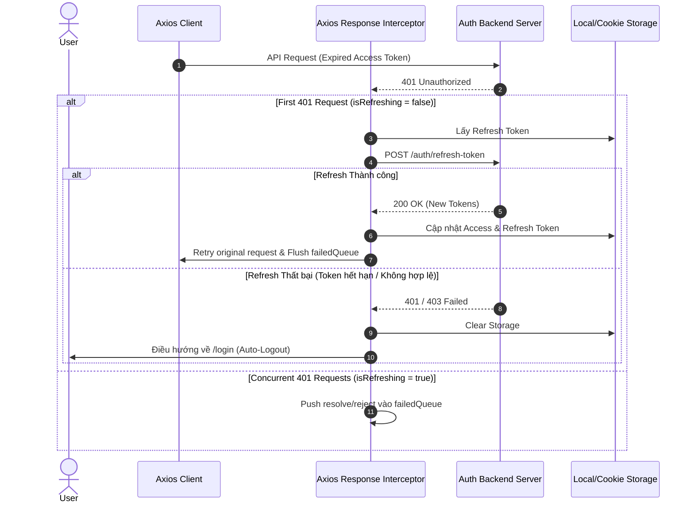

# Archive: Cổng Xác thực Người dùng, Giao diện Split-Screen AntD & Cơ chế Silent Refresh Token Auto-Logout

## 1. Problem & Core Value (Bài toán & Giá trị Cốt lõi)
- **Vấn đề (Problem)**:
  - Trước đây, các trang xác thực công khai (`/login`, `/register`, `/forget-password`) nằm trong bố cục dọc đơn điệu, thiếu tính nhận diện thương hiệu, không tối ưu cho màn hình lớn và thiếu đồng bộ với hệ thống theme Ant Design.
  - Về bảo mật phiên làm việc: Khi `accessToken` hết hạn, hệ thống trả về mã lỗi `401 Unauthorized`. Frontend không có cơ chế tự động gia hạn token ngầm (silent refresh) dẫn đến việc người dùng bị gián đoạn thao tác giữa chừng hoặc kẹt ở trạng thái lỗi dữ liệu mà không được điều hướng đăng xuất an toàn.
- **Giá trị (Value)**:
  - **Split-Screen Responsive UI**: Hiện đại hóa giao diện xác thực thành layout chia đôi màn hình 12 cột (`CustomRow`/`CustomCol` với tỷ lệ `13/11`), tích hợp visual banner 3D công nghệ cao trên desktop và tự động co giãn mượt mà trên thiết bị di động.
  - **Silent Refresh Token & Promise Queue**: Xây dựng cơ chế tự động bắt mã `401` qua Axios Response Interceptor, sử dụng cờ `isRefreshing` cùng hàng đợi `failedQueue` chống race-condition khi có nhiều request đồng thời, tự động retry request với token mới.
  - **Fallback Auto-Logout An toàn**: Tự động dọn dẹp Storage, reset session và điều hướng về trang `/login` nếu việc làm mới token thất bại.

## 2. Key Architecture & Decisions (Kiến trúc & Quyết định Then chốt)

### 2.1 Responsive Split-Screen Grid Layout
- Cấu trúc layout xác thực sử dụng hoàn toàn Ant Design primitives (`CustomRow`, `CustomCol`, `CustomFlex`, `CustomCard`, `CustomTypography`, `CustomButton`) thay thế các wrapper HTML/Tailwind ad-hoc.
- Cột trái (`lg={13}`): Hero Visual Banner (`AuthHeroBanner`) chứa nhận diện thương hiệu và value propositions.
- Cột phải (`lg={11}`): Thẻ form tương tác (`AuthCard`) chứa các form đăng nhập, đăng ký, quên mật khẩu và nút đăng nhập xã hội (`AuthSocialLogin`).

### 2.2 Axios Interceptor & Silent Refresh Token Flow
- **Interceptor bắt 401**: Lắng nghe mọi response lỗi từ API. Nếu `status === 401` và request chưa từng retry (`!originalRequest._retry`):
  - Nếu chưa có tiến trình refresh (`!isRefreshing`): Đặt cờ `isRefreshing = true`, gọi endpoint `POST /auth/refresh-token`.
  - Nếu đang có tiến trình refresh: Đẩy request hiện tại vào `failedQueue` (Promise queue).
  - Khi refresh thành công: Lưu `accessToken` mới vào Storage, resolve toàn bộ queue và retry request ban đầu.
  - Khi refresh thất bại: Reject toàn bộ queue, xóa sạch token trong Storage, kích hoạt `authProvider.logout` và chuyển hướng về `/login`.

## 3. Scope & Key Changes (Phạm vi & Thay đổi Chính)
- [src/app/(public)/_components/auth/AuthHeroBanner.tsx](file:///Users/kiem/Sources/PERSONAL/only-one-fe/src/app/(public)/_components/auth/AuthHeroBanner.tsx): Banner hình ảnh công nghệ và thông điệp giá trị.
- [src/app/(public)/_components/auth/AuthLayout.tsx](file:///Users/kiem/Sources/PERSONAL/only-one-fe/src/app/(public)/_components/auth/AuthLayout.tsx): Responsive split-screen layout grid.
- [src/app/(public)/_components/auth/AuthCard.tsx](file:///Users/kiem/Sources/PERSONAL/only-one-fe/src/app/(public)/_components/auth/AuthCard.tsx): Container thẻ xác thực chuẩn hóa `<CustomCard>`.
- [src/app/(public)/_components/auth/AuthSocialLogin.tsx](file:///Users/kiem/Sources/PERSONAL/only-one-fe/src/app/(public)/_components/auth/AuthSocialLogin.tsx): Nút đăng nhập Google OAuth.
- [src/app/(public)/login/page.tsx](file:///Users/kiem/Sources/PERSONAL/only-one-fe/src/app/(public)/login/page.tsx): Trang đăng nhập hệ thống.
- [src/app/(public)/register/page.tsx](file:///Users/kiem/Sources/PERSONAL/only-one-fe/src/app/(public)/register/page.tsx): Trang đăng ký tài khoản.
- [src/app/(public)/forget-password/page.tsx](file:///Users/kiem/Sources/PERSONAL/only-one-fe/src/app/(public)/forget-password/page.tsx): Trang yêu cầu đặt lại mật khẩu.
- [src/providers/data-provider.ts](file:///Users/kiem/Sources/PERSONAL/only-one-fe/src/providers/data-provider.ts): Axios interceptor `createSessionAxiosInstance` xử lý 401, retry queue và silent refresh.
- [src/contexts/RefineContext.tsx](file:///Users/kiem/Sources/PERSONAL/only-one-fe/src/contexts/RefineContext.tsx): Quản lý `authProvider`, điều phối vòng đời đăng nhập, đăng xuất và làm mới phiên.

## 4. Verification Evidence & PR (Bằng chứng Nghiệm thu & PR)
- **Trạng thái Test**: 100% Passed.
- **Branch**: `main` / `local`
