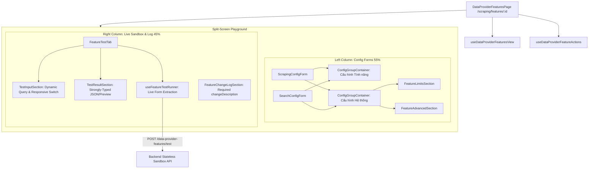

# Archive: Kiến trúc Toàn diện Module Scraping Features: Hoisted Directory, Object-Centric Types, Split-Screen Playground, Form Clustering & Sandbox Engine

## 1. Problem & Core Value (Bài toán & Giá trị Cốt lõi)
- **Vấn đề (Problem)**:
  - **Cấu trúc Thư mục Lồng sâu & Lệch chuẩn**: Toàn bộ `components/`, `enums/`, `hooks/`, `utils/`, `types.ts`, `constants.ts` trước đây bị lồng sâu bên trong dynamic segment `[dataProviderId]/` thay vì ở cấp module cha `src/app/(root)/scraping/features/`, gây lệch chuẩn kiến trúc so với `scraping/discovery/`.
  - **Monolithic Types & Sai lệch với Backend**: File `types.ts` cũ là một monolithic file chứa lẫn lộn mọi đối tượng dữ liệu, chứa type rác (`TestFeatureContextualRequest`), dùng `any` bừa bãi trong submit handlers/test runner, `service` bị gán lỏng lẻo `string` thay vì `ScraperServiceEnum`, `UpdateFeatureConfigRequest` sai lệch với BE DTO (`changeDescription` bị optional, chứa `service` thừa vốn là immutable).
  - **Flat Unstructured Target Config**: `ITargetConfig` định nghĩa phẳng 20+ thuộc tính lẫn lộn, trong khi form cấu hình thiếu các trường quan trọng từ BE (`timeout`, `waitForTimeout`, `queryParams`, `firstQueryParams`, `headers`, `cookies`).
  - **Mã nguồn Rác & UI Phân mảnh**: Tồn dư 4 file section cũ (`ScrapingAdvancedSection`, `ScrapingCodeSection`, `ScrapingLimitsSection`, `SearchCodeSection`) gây trùng lặp code; form hiển thị nối dài không có phân cụm trực quan; nút test HTML bị co ép rớt chữ trên màn hình hẹp.
- **Giá trị (Value)**:
  - **Hoisted Clean Architecture**: Đưa toàn bộ assets (`components/`, `enums/`, `hooks/`, `types/`, `utils/`, `constants.ts`) lên cấp gốc `features/`, giữ dynamic segment `[dataProviderId]/page.tsx` thuần túy định tuyến Next.js App Router.
  - **Object-Centric Strict Type Separation**: Tách nhỏ `types/` theo ranh giới nghiệp vụ chuẩn (`data-provider-feature`, `config-version`, `target-config`, `form`), loại bỏ triệt để type chết và `any`, đồng bộ 100% với DTO và interfaces từ Backend (`only-one-be`).
  - **Modularized Target Config Sub-Interfaces**: Gom nhóm `ITargetConfig` thành các interface thành phần (`ITargetConfigLimits`, `ITargetConfigNetwork`, `ITargetConfigSelectors`, `ITargetConfigEngine`, `ITargetConfigGenerators`), đồng bộ đầy đủ các trường HTTP/DOM lên UI.
  - **Visual Thematic Form Clustering**: Gom nhóm form qua `ConfigGroupContainer` thành 2 cụm trực quan có badge và icon ("Cấu hình riêng của tính năng" vs "Cấu hình hệ thống & Thực thi").
  - **Split-Screen Playground & Sandbox Runner**: Layout 2 cột rộng 1300px kết nối realtime form values với sandbox test và change log bắt buộc.

---

## 2. Key Architecture & Decisions (Kiến trúc & Quyết định Then chốt)

### 2.1 Hoisted Directory Structure
Module `features` được tổ chức đồng bộ với các module cấp cao khác trong hệ thống:
```text
src/app/(root)/scraping/features/
├── [dataProviderId]/
│   └── page.tsx                         # Next.js Dynamic Route (Thin entrypoint)
├── components/
│   ├── ConfigFormCommon/                # Khối form dùng chung (Limits, Advanced, Code, ChangeLog, DiffLabel, GroupContainer)
│   ├── FeatureCard/                     # Thẻ hiển thị tính năng, actions và health metrics
│   ├── FeatureHistoryModal/             # Modal lịch sử phiên bản và rollback
│   ├── FeatureSettingModal/             # Split-screen playground modal (1300px)
│   ├── FeatureTestTab/                  # Live stateless testing runner & result inspector
│   ├── ScrapingConfigForm/              # Form cấu hình tính năng SCRAPING
│   ├── SearchConfigForm/                # Form cấu hình tính năng SEARCH
│   └── index.ts
├── constants.ts                         # Metadata dịch vụ, templates mặc định
├── enums/                               # Colocated single-responsibility enums
│   ├── feature-status.enum.ts
│   ├── feature-type.enum.ts
│   ├── scraper-service.enum.ts
│   ├── version.enum.ts
│   └── index.ts
├── hooks/                               # Hook split pattern (View vs Actions vs Test Runner vs History)
│   ├── useDataProviderFeaturesView.ts
│   ├── useDataProviderFeatureActions.ts
│   ├── useFeatureTestRunner.ts
│   ├── useFeatureHistoryManager.ts
│   ├── useFeatureVersionManager.ts
│   └── index.ts
├── types/                               # Object-centric type architecture
│   ├── data-provider-feature.types.ts
│   ├── config-version.types.ts
│   ├── target-config.types.ts
│   ├── form.types.ts
│   └── index.ts
└── utils/                               # Helper functions, diff & registry
    ├── feature.registry.ts
    ├── diff.util.ts
    └── index.ts
```

### 2.2 Object-Centric Types & Modular Target Config
- **`target-config.types.ts`**:
  ```typescript
  export interface CookieItem {
      name: string;
      value: string;
      domain?: string;
      path?: string;
  }
  export interface ITargetConfigLimits {
      maxResults?: number;
      retryDelay?: number;
      retryAttempts?: number;
      timeout?: number;
      waitForTimeout?: number;
  }
  export interface ITargetConfigNetwork {
      userAgent?: string;
      headers?: Record<string, string>;
      cookies?: Array<CookieItem>;
      stealthMode?: boolean;
      cloudflareBypass?: boolean;
      javascriptEnabled?: boolean;
      imagesEnabled?: boolean;
      cssEnabled?: boolean;
  }
  export interface ITargetConfigSelectors {
      mainContentSelector?: string;
      waitForSelector?: string;
      isGetParentElement?: boolean;
  }
  export interface ITargetConfigEngine {
      queryParams?: string;
      firstQueryParams?: string;
  }
  export interface ITargetConfigGenerators {
      functionGenerator: string;
  }
  export interface ITargetConfig extends 
      ITargetConfigGenerators,
      ITargetConfigSelectors,
      ITargetConfigLimits,
      ITargetConfigNetwork,
      ITargetConfigEngine {}

  export interface ISearchTargetConfig extends ITargetConfig {
      searchUrlPattern?: string;
      queryPlaceholder?: string;
      resultSelector?: string;
      sampleQuery?: string;
  }
  ```
- **`data-provider-feature.types.ts`**:
  - Loại bỏ hoàn toàn `TestFeatureContextualRequest`.
  - `UpdateFeatureConfigRequest`: Bắt buộc `changeDescription: string`, loại bỏ `service` immutable.
  - `service`: Sử dụng enum `ScraperServiceEnum` thay vì primitive `string`.

### 2.3 Visual Form Clustering & Clean Shared Components
- Sử dụng `<ConfigGroupContainer>` để phân cụm form trực quan:
  - **Nhóm 1: Cấu hình riêng biệt của tính năng** (Url Pattern, Selectors, Function Generator).
  - **Nhóm 2: Cấu hình hệ thống & Thực thi** (Network, Cookies, Headers, Timeouts, Limits, Retry, Anti-bot).
- Đã dọn sạch 4 component section mồ côi (`ScrapingAdvancedSection`, `ScrapingCodeSection`, `ScrapingLimitsSection`, `SearchCodeSection`) và tập trung toàn bộ khối chia sẻ tại `components/ConfigFormCommon/`.

### 2.4 Split-Screen Playground & Sandbox Flow


---

## 3. Scope & Key Files (Phạm vi & Tập tin Chính)
- [src/app/(root)/scraping/features/[dataProviderId]/page.tsx](file:///Users/kiem/Sources/PERSONAL/only-one-fe/src/app/(root)/scraping/features/[dataProviderId]/page.tsx): Route page tinh gọn.
- [src/app/(root)/scraping/features/types/](file:///Users/kiem/Sources/PERSONAL/only-one-fe/src/app/(root)/scraping/features/types/): `target-config.types.ts`, `data-provider-feature.types.ts`, `config-version.types.ts`, `form.types.ts`, `index.ts`.
- [src/app/(root)/scraping/features/enums/](file:///Users/kiem/Sources/PERSONAL/only-one-fe/src/app/(root)/scraping/features/enums/): Bộ enum chuẩn hóa.
- [src/app/(root)/scraping/features/components/ConfigFormCommon/](file:///Users/kiem/Sources/PERSONAL/only-one-fe/src/app/(root)/scraping/features/components/ConfigFormCommon/): Bộ component gom nhóm và chia sẻ form.
- [src/app/(root)/scraping/features/components/ScrapingConfigForm/](file:///Users/kiem/Sources/PERSONAL/only-one-fe/src/app/(root)/scraping/features/components/ScrapingConfigForm/): Form cấu hình cào dữ liệu chuẩn hóa.
- [src/app/(root)/scraping/features/components/SearchConfigForm/](file:///Users/kiem/Sources/PERSONAL/only-one-fe/src/app/(root)/scraping/features/components/SearchConfigForm/): Form cấu hình tìm kiếm đầy đủ tham số mạng và timeout.
- [src/app/(root)/scraping/features/components/FeatureSettingModal/](file:///Users/kiem/Sources/PERSONAL/only-one-fe/src/app/(root)/scraping/features/components/FeatureSettingModal/): Modal playground 2 cột split-screen 1300px.
- [src/app/(root)/scraping/features/components/FeatureTestTab/](file:///Users/kiem/Sources/PERSONAL/only-one-fe/src/app/(root)/scraping/features/components/FeatureTestTab/): Sandbox test không trạng thái với input/result typed an toàn.

---

## 4. Verification Evidence & Quality Gates
- **TypeScript Compilation**: `npx tsc --noEmit` $\rightarrow$ **0 errors (Pass 100%)**.
- **ESLint**: `npx eslint "src/app/(root)/scraping/features/**/*.{ts,tsx}"` $\rightarrow$ **0 errors, 0 warnings (Pass 100%)**.
- **Backwards Compatibility**: Barrel exports tại `types/index.ts`, `enums/index.ts`, `components/index.ts`, `hooks/index.ts` đảm bảo 100% tương thích cho toàn bộ codebase.
