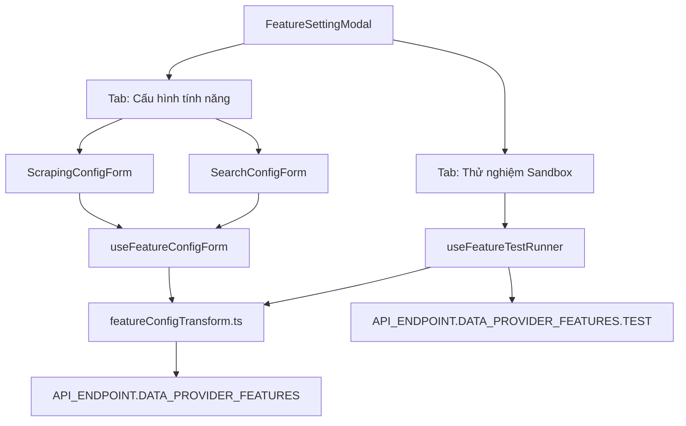

# Archive: Kiến trúc Toàn diện Module Scraping Features: Hoisted Directory, Object-Centric Types, Modal-Level Tabs, Form Hooks & Centralized Transformers

## 1. Problem & Core Value (Bài toán & Giá trị Cốt lõi)

- **Vấn đề (Problem)**:
  - **Mã nguồn lặp lại & Boilerplate cao**: `ScrapingConfigForm` và `SearchConfigForm` từng lặp lại 85-90% logic khởi tạo form (`useEffect` mapping 18+ trường), chuyển template code (`handleServiceChange`), và lưu mutation (`handleSave`).
  - **Lệch chuẩn Endpoint & Raw String Hardcoding**: Các thao tác `switch-status`, `test`, `by-provider` từng dùng raw string URL thay vì định nghĩa tập trung trong `API_ENDPOINT`.
  - **Lệch Schema Dữ liệu Test Sandbox**: Khi người dùng nhập chuỗi JSON `headers` hoặc `cookies` trong form cấu hình, test runner từng đọc raw string gửi lên API `/test` mà không qua parser `safeParseJson`.
  - **UI chật hẹp & Tab con lồng ghép**: Form cấu hình từng bị chia nhỏ thành nhiều tab con hoặc chia đôi cột ngang chật hẹp, khiến Monaco Editor bị thu hẹp diện tích.
- **Giá trị (Value)**:
  - **Hoisted Clean Architecture**: Đưa toàn bộ assets (`components/`, `enums/`, `hooks/`, `types/`, `utils/`, `constants.ts`) lên cấp gốc `features/`, giữ dynamic segment `[dataProviderId]/page.tsx` thuần túy định tuyến Next.js App Router.
  - **Modal-Level Tabs & Wide Form Flow**: Modal cấu hình có 2 tab cấp cao (`Cấu hình tính năng` rộng 1300px vs `Thử nghiệm Sandbox`), các section trong form được bọc card phân định rõ ràng.
  - **Centralized Form Lifecycle Hook (`useFeatureConfigForm`)**: Đóng gói toàn bộ logic khởi tạo, chuyển service template, mutation saving, loading state và toast notification. Giảm hơn 70% boilerplate trong các file form.
  - **Unified Data Transformers (`featureConfigTransform.ts`)**: Tách các hàm pure functions an toàn (`safeParseJson`, `mapConfigToBaseFormValues`, `extractTargetConfigFromFormValues`, `buildFeatureMutationPayload`, `createDefaultDraftFeature`). Đảm bảo `headers` và `cookies` luôn được parse an toàn trước khi lưu hoặc chạy sandbox test.
  - **100% Typed Endpoints**: Bổ sung `API_ENDPOINT.DATA_PROVIDER_FEATURES.SWITCH_STATUS` và đồng bộ toàn bộ endpoint calls qua `@/config`.

---

## 2. Key Architecture & Decisions (Kiến trúc & Quyết định Then chốt)

### 2.1 Directory Structure
```text
src/app/(root)/scraping/features/
├── [dataProviderId]/
│   └── page.tsx                         # Next.js Dynamic Route (Thin entrypoint)
├── components/
│   ├── ConfigFormCommon/                # Khối form dùng chung (Limits, Advanced, Code, Section Container)
│   ├── FeatureCard/                     # Thẻ hiển thị tính năng, actions và health metrics
│   ├── FeatureHistoryModal/             # Modal lịch sử phiên bản và rollback
│   ├── FeatureSettingModal/             # Modal-level tabs ('config' | 'test') với cross-tab validation
│   ├── FeatureTestTab/                  # Live stateless testing runner & result inspector
│   ├── ScrapingConfigForm/              # Form cấu hình tính năng SCRAPING (Gọn nhẹ qua hook)
│   ├── SearchConfigForm/                # Form cấu hình tính năng SEARCH (Gọn nhẹ qua hook)
│   └── index.ts
├── constants.ts                         # Metadata dịch vụ, templates mặc định
├── enums/                               # Colocated single-responsibility enums
│   ├── feature-status.enum.ts
│   ├── feature-type.enum.ts
│   ├── scraper-service.enum.ts
│   ├── version.enum.ts
│   └── index.ts
├── hooks/                               # Domain React Hooks
│   ├── useDataProviderFeatureActions.ts # Quản lý modal switch status, open draft/existing
│   ├── useDataProviderFeaturesView.ts   # Query data provider & features list
│   ├── useFeatureConfigForm.ts          # Form lifecycle & mutation save hook
│   ├── useFeatureHistoryManager.ts      # Rollback & inspect config versions
│   ├── useFeatureTestRunner.ts          # Sandbox live execution runner
│   ├── useFeatureVersionManager.ts      # Modal version management state
│   └── index.ts
├── types/                               # Object-Centric Strict Type Definitions
│   ├── config-version.types.ts
│   ├── data-provider-feature.types.ts
│   ├── form.types.ts                    # Form props, values, hook options & test results
│   ├── target-config.types.ts           # Modularized TargetConfig sub-interfaces
│   └── index.ts
└── utils/                               # Pure Domain Utilities
    ├── diff.util.ts                     # Monaco JSON diff comparator
    ├── feature.registry.ts              # Feature type metadata & dynamic component registry
    ├── featureConfigTransform.ts        # Data mappers, safe JSON parser, draft factory & payload builder
    └── index.ts
```

### 2.2 Data Flow & Form Lifecycle



---

## 3. Scope & Key Changes (Phạm vi & Thay đổi Chính)

- [src/config/endpoint.ts](file:///Users/kiem/Sources/PERSONAL/only-one-fe/src/config/endpoint.ts): Bổ sung `API_ENDPOINT.DATA_PROVIDER_FEATURES.SWITCH_STATUS`.
- [src/app/(root)/scraping/features/utils/featureConfigTransform.ts](file:///Users/kiem/Sources/PERSONAL/only-one-fe/src/app/(root)/scraping/features/utils/featureConfigTransform.ts): Thêm `extractTargetConfigFromFormValues`, `createDefaultDraftFeature`, `safeParseJson`, `mapConfigToBaseFormValues`, `buildFeatureMutationPayload`.
- [src/app/(root)/scraping/features/hooks/useFeatureConfigForm.ts](file:///Users/kiem/Sources/PERSONAL/only-one-fe/src/app/(root)/scraping/features/hooks/useFeatureConfigForm.ts): Custom hook quản lý toàn bộ vòng đời form, mapping default values, handling service changes, và mutation save.
- [src/app/(root)/scraping/features/hooks/useDataProviderFeatureActions.ts](file:///Users/kiem/Sources/PERSONAL/only-one-fe/src/app/(root)/scraping/features/hooks/useDataProviderFeatureActions.ts): Đồng bộ typed `API_ENDPOINT.DATA_PROVIDER_FEATURES.SWITCH_STATUS` và dùng `createDefaultDraftFeature`.
- [src/app/(root)/scraping/features/hooks/useFeatureTestRunner.ts](file:///Users/kiem/Sources/PERSONAL/only-one-fe/src/app/(root)/scraping/features/hooks/useFeatureTestRunner.ts): Tái sử dụng `extractTargetConfigFromFormValues` để parse headers/cookies trước khi gửi tới `API_ENDPOINT.DATA_PROVIDER_FEATURES.TEST`.
- [src/app/(root)/scraping/features/components/ScrapingConfigForm/index.tsx](file:///Users/kiem/Sources/PERSONAL/only-one-fe/src/app/(root)/scraping/features/components/ScrapingConfigForm/index.tsx): Refactor sử dụng `useFeatureConfigForm`, giảm từ 207 dòng xuống ~70 dòng.
- [src/app/(root)/scraping/features/components/SearchConfigForm/index.tsx](file:///Users/kiem/Sources/PERSONAL/only-one-fe/src/app/(root)/scraping/features/components/SearchConfigForm/index.tsx): Refactor sử dụng `useFeatureConfigForm`, giảm từ 215 dòng xuống ~75 dòng.

---

## 4. Verification Evidence & Ground Truth Check (Bằng chứng Nghiệm thu)

- **TypeScript Compilation**: `npx tsc --noEmit` $\rightarrow$ 100% Passed (0 errors).
- **ESLint**: `npx eslint` $\rightarrow$ 100% Passed (0 errors, 0 warnings).
- **Next.js Production Build**: `npm run build` (Turbopack) $\rightarrow$ 100% Passed (Compiled in 5.8s, 28/28 static pages generated).
- **Ground Truth Consistency**: Toàn bộ symbol, types, endpoints và utility functions đã được kiểm chứng trực tiếp trên mã nguồn hoạt động.
