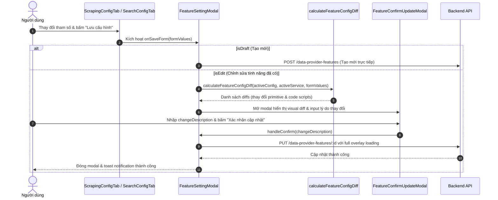

# Archive: Kiến Trúc Toàn Diện Module Scraping Features: Hoisted Assets, Base CustomModal Loading, Visual Diff Confirmation & Opt-in Config Switches

## 1. Problem & Core Value (Bài toán & Giá trị Cốt lõi)

### Problem (Vấn đề)
- **Mã nguồn lặp lại & Boilerplate cao**: `ScrapingConfigForm` và `SearchConfigForm` từng lặp lại logic khởi tạo form (`useEffect` mapping 18+ trường), chuyển template code (`handleServiceChange`), và lưu mutation.
- **Trạng thái Loading Rời Rạc & Boilerplate Custom CSS**: Các modal phải tự bọc `modalRender` kèm CSS overrides để hiển thị overlay loading thay vì có sẵn prop ở base primitive [CustomModal](file:///Users/kiem/Sources/PERSONAL/only-one-fe/src/components/custom-antd/custom-modal/index.tsx).
- **Thiếu Bước Review Diff Trước Khi Cập Nhật**: Khi lưu cấu hình feature đã vận hành, form submit trực tiếp mà không hiển thị bảng so sánh (visual diff) những trường bị thay đổi so với active config, dễ gây đột biến không kiểm soát.
- **Cho Phép Thay Đổi Engine Đang Vận Hành**: Dropdown `Service Engine` từng mở ở mode Edit khiến người dùng vô tình đổi engine làm hỏng template script và capability matrix.
- **Khối Editor Quá Tải**: Khối `headers` và `cookies` luôn render `CodeDisplay` kích thước lớn chiếm diện tích form kể cả khi không dùng.

### Value (Giá trị Đạt được)
- **Hoisted Clean Architecture**: Đưa toàn bộ assets (`components/`, `enums/`, `hooks/`, `types/`, `utils/`, `constants.ts`) lên cấp gốc `features/`, giữ dynamic segment `[dataProviderId]/page.tsx` thuần túy định tuyến Next.js App Router.
- **Base Modal Loading Integration**: Chuẩn hóa prop `loading`, `spinning`, `loadingTip` trực tiếp vào [CustomModal](file:///Users/kiem/Sources/PERSONAL/only-one-fe/src/components/custom-antd/custom-modal/index.tsx), loại bỏ hoàn toàn các đoạn code `modalRender` cồng kềnh.
- **Visual Diff Confirmation Flow**: Tích hợp [FeatureConfirmUpdateModal](file:///Users/kiem/Sources/PERSONAL/only-one-fe/src/app/(root)/scraping/features/components/FeatureConfirmUpdateModal/index.tsx) ở cấp [FeatureSettingModal](file:///Users/kiem/Sources/PERSONAL/only-one-fe/src/app/(root)/scraping/features/components/FeatureSettingModal/index.tsx), tự động tính toán sai khác qua `lodash` (`isEqual`) và hiển thị so sánh code diff qua [CodeDisplay](file:///Users/kiem/Sources/PERSONAL/only-one-fe/src/components/common/display/code-display/CodeDisplay.tsx) trước khi gửi mutation lên backend.
- **Locked Service Engine in Edit Mode**: Tự động vô hiệu hóa dropdown `Service Engine` khi chỉnh sửa feature đã có ID hoặc khi xem lịch sử; chỉ cho phép chọn khi tạo mới (Draft mode).
- **Opt-in Switches for Advanced Headers & Cookies**: Trang bị `CustomSwitch` cho Headers và Cookies trong [FeatureAdvancedSection](file:///Users/kiem/Sources/PERSONAL/only-one-fe/src/app/(root)/scraping/features/components/ConfigFormCommon/FeatureAdvancedSection.tsx), thu gọn form khi không dùng và tự động khôi phục nội dung từ cache khi bật lại.

---

## 2. Key Architecture & Decisions (Kiến trúc & Quyết định Then chốt)

### 2.1 Cấu trúc Thư mục Toàn diện
```text
src/app/(root)/scraping/features/
├── [dataProviderId]/
│   └── page.tsx                         # Next.js Dynamic Route (Thin entrypoint)
├── components/
│   ├── ConfigFormCommon/                # Khối form dùng chung (Limits, Advanced, Code, Section Container)
│   ├── FeatureCardDetail/               # Thẻ hiển thị tính năng, actions, loading switch và health metrics
│   ├── FeatureConfirmUpdateModal/       # Modal Review Changes & Diff Confirmation với CodeDisplay
│   ├── FeatureHistoryModal/             # Modal lịch sử phiên bản và rollback
│   ├── FeatureSettingModal/             # Modal-level tabs ('config' | 'test') với CustomModal loading
│   ├── FeatureTestTab/                  # Live stateless testing runner & result inspector
│   ├── ScrapingConfigTab/               # Form cấu hình tính năng SCRAPING (Gọn nhẹ qua hook)
│   ├── SearchConfigTab/                 # Form cấu hình tính năng SEARCH (Gọn nhẹ qua hook)
│   └── index.ts
├── constants.ts                         # Metadata dịch vụ, templates mặc định
├── enums/                               # Colocated single-responsibility enums
│   ├── feature-status.enum.ts
│   ├── feature-type.enum.ts
│   ├── scraper-service.enum.ts
│   └── index.ts
├── hooks/
│   ├── useFeatureActions.ts             # Quản lý hành động CRUD, switch status với switchingFeatureId state
│   ├── useFeatureConfigForm.ts          # Quản lý form lifecycle, submit async mutation an toàn
│   ├── useFeatureHistory.ts             # Quản lý lịch sử và rollback phiên bản cấu hình
│   ├── useFeatureModalController.ts     # Centralized coordinator tổng hợp 100% modal loading overlay
│   ├── useFeatureTestRunner.ts          # Quản lý stateless execution sandbox
│   ├── useFeaturesView.ts               # Quản lý view state và tabs
│   └── index.ts
├── types/                               # Object-centric interface boundaries
│   ├── config-version.types.ts
│   ├── data-provider-feature.types.ts
│   ├── form.types.ts
│   ├── target-config.types.ts
│   └── index.ts
└── utils/
    ├── difference-text.ts               # Pure string difference utility
    ├── feature-config-transform.ts      # Pure data transformers & JSON parser
    ├── feature-diff.ts                  # Lodash-driven diff calculation & metadata mapping
    ├── feature-registry.ts              # Feature registry definitions
    └── index.ts
```

### 2.2 Sơ đồ Luồng Cập Nhật Cấu Hình & Review Changes


---

## 3. Scope & Key Changes (Phạm vi & Thay đổi Chính)

- [custom-modal/index.tsx](file:///Users/kiem/Sources/PERSONAL/only-one-fe/src/components/custom-antd/custom-modal/index.tsx): Thêm prop `loading`, `spinning`, `loadingTip` và bọc toàn bộ modal dialog bằng `CustomSpin` khi loading.
- [FeatureConfirmUpdateModal/index.tsx](file:///Users/kiem/Sources/PERSONAL/only-one-fe/src/app/(root)/scraping/features/components/FeatureConfirmUpdateModal/index.tsx): Xây dựng modal review diff trước khi mutate.
- [feature-diff.ts](file:///Users/kiem/Sources/PERSONAL/only-one-fe/src/app/(root)/scraping/features/utils/feature-diff.ts): Xây dựng hàm tính toán sai khác `calculateFeatureConfigDiff` dựa trên `lodash` (`isEqual`, `isNil`, `isBoolean`).
- [FeatureSettingModal/index.tsx](file:///Users/kiem/Sources/PERSONAL/only-one-fe/src/app/(root)/scraping/features/components/FeatureSettingModal/index.tsx): Tích hợp luồng mở modal confirm và gom toàn bộ loading vào `loading={isGlobalLoading}`.
- [ScrapingBasicSection.tsx](file:///Users/kiem/Sources/PERSONAL/only-one-fe/src/app/(root)/scraping/features/components/ScrapingConfigTab/ScrapingBasicSection.tsx) & [SearchUrlPatternSection.tsx](file:///Users/kiem/Sources/PERSONAL/only-one-fe/src/app/(root)/scraping/features/components/SearchConfigTab/SearchUrlPatternSection.tsx): Vô hiệu hóa `CustomSelect` Service Engine ở mode edit.
- [FeatureAdvancedSection.tsx](file:///Users/kiem/Sources/PERSONAL/only-one-fe/src/app/(root)/scraping/features/components/ConfigFormCommon/FeatureAdvancedSection.tsx): Bổ sung `CustomSwitch` cho Headers và Cookies kèm cơ chế cache phục hồi.

---

## 4. Verification Evidence & PR (Bằng chứng Nghiệm thu & PR)
- **Trạng thái Typecheck**: `npx tsc --noEmit` $\rightarrow$ PASS (100% type-safe).
- **Trạng thái Lint**: `npm run lint:fix` $\rightarrow$ PASS (0 lint warnings/errors).
