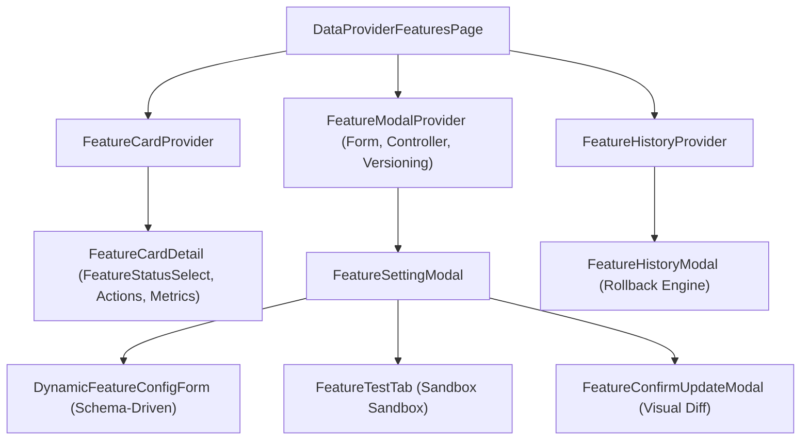

# Archive: Kiến Trúc Toàn Diện Module Scraping Features: Schema-Driven Form, Context Mesh, Multi-State Lifecycle & Visual Diff

## 1. Problem & Core Value (Bài toán & Giá trị Cốt lõi)

### Problem (Vấn đề)
- **Props Drilling & Phân mảnh State**: Logic điều khiển modal, test runner, và version history từng bị truyền thủ công qua 8–10 props qua nhiều tầng components (`FeatureSettingModal` $\rightarrow$ `ScrapingConfigTab` $\rightarrow$ Sections), gây boilerplate lớn và khó bảo trì.
- **Hardcoded JSX Form Sections**: Cấu trúc các trường cấu hình cào dữ liệu và tìm kiếm từng bị hardcode phân tán trong 7+ files JSX, gây trùng lặp validation rules và khó mở rộng khi bổ sung Service Engine mới.
- **Switch Nhị Phân Che Giấu Vòng Đời Máy Trạng Thái**: `CustomSwitch` (Bật/Tắt) chỉ cho phép đảo giữa `READY` và `DISABLED`, làm mất khả năng chuyển đổi chủ động sang `TESTING` hoặc xử lý khi gặp `ERROR`.
- **Thiếu Bước Review Diff Trước Khi Cập Nhật**: Cấu hình đang vận hành từng bị submit trực tiếp mà không hiển thị bảng so sánh (visual diff), dễ gây đột biến ngoài ý muốn.

### Value (Giá trị Đạt được)
- **Context Mesh Architecture**: Đóng gói trạng thái theo miền chuyên biệt với 4 Contexts trực quan:
  - `FeatureModalContext`: Điều khiển toàn bộ vòng đời modal, form instance, versioning, và loading overlay.
  - `FeatureCardContext`: Cung cấp metadata registry, computed health flags và trigger switch status cho từng thẻ.
  - `FeatureHistoryContext`: Đóng gói danh sách phiên bản và luồng rollback.
  - `FeatureTestContext`: Quản lý runtime execution sandbox và dynamic query placeholders.
- **Schema-Driven Form Architecture**: Khai báo cấu trúc form (`sections`, `fields`, `rules`, `gridSpan`, `visibleWhen`) tập trung tại `constants/`, sử dụng `DynamicFeatureConfigForm` để render đồng nhất mọi widget (`text`, `select`, `switch`, `code_editor`, `json_toggle_editor`).
- **Multi-State Lifecycle Control**: Trang bị `FeatureStatusSelect` tại cả `FeatureCardHeader` và `FeatureModalHeader`, hỗ trợ kiểm soát chính xác 5 trạng thái (`READY`, `TESTING`, `DISABLED`, `ERROR`, `UNCONFIGURED`).
- **Visual Diff Confirmation Flow**: Tích hợp `FeatureConfirmUpdateModal` tự động tính toán sai khác qua `lodash` (`isEqual`) và hiển thị visual code diff trước khi lưu cấu hình.

---

## 2. Key Architecture & Decisions (Kiến trúc & Quyết định Then chốt)

### 2.1 Cấu trúc Thư mục Chuẩn (Ground Truth Codebase)
```text
src/app/(root)/scraping/features/
├── [dataProviderId]/
│   └── page.tsx                         # Next.js Dynamic Route (Thin entrypoint)
├── components/
│   ├── ConfigFormCommon/                # Dynamic Schema Form Renderer & FormDiffLabel
│   │   ├── DynamicFeatureConfigForm.tsx
│   │   ├── DynamicFormField/
│   │   ├── DynamicFormSection.tsx
│   │   └── FormDiffLabel.tsx
│   ├── FeatureCardDetail/               # Card dashboard, actions, status select, health metrics
│   │   ├── FeatureCardActions.tsx
│   │   ├── FeatureCardHeader.tsx
│   │   ├── FeatureHealthMetrics.tsx
│   │   └── index.tsx
│   ├── FeatureConfirmUpdateModal/       # Visual Diff & Change Reason Modal
│   ├── FeatureHistoryModal/             # Version History Inspector & Rollback
│   ├── FeatureSettingModal/             # Config & Test Playground Modal
│   │   ├── FeatureModalHeader.tsx
│   │   ├── FeatureModalFooter.tsx
│   │   ├── ScrapingConfigTab.tsx
│   │   ├── SearchConfigTab.tsx
│   │   └── index.tsx
│   ├── FeatureTestTab/                  # Stateless Sandbox Test Runner
│   ├── FeatureStatusSelect.tsx          # Status Badge / Dropdown Select Component
│   └── index.ts
├── constants/                           # Schema Single Source of Truth & Metadata
│   ├── common.constants.ts
│   ├── feature-form.constants.ts
│   ├── feature-status.constants.ts
│   ├── scraping.constants.ts
│   ├── search.constants.ts
│   └── index.ts
├── context/                             # Modular Context Mesh
│   ├── FeatureCardContext.tsx
│   ├── FeatureHistoryContext.tsx
│   ├── FeatureModalContext.tsx
│   ├── FeatureTestContext.tsx
│   └── index.ts
├── enums/                               # Colocated Enums with Barrel Export
│   ├── config-version.enum.ts
│   ├── feature-form.enum.ts
│   ├── feature-status.enum.ts
│   ├── feature-type.enum.ts
│   ├── scraper-service.enum.ts
│   └── index.ts
├── hooks/                               # Context-Aware Hooks & Coordinators
│   ├── useFeatureActions.ts
│   ├── useFeatureConfigForm.ts
│   ├── useFeatureHistory.ts
│   ├── useFeatureModalController.ts
│   ├── useFeatureTestRunner.ts
│   ├── useFeaturesView.ts
│   └── index.ts
├── types/                               # Object-Centric Interfaces
│   ├── config-version.types.ts
│   ├── data-provider-feature.types.ts
│   ├── feature-form.types.ts
│   ├── target-config.types.ts
│   └── index.ts
└── utils/                               # Pure Transformers & Diff Calculator
    ├── difference-text.ts
    ├── feature-config-transform.ts
    ├── feature-diff.ts
    └── index.ts
```

### 2.2 Sơ đồ Luồng Vận Hành State & Context Mesh


---

## 3. Scope & Key Changes (Phạm vi & Thay đổi Chính)

- [FeatureStatusSelect.tsx](file:///Users/kiem/Sources/PERSONAL/only-one-fe/src/app/(root)/scraping/features/components/FeatureStatusSelect.tsx): Component điều khiển trạng thái đa pha, mapping trực tiếp với backend `switchStatus` endpoint.
- [DynamicFeatureConfigForm.tsx](file:///Users/kiem/Sources/PERSONAL/only-one-fe/src/app/(root)/scraping/features/components/ConfigFormCommon/DynamicFeatureConfigForm.tsx): Bộ renderer tự động hóa form theo schema metadata.
- [feature-diff.ts](file:///Users/kiem/Sources/PERSONAL/only-one-fe/src/app/(root)/scraping/features/utils/feature-diff.ts): Thuật toán so sánh diff trực tiếp trên cấu hình `ITargetConfig`.
- [FeatureModalContext.tsx](file:///Users/kiem/Sources/PERSONAL/only-one-fe/src/app/(root)/scraping/features/context/FeatureModalContext.tsx): Quản lý tập trung vòng đời modal cấu hình và testing.
- [FeatureCardContext.tsx](file:///Users/kiem/Sources/PERSONAL/only-one-fe/src/app/(root)/scraping/features/context/FeatureCardContext.tsx): Đóng gói state hiển thị và mutation status của từng card.

---

## 4. Verification Evidence & PR (Bằng chứng Nghiệm thu & PR)
- **TypeScript Strict Check**: `npx tsc --noEmit` $\rightarrow$ PASS (0 type errors).
- **ESLint & Prettier**: `npx eslint "src/app/(root)/scraping/features/**/*.{ts,tsx}"` $\rightarrow$ PASS (0 warnings/errors).
