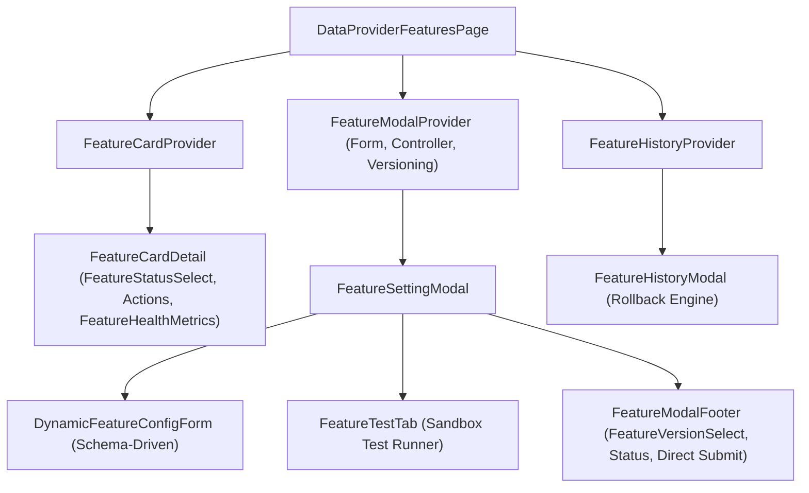

# Archive: Kiến Trúc Toàn Diện Module Scraping Features: Schema-Driven Form, Context Mesh, Version Management & Health Metrics

## 1. Problem & Core Value (Bài toán & Giá trị Cốt lõi)

### Problem (Vấn đề)
- **Props Drilling & Phân mảnh State**: Logic điều khiển modal, test runner, và version history từng bị truyền thủ công qua 8–10 props qua nhiều tầng components, gây boilerplate lớn và khó bảo trì.
- **Hardcoded JSX Form Sections & Lệch Schema**: Cấu trúc các trường cấu hình cào dữ liệu và tìm kiếm từng bị hardcode phân tán trong 7+ files JSX, gây trùng lặp validation rules, thiếu sót thuộc tính kế thừa (ví dụ `mainContentSelector` trong Search Feature) và lỗi form không fill được dữ liệu từ API.
- **Switch Nhị Phân & Chuyển Đổi Trạng Thái Không Kiểm Soát**: `CustomSwitch` (Bật/Tắt) che giấu vòng đời máy trạng thái 5 trạng thái (`READY`, `TESTING`, `DISABLED`, `ERROR`, `UNCONFIGURED`), không ràng buộc ma trận chuyển đổi FSM với Backend `switchStatus`.
- **Thao tác Phiên bản & Modal Xác nhận Rườm rà**: Trước đây việc submit form yêu cầu qua modal trung gian xác nhận `FeatureConfirmUpdateModal` với nhập liệu thủ công; footer modal sử dụng select form input thô kệch; và trạng thái cache query phiên bản từng bị stale do eager locking state.

### Value (Giá trị Đạt được)
- **Context Mesh Architecture**: Đóng gói trạng thái theo miền chuyên biệt với 4 Contexts:
  - `FeatureModalContext`: Điều khiển toàn bộ vòng đời modal, form instance, versioning, và loading overlay.
  - `FeatureCardContext`: Cung cấp metadata registry, computed health flags và trigger switch status cho từng thẻ.
  - `FeatureHistoryContext`: Đóng gói danh sách phiên bản và luồng rollback.
  - `FeatureTestContext`: Quản lý runtime execution sandbox và dynamic query placeholders.
- **Schema-Driven Form Architecture & Full Type Sync**:
  - Khai báo cấu trúc form (`sections`, `fields`, `rules`, `gridSpan`, `visibleWhen`) tập trung tại `constants/` (`scraping-config.constants.ts`, `search-config.constants.ts`).
  - Đồng bộ 100% trường giữa `target-config.types.ts` và UI schema.
  - Tự động hóa trích xuất giá trị mặc định (`getDefaultFormValuesFromSections`) và map dữ liệu form linh hoạt (`mapConfigToBaseFormValues`).
- **Tự động sinh Change Description & 1-Step Form Save**:
  - Loại bỏ hoàn toàn modal xác nhận trung gian `FeatureConfirmUpdateModal`.
  - Tự động tính toán diffs cấu hình và sinh mô tả thay đổi định dạng chuẩn qua `generateAutoChangeDescription` để gửi kèm payload mutation.
- **Quản lý Phiên bản Hiện đại & Tự động Làm tươi (Fresh Cache)**:
  - `FeatureVersionSelect`: Dropdown trigger badge hiện đại hiển thị phiên bản active và lịch sử các phiên bản với xác nhận rollback trực quan.
  - Loại bỏ eager locking `selectedVersionId`, kích hoạt auto-refetch khi mở modal và sau khi lưu thành công, đảm bảo UI luôn phản ánh dữ liệu mới nhất.
- **Health Metrics 2x2 Grid**: Hiển thị trực quan sức khỏe feature qua 4 tile chỉ số (Tình trạng, Lỗi liên tiếp, Chạy OK cuối, Chạy lỗi cuối) và banner cảnh báo lỗi sắc nét.

---

## 2. Key Architecture & Decisions (Kiến trúc & Quyết định Then chốt)

### 2.1 Cấu trúc Thư mục Chuẩn (Ground Truth Codebase)
```text
src/app/(root)/scraping/features/
├── [dataProviderId]/
│   └── page.tsx                         # Next.js Dynamic Route (Thin entrypoint)
├── components/
│   ├── ConfigFormCommon/                # Dynamic Schema Form Renderer & FormDiffLabel
│   │   ├── DynamicFeatureConfigForm.tsx
│   │   ├── DynamicFormField/
│   │   │   ├── CodeEditorWidget.tsx
│   │   │   ├── JsonToggleWidget.tsx
│   │   │   ├── NumberFieldWidget.tsx
│   │   │   ├── SelectFieldWidget.tsx
│   │   │   ├── SwitchCardWidget.tsx
│   │   │   └── TextFieldWidget.tsx
│   │   ├── DynamicFormSection.tsx
│   │   └── FormDiffLabel.tsx
│   ├── FeatureCardDetail/               # Card dashboard, actions, status select, health metrics
│   │   ├── FeatureCardActions.tsx
│   │   ├── FeatureCardHeader.tsx
│   │   ├── FeatureHealthMetrics.tsx
│   │   └── index.tsx
│   ├── FeatureHistoryModal/             # Version History Inspector & Rollback
│   ├── FeatureSettingModal/             # Config & Test Playground Modal
│   │   ├── DynamicFeatureConfigForm.tsx
│   │   ├── FeatureModalHeader.tsx
│   │   ├── FeatureModalFooter.tsx
│   │   └── index.tsx
│   ├── FeatureStatusSelect/             # Status Badge / Dropdown Select Component
│   ├── FeatureTestTab/                  # Stateless Sandbox Test Runner
│   ├── FeatureVersionSelect/            # Rich Dropdown Version Selector & Rollback
│   │   ├── FeatureVersionTrigger.tsx
│   │   └── index.tsx
│   └── index.ts
├── constants/                           # Schema Single Source of Truth & Metadata
│   ├── common.constants.ts
│   ├── feature-form.constants.ts
│   ├── feature-status.constants.ts
│   ├── scraping-config.constants.ts
│   ├── search-config.constants.ts
│   └── index.ts
├── context/                             # Modular Context Mesh
│   ├── FeatureCardContext.tsx
│   ├── FeatureHistoryContext.tsx
│   ├── FeatureModalContext.tsx
│   ├── FeatureTestContext.tsx
│   └── index.ts
├── enums/                               # Colocated Enums with Barrel Export
│   ├── config-version.enum.ts
│   ├── feature-form.enum.ts
│   ├── feature-status.enum.ts
│   ├── feature-type.enum.ts
│   ├── scraper-service.enum.ts
│   └── index.ts
├── hooks/                               # Context-Aware Hooks & Coordinators
│   ├── useFeatureActions.ts
│   ├── useFeatureHistory.ts
│   ├── useFeatureModalController.ts
│   ├── useFeatureTestRunner.ts
│   ├── useFeaturesView.ts
│   └── index.ts
├── types/                               # Object-Centric Interfaces
│   ├── config-version.types.ts
│   ├── data-provider-feature.types.ts
│   ├── feature-form.types.ts
│   ├── target-config.types.ts
│   └── index.ts
└── utils/                               # Pure Transformers & Diff Calculator
    ├── difference-text.ts
    ├── feature-config-transform.ts
    ├── feature-diff.ts
    ├── feature-form.utils.ts
    └── index.ts
```

### 2.2 Sơ đồ Luồng Vận Hành State & Context Mesh


---

## 3. Scope & Key Changes (Phạm vi & Thay đổi Chính)

- [FeatureStatusSelect](file:///d:/Sources/Personal/only-one-fe/src/app/(root)/scraping/features/components/FeatureStatusSelect): Component điều khiển trạng thái đa pha, mapping trực tiếp với backend `switchStatus` endpoint và ma trận FSM `SELECTABLE_FEATURE_STATUS_TRANSITIONS`.
- [FeatureVersionSelect](file:///d:/Sources/Personal/only-one-fe/src/app/(root)/scraping/features/components/FeatureVersionSelect): Trigger pill badge kèm dropdown quản lý phiên bản và hộp thoại xác nhận khôi phục snapshot.
- [FeatureHealthMetrics.tsx](file:///d:/Sources/Personal/only-one-fe/src/app/(root)/scraping/features/components/FeatureCardDetail/FeatureHealthMetrics.tsx): Lưới 2x2 metric thẻ sức khỏe (Tình trạng, Lỗi liên tiếp, Chạy OK cuối, Chạy lỗi cuối) và banner hiển thị chi tiết lỗi.
- [DynamicFeatureConfigForm.tsx](file:///d:/Sources/Personal/only-one-fe/src/app/(root)/scraping/features/components/ConfigFormCommon/DynamicFeatureConfigForm.tsx): Bộ renderer tự động hóa form theo schema metadata.
- [feature-diff.ts](file:///d:/Sources/Personal/only-one-fe/src/app/(root)/scraping/features/utils/feature-diff.ts): Thuật toán so sánh diff trực tiếp trên cấu hình `ITargetConfig` & `ISearchTargetConfig`, cung cấp `generateAutoChangeDescription`.
- [useFeatureModalController.ts](file:///d:/Sources/Personal/only-one-fe/src/app/(root)/scraping/features/hooks/useFeatureModalController.ts): Quản lý tập trung vòng đời modal, tự động tạo change description khi submit form, và tự động làm tươi versions query.
- [FeatureModalContext.tsx](file:///d:/Sources/Personal/only-one-fe/src/app/(root)/scraping/features/context/FeatureModalContext.tsx): Đóng gói state điều khiển modal.
- [FeatureCardContext.tsx](file:///d:/Sources/Personal/only-one-fe/src/app/(root)/scraping/features/context/FeatureCardContext.tsx): Đóng gói state hiển thị và mutation status của từng card.

---

## 4. Verification Evidence & PR (Bằng chứng Nghiệm thu & PR)
- **TypeScript Strict Check**: `npx tsc --noEmit` $\rightarrow$ PASS (0 type errors).
- **ESLint & Prettier**: `npx eslint "src/app/(root)/scraping/features/**/*.{ts,tsx}"` $\rightarrow$ PASS (0 warnings/errors).
