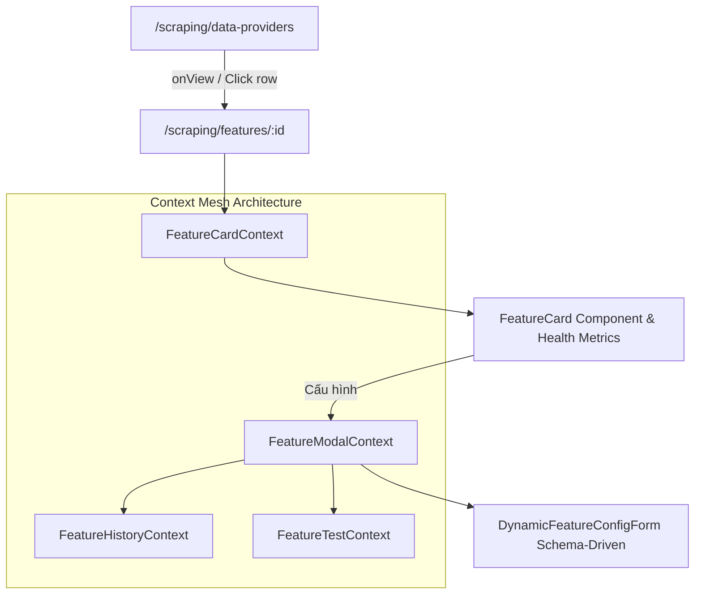

# Archive: Kiến Trúc Toàn Diện Data Providers & Scraping Features

## 1. Problem & Core Value (Bài toán & Giá trị Cốt lõi)

### Problem (Vấn đề)
- **Data Provider Form & Validation**: Cấu hình Data Provider trước đây thiếu tiện ích tự động sinh mã code (`identifier`) chuẩn SEO từ tên tiếng Việt, và thiếu validator chuẩn hóa cho `identifier` (`/^[a-z0-9-]+$/`) và `baseUrl` (chuẩn URL không trailing slash).
- **Props Drilling & Phân mảnh State Feature**: Logic điều khiển modal cấu hình, test runner, và version history từng bị truyền qua 8–10 props qua nhiều tầng components, gây boilerplate lớn.
- **Hardcoded JSX Form Sections & Lệch Schema**: Cấu trúc các trường cấu hình cào và tìm kiếm từng bị hardcode phân tán trong 7+ files JSX, gây trùng lặp validation rules và thiếu sót thuộc tính kế thừa (`mainContentSelector`).
- **Switch Nhị Phân & Chuyển Đổi Trạng Thái**: `CustomSwitch` che giấu vòng đời 5 trạng thái (`READY`, `TESTING`, `DISABLED`, `ERROR`, `UNCONFIGURED`), không ràng buộc ma trận chuyển đổi FSM với Backend `switchStatus`.
- **Thao tác Phiên bản Rườm rà**: Submit form yêu cầu qua modal xác nhận trung gian với nhập liệu thủ công; trạng thái cache query phiên bản từng bị stale do eager locking state.

### Value (Giá trị Đạt được)
- **Data Provider Entity Management**: Form chuẩn với nút `⚡ Tự động sinh` mã sử dụng `slugify`, tích hợp `FormRuleType.Code` và `FormRuleType.Url` trong `buildFormRules`.
- **Context Mesh Architecture**: Đóng gói trạng thái theo 4 contexts chuyên trách: `FeatureModalContext`, `FeatureCardContext`, `FeatureHistoryContext`, `FeatureTestContext`.
- **Schema-Driven Form Architecture & Full Type Sync**:
  - Khai báo cấu trúc form (`sections`, `fields`, `rules`, `gridSpan`, `visibleWhen`) tập trung tại `constants/` (`scraping-config.constants.ts`, `search-config.constants.ts`).
  - Đồng bộ 100% trường giữa `target-config.types.ts` và UI schema.
  - Tự động hóa trích xuất giá trị mặc định (`getDefaultFormValuesFromSections`) và map dữ liệu form (`mapConfigToBaseFormValues`).
- **Tự động sinh Change Description & 1-Step Form Save**:
  - Loại bỏ hoàn toàn modal xác nhận trung gian `FeatureConfirmUpdateModal`.
  - Tự động tính toán diffs cấu hình và sinh mô tả thay đổi chuẩn qua `generateAutoChangeDescription` gửi kèm payload mutation.
- **Quản lý Phiên bản Hiện đại & Tự động Làm tươi (Fresh Cache)**:
  - `FeatureVersionSelect`: Dropdown trigger badge hiển thị phiên bản active và lịch sử phiên bản kèm xác nhận rollback trực quan.
  - Loại bỏ eager locking `selectedVersionId`, kích hoạt auto-refetch khi mở modal và sau khi lưu thành công.
- **Health Metrics 2x2 Grid**: Hiển thị trực quan sức khỏe feature qua 4 tile chỉ số (Tình trạng, Lỗi liên tiếp, Chạy OK cuối, Chạy lỗi cuối) và banner cảnh báo lỗi.

---

## 2. Key Architecture & Decisions (Kiến trúc & Quyết định Then chốt)

### 2.1 Luồng Quản lý Nhà Cung Cấp & Bảng Điều Khiển Tính Năng
- Từ bảng Data Provider (`/scraping/data-providers`), người dùng click vào dòng để điều hướng tới `/scraping/features/:dataProviderId`.
- Form tạo/sửa Data Provider tích hợp helper `slugify` và rule builder `buildFormRules([FormRuleType.Code, FormRuleType.Url])`.
- Bảng điều khiển Features hiển thị lưới `<CustomRow gutter={[24, 24]}>` các `<FeatureCard>`.

### 2.2 Sơ đồ Luồng Hoạt động Context Mesh & Schema Form

---

## 3. Scope & Key Changes (Phạm vi & Thay đổi Chính)
- [`src/libs/string-helper.ts`](file:///d:/Sources/Personal/only-one-fe/src/libs/string-helper.ts): Hàm `slugify(text, maxLength)`.
- [`src/utilities/form-rules.ts`](file:///d:/Sources/Personal/only-one-fe/src/utilities/form-rules.ts): `FormRuleType.Code` và `FormRuleType.Url`.
- [`src/app/(root)/scraping/data-providers/`](file:///d:/Sources/Personal/only-one-fe/src/app/(root)/scraping/data-providers): `page.tsx`, `constants.ts`, `DataProviderFormModal.tsx`.
- [`src/app/(root)/scraping/features/contexts/`](file:///d:/Sources/Personal/only-one-fe/src/app/(root)/scraping/features/contexts): `FeatureModalContext`, `FeatureCardContext`, `FeatureHistoryContext`, `FeatureTestContext`.
- [`src/app/(root)/scraping/features/constants/`](file:///d:/Sources/Personal/only-one-fe/src/app/(root)/scraping/features/constants): `scraping-config.constants.ts`, `search-config.constants.ts`.
- [`src/app/(root)/scraping/features/components/`](file:///d:/Sources/Personal/only-one-fe/src/app/(root)/scraping/features/components): `DynamicFeatureConfigForm.tsx`, `FeatureSettingModal.tsx`, `FeatureCard/`, `FeatureTestTab/`, `FeatureVersionSelect.tsx`.

---

## 4. Verification Evidence & PR (Bằng chứng Nghiệm thu)
- **TypeScript Compilation**: `npx tsc --noEmit` $\rightarrow$ Passed (0 errors).
- **Linter**: `npx eslint src` $\rightarrow$ Passed (0 errors, 0 warnings).
