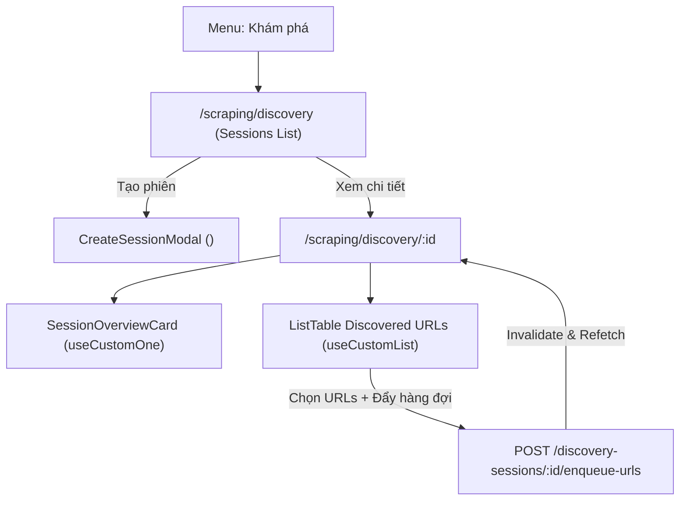

# Archive: Phân hệ Khám phá Dữ liệu Cào, Tích hợp REST API & Chuẩn hóa Modal Form

## 1. Problem & Core Value (Bài toán & Giá trị Cốt lõi)
- **Vấn đề (Problem)**:
  - Khám phá sản phẩm (Seed URLs $\rightarrow$ Discovered URLs) cần giao diện quản lý phiên quét độc lập, lọc theo Data Provider, duyệt chi tiết URLs, kiểm tra độ tin cậy/giá phát hiện và đẩy vào hàng đợi cào (Batch Enqueue).
  - Modal tạo phiên (`CreateSessionModal`) trước đây kết hợp trực tiếp `CustomModal` với `CustomForm`, khiến footer chứa action buttons ("Hủy", "Bắt đầu khám phá") bị ẩn hoàn toàn do cơ chế mặc định `footer: false` của `CustomModal`.
- **Giá trị (Value)**:
  1. **Hoàn thiện Phân hệ Discovery**: Kết nối 100% với REST API backend (`/discovery-sessions`, `/discovery-urls`) qua các hook chuẩn (`useCustomList`, `useCustomOne`, `useCustomMutationData`).
  2. **Chuẩn hóa Modal Form**: Refactor `CreateSessionModal` sang `<CustomModalForm>` từ `@/components/common`, tự động binding đầy đủ `saveButtonProps`, responsive layout, loading skeleton và reset form.
  3. **Tương tác Chi tiết Phiên & Batch Enqueue**: Hỗ trợ xem chỉ số real-time (`totalDiscovered`, `totalValidated`, `totalQueued`), bảng URLs phân trang, bộ lọc trạng thái và batch enqueue tự động làm tươi cache.

---

## 2. Key Architecture & Decisions (Kiến trúc & Quyết định Then chốt)

### 2.1 Luồng Điều hướng & Tương tác Phân hệ Discovery
- Danh sách phiên nằm tại `/scraping/discovery`, chi tiết phiên nằm tại `/scraping/discovery/[id]`.
- Nút tạo phiên mở `CreateSessionModal` sử dụng `<CustomModalForm>`.
- Trang chi tiết sử dụng `SessionOverviewCard` hiển thị số liệu từ `useCustomOne<IDiscoverySession>` và bảng `ListTable` quản lý URLs qua `useCustomList<IDiscoveryUrl>`.

---

## 3. Scope & Key Changes (Phạm vi & Thay đổi Chính)
- [`src/config/endpoint.ts`](file:///d:/Sources/Personal/only-one-fe/src/config/endpoint.ts): `API_ENDPOINT.DISCOVERY_SESSIONS` và `API_ENDPOINT.DISCOVERY_URLS`.
- [`src/app/(root)/scraping/discovery/types.ts`](file:///d:/Sources/Personal/only-one-fe/src/app/(root)/scraping/discovery/types.ts): Enums validation status, interfaces `IDiscoverySession`, `IDiscoveryUrl`.
- [`src/app/(root)/scraping/discovery/constants.ts`](file:///d:/Sources/Personal/only-one-fe/src/app/(root)/scraping/discovery/constants.ts): `DISCOVERY_SESSION_STATUS_COLOR_MAP`, `DISCOVERY_SESSION_STATUS_LABELS`, `DEFAULT_CREATE_SESSION_VALUES`.
- [`src/app/(root)/scraping/discovery/page.tsx`](file:///d:/Sources/Personal/only-one-fe/src/app/(root)/scraping/discovery/page.tsx) & [`hooks.ts`](file:///d:/Sources/Personal/only-one-fe/src/app/(root)/scraping/discovery/hooks.ts): Danh sách phiên và hook quản lý modal.
- [`src/app/(root)/scraping/discovery/components/CreateSessionModal.tsx`](file:///d:/Sources/Personal/only-one-fe/src/app/(root)/scraping/discovery/components/CreateSessionModal.tsx): Sử dụng `<CustomModalForm>`.
- [`src/app/(root)/scraping/discovery/[id]/page.tsx`](file:///d:/Sources/Personal/only-one-fe/src/app/(root)/scraping/discovery/[id]/page.tsx) & [`components/SessionOverviewCard.tsx`](file:///d:/Sources/Personal/only-one-fe/src/app/(root)/scraping/discovery/[id]/components/SessionOverviewCard.tsx): Trang chi tiết phiên và thẻ tổng quan.

---

## 4. Verification Evidence & PR (Bằng chứng Nghiệm thu)
- **TypeScript Compilation**: `npx tsc --noEmit` $\rightarrow$ Passed (0 errors).
- **Linter**: `npx eslint src` $\rightarrow$ Passed (0 errors, 0 warnings).
