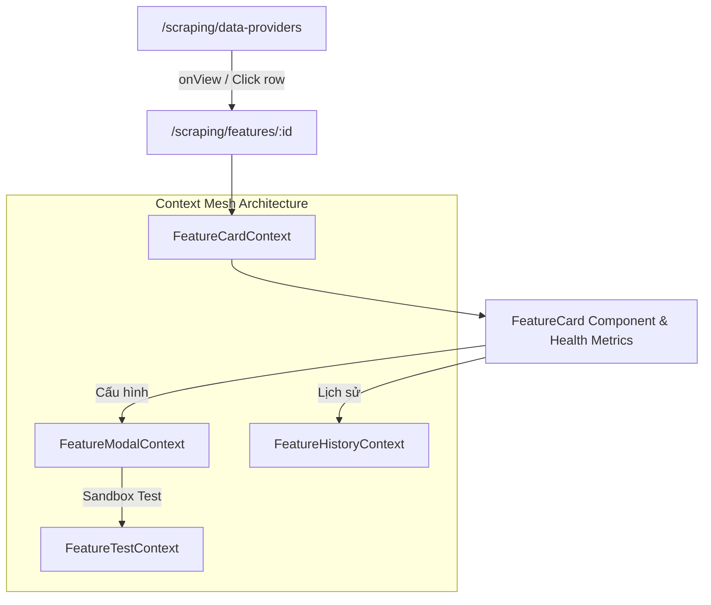

# Archive: Kiến Trúc Toàn Diện Data Providers & Scraping Features

## 1. Problem & Core Value (Bài toán & Giá trị Cốt lõi)

### Problem (Vấn đề)
- **Data Provider Form & Validation**: Cấu hình Data Provider trước đây thiếu tiện ích tự động sinh mã code (`identifier`) chuẩn SEO từ tên tiếng Việt, và thiếu validator chuẩn hóa cho `identifier` (`/^[a-z0-9-]+$/`) và `baseUrl` (chuẩn URL không trailing slash).
- **Props Drilling & Phân mảnh State Feature**: Logic điều khiển modal cấu hình, test runner, và version history từng bị truyền qua 8–10 props qua nhiều tầng components, gây boilerplate lớn.
- **Infinite Refetch Loop**: Hook `useFeatureHistory` và `useFeatureModalController` từng chứa `useEffect` gọi `query.refetch()` với dependency `[open, featureId, query]`, kích hoạt vòng lặp gọi API vô hạn.
- **Header & Styling Lệch Chuẩn**: Modal lịch sử `FeatureHistoryModal` hiển thị raw key `"generic"` thay vì nhãn tiếng Việt và có layout header cồng kềnh lệch chuẩn modal compact.
- **Treo Giao Diện Sandbox Runner**: Component `CodeDisplay` từng sử dụng regex đa vòng lặp bị catastrophic backtracking `("([^"\\]|\\.)*")\s*:`, dẫn đến việc treo luồng chính khi hiển thị nội dung HTML/text.

### Value (Giá trị Đạt được)
- **Data Provider Entity Management**: Form chuẩn với nút `⚡ Tự động sinh` mã sử dụng `slugify`, tích hợp `FormRuleType.Code` và `FormRuleType.Url` trong `buildFormRules`.
- **Context Mesh Architecture**: Đóng gói trạng thái theo 4 contexts chuyên trách: `FeatureModalContext`, `FeatureCardContext`, `FeatureHistoryContext`, `FeatureTestContext`.
- **Schema-Driven Form Architecture & Full Type Sync**:
  - Khai báo cấu trúc form tập trung tại `constants/` (`scraping-config.constants.ts`, `search-config.constants.ts`).
  - Đồng bộ 100% trường giữa `target-config.types.ts` và UI schema.
  - Tự động hóa trích xuất giá trị mặc định (`getDefaultFormValuesFromSections`) và map dữ liệu form (`mapConfigToBaseFormValues`).
- **Tự động sinh Change Description & 1-Step Form Save**: Tự động tính toán diffs cấu hình và sinh mô tả thay đổi chuẩn qua `generateAutoChangeDescription` gửi kèm payload mutation.
- **Quản lý Phiên bản & Triệt tiêu Infinite Loop**:
  - Loại bỏ hoàn toàn manual `query.refetch()` trong `useEffect`, dựa vào TanStack Query `queryOptions: { refetchOnMount: 'always' }` và `enabled: Boolean(open && featureId)`.
  - Tối ưu header modal lịch sử đồng bộ layout compact (`bodyClassName="!p-2.5 sm:!p-4"`, `className="top-6 max-w-[96vw]"`) và ánh xạ nhãn qua `SCRAPER_SERVICE_LABELS`.
- **Health Metrics 2x2 Grid**: Hiển thị trực quan sức khỏe feature qua 4 tile chỉ số (Tình trạng, Lỗi liên tiếp, Chạy OK cuối, Chạy lỗi cuối) và banner cảnh báo lỗi.
- **High-Performance Single-Pass Code Display Tokenizer**: Regex tuyến tính $O(N)$ an toàn `("(?:[^"\\]|\\.)*")(\s*:)?|\b(true|false|null)\b|-?\d+(?:\.\d*)?(?:[eE][+-]?\d+)?|[{}[\],]/g` kết hợp `useMemo`.

## 2. Key Architecture & Decisions (Kiến trúc & Quyết định Then chốt)

### 2.1 Sơ đồ Luồng Hoạt động Context Mesh & Schema Form

## 3. Scope & Key Changes (Phạm vi & Thay đổi Chính)
- [useFeatureHistory.ts](file:///Users/kiem/Sources/PERSONAL/only-one-fe/src/app/(root)/scraping/features/hooks/useFeatureHistory.ts): Quản lý query lịch sử phiên bản, loại bỏ infinite fetch loop.
- [useFeatureModalController.ts](file:///Users/kiem/Sources/PERSONAL/only-one-fe/src/app/(root)/scraping/features/hooks/useFeatureModalController.ts): Điều khiển modal cấu hình tính năng.
- [FeatureHistoryModal/index.tsx](file:///Users/kiem/Sources/PERSONAL/only-one-fe/src/app/(root)/scraping/features/components/FeatureHistoryModal/index.tsx): Modal xem lịch sử cấu hình với header compact và `SCRAPER_SERVICE_LABELS`.
- [CodeDisplay.tsx](file:///Users/kiem/Sources/PERSONAL/only-one-fe/src/components/common/display/code-display/index.tsx): High-performance syntax tokenizer.

## 4. Verification Evidence & PR (Bằng chứng Nghiệm thu & PR)
- **Typecheck & Build**: `npm run build` $\rightarrow$ `PASS (0 errors)`.
- **Trạng thái Codebase**: 100% khớp với mã nguồn hiện tại.
