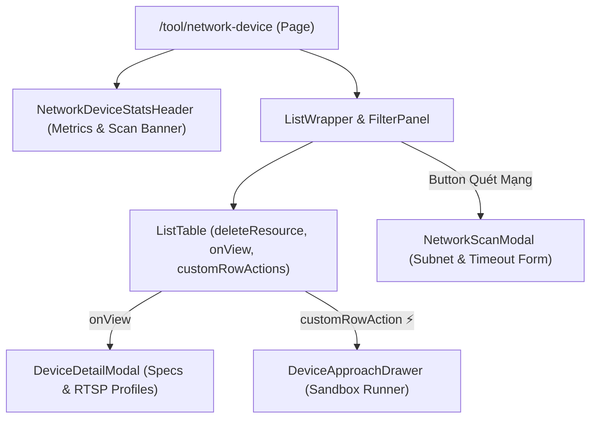

# Archive: Giao Diện Quản Lý, Khám Phá & Chẩn Đoán Thiết Bị Mạng (/tool/network-device)

## 1. Problem & Core Value (Bài toán & Giá trị Cốt lõi)
- **Vấn đề (Problem)**: Backend đã cung cấp đầy đủ API khám phá subnet, quét cổng TCP và xác thực giao thức ONVIF/Camera (`/network-devices`), nhưng hệ thống thiếu giao diện người dùng chuyên trách để quản trị viên có thể theo dõi danh sách thiết bị LAN, kích hoạt quét mạng thời gian thực, xem chi tiết profiles RTSP/ONVIF và thực thi chẩn đoán (Approach Sandbox).
- **Giá trị (Value)**: Xây dựng hoàn chỉnh trang quản trị `/tool/network-device` tuân thủ 100% Design System & Layout Pattern chuẩn của dự án:
  - Bảng danh sách `<ListTable<INetworkDevice> />` kết hợp `<ListWrapper />` và `<FilterPanel />` hỗ trợ lọc theo IP, Type, Status.
  - Header thống kê trực quan `<NetworkDeviceStatsHeader />` với 4 cards metric và banner trạng thái quét mạng tự động polling.
  - Modal kích hoạt quét mạng mới `<NetworkScanModal />` với cấu hình subnet và timeout.
  - Modal chi tiết thiết bị `<DeviceDetailModal />` hiển thị hardware specs, ONVIF stream profiles với nút Copy RTSP URL nhanh.
  - Drawer chẩn đoán sandbox `<DeviceApproachDrawer />` cho phép thực thi trực tiếp 3 hướng tiếp cận (`NETWORK_DISCOVERY`, `PORT_SCAN`, `PROTOCOL_AUTH`) và xem kết quả JSON/Formatted ngay lập tức.

## 2. Key Architecture & Decisions (Kiến trúc & Quyết định Then chốt)
- **Colocation Pattern**: Toàn bộ `types/`, `enums/`, `constants/`, `components/`, và `hooks.ts` được đặt trực tiếp bên trong `src/app/(root)/tool/network-device/`.
- **Refine Hooks Integration**: Tận dụng `useCustomTable` để phân trang/lọc dữ liệu từ backend, `useCustomMutationData` cho các thao tác mutation (kích hoạt quét, thực thi sandbox approach), và `deleteResource={RESOURCE.NETWORK_DEVICES}` để đồng bộ quyền xóa.
- **Realtime Scan Status Polling**: Hook `useNetworkScanStatus` tự động kích hoạt polling trạng thái quét khi status là `SCANNING` và tự động làm mới bảng danh sách khi chuyển sang `COMPLETED`.

## 3. Scope & Key Changes (Phạm vi & Thay đổi Chính)
- [`src/app/(root)/tool/network-device/page.tsx`](file:///Users/kiem/Sources/PERSONAL/only-one-fe/src/app/(root)/tool/network-device/page.tsx): Trang danh sách thiết bị mạng chính.
- [`src/app/(root)/tool/network-device/hooks.ts`](file:///Users/kiem/Sources/PERSONAL/only-one-fe/src/app/(root)/tool/network-device/hooks.ts): Custom hooks `useNetworkScanStatus`, `useTriggerNetworkScan`, `useExecuteApproach`.
- [`src/app/(root)/tool/network-device/components/NetworkDeviceStatsHeader.tsx`](file:///Users/kiem/Sources/PERSONAL/only-one-fe/src/app/(root)/tool/network-device/components/NetworkDeviceStatsHeader.tsx): Header thống kê và banner tiến độ quét mạng.
- [`src/app/(root)/tool/network-device/components/NetworkScanModal.tsx`](file:///Users/kiem/Sources/PERSONAL/only-one-fe/src/app/(root)/tool/network-device/components/NetworkScanModal.tsx): Modal kích hoạt quét mạng subnet mới.
- [`src/app/(root)/tool/network-device/components/DeviceDetailModal.tsx`](file:///Users/kiem/Sources/PERSONAL/only-one-fe/src/app/(root)/tool/network-device/components/DeviceDetailModal.tsx): Modal xem thông tin chi tiết thiết bị & RTSP streams.
- [`src/app/(root)/tool/network-device/components/DeviceApproachDrawer.tsx`](file:///Users/kiem/Sources/PERSONAL/only-one-fe/src/app/(root)/tool/network-device/components/DeviceApproachDrawer.tsx): Drawer chẩn đoán và thử nghiệm approach.
- [`src/app/(root)/tool/network-device/types/index.ts`](file:///Users/kiem/Sources/PERSONAL/only-one-fe/src/app/(root)/tool/network-device/types/index.ts): Định nghĩa kiểu dữ liệu `INetworkDevice`, `IStreamProfile`, `INetworkDeviceApproachResult`.

## 4. Verification Evidence & PR (Bằng chứng Nghiệm thu & PR)
- **TypeScript & Build**: `npm run build` $\rightarrow$ `PASS (0 errors)`.
- **Prettier & ESLint**: `npx eslint src/app/(root)/tool/network-device/**` $\rightarrow$ `PASS (0 errors, 0 warnings)`.
- **Branch**: `main`
