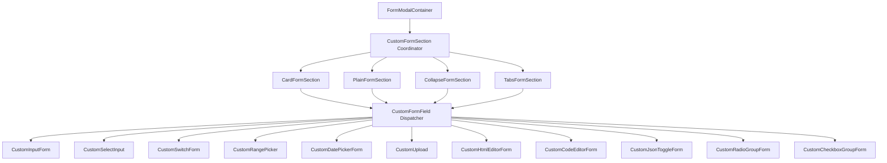

# Archive: Kiến Trúc Form Section Đa Hình & Hệ Thống Input Widget Mở Rộng

## 1. Problem & Core Value (Bài toán & Giá trị Cốt lõi)
- **Vấn đề (Problem)**: 
  - `FormModalContainer` trước đây chỉ nhận danh sách phẳng các fields (`fields?: IFormField[]`), không hỗ trợ cấu trúc layout đa dạng (Card, Plain, Collapse, Tabs).
  - Thiếu hụt các input widgets thông dụng (`date_picker`, `range_picker`, `upload`, `html_editor`, `code_editor`, `json_toggle`, `radio_group`, `checkbox_group`) trong hệ thống typing `IFormField` và bộ điều phối `CustomFormField`.
  - Một số input widgets ban đầu được viết inline thẻ `CustomForm.Item` trực tiếp bên trong `CustomFormField`, gây phá vỡ tính module hóa và vi phạm kiến trúc single-responsibility.
- **Giá trị (Value)**:
  - Chuẩn hoá kiến trúc Section-First với polymorphic schema `IFormSection` (`card`, `plain`, `collapse`, `tabs`) kế thừa từ `IBaseFormSection`.
  - Toàn bộ các widgets form được đóng gói thành các custom form component độc lập trong `src/components/common/forms/`, export qua barrel root `@/components/common`.
  - `FormModalContainer` chuyển đổi hoàn toàn sang `sections?: IFormSection<TValues>[]` giúp các trang khai báo cấu trúc form linh hoạt, bảo toàn state form trên các hidden tabs (`destroyInactiveTabPane: false`, `forceRender: true`).

## 2. Key Architecture & Decisions (Kiến trúc & Quyết định Then chốt)
- **Hướng tiếp cận (Approach)**:
  - **Polymorphic Section Model**:
    - `IBaseFormSection`: Thuộc tính chung (`key`, `type`, `visible`, `className`).
    - `ICardFormSection`: Section dạng Card kèm Header & border.
    - `IPlainFormSection`: Section dạng khối phẳng không viền.
    - `ICollapseFormSection`: Section có thể thu gọn / mở rộng.
    - `ITabsFormSection`: Section dạng tab đa bảng điều khiển.
  - **Single Entry Point Coordinator**:
    - `CustomFormSection` (`src/components/common/forms/custom-form-section/index.tsx`) là điểm truy cập duy nhất điều phối render các section components con (`CardFormSection`, `PlainFormSection`, `CollapseFormSection`, `TabsFormSection`).
  - **Encapsulated Atomic Custom Form Components**:
    - Mọi input field được đóng gói kèm `CustomForm.Item` và rule validation (`CustomDatePickerForm`, `CustomHtmlEditorForm`, `CustomCodeEditorForm`, `CustomRadioGroupForm`, `CustomCheckboxGroupForm`, `CustomJsonToggleForm`).
    - `CustomFormField` chỉ đóng vai trò phân luồng (dispatcher) theo `field.type`.

- **Sơ đồ Kiến trúc (Architecture Diagram)**:

## 3. Scope & Key Changes (Phạm vi & Thay đổi Chính)
- **Interfaces**:
  - [`src/interfaces/forms.ts`](file:///Users/kiem/Sources/PERSONAL/only-one-fe/src/interfaces/forms.ts): Khai báo `IFormSection` polymorphic types, mở rộng `FormFieldType` và các interface sub-fields.
- **Form Section Subsystem**:
  - [`src/components/common/forms/custom-form-section/index.tsx`](file:///Users/kiem/Sources/PERSONAL/only-one-fe/src/components/common/forms/custom-form-section/index.tsx): Coordinator component.
  - [`CardFormSection.tsx`](file:///Users/kiem/Sources/PERSONAL/only-one-fe/src/components/common/forms/custom-form-section/CardFormSection.tsx)
  - [`PlainFormSection.tsx`](file:///Users/kiem/Sources/PERSONAL/only-one-fe/src/components/common/forms/custom-form-section/PlainFormSection.tsx)
  - [`CollapseFormSection.tsx`](file:///Users/kiem/Sources/PERSONAL/only-one-fe/src/components/common/forms/custom-form-section/CollapseFormSection.tsx)
  - [`TabsFormSection.tsx`](file:///Users/kiem/Sources/PERSONAL/only-one-fe/src/components/common/forms/custom-form-section/TabsFormSection.tsx)
  - [`SectionHeader.tsx`](file:///Users/kiem/Sources/PERSONAL/only-one-fe/src/components/common/forms/custom-form-section/SectionHeader.tsx)
- **Custom Form Components**:
  - [`custom-date-picker-form`](file:///Users/kiem/Sources/PERSONAL/only-one-fe/src/components/common/forms/custom-date-picker-form/index.tsx)
  - [`custom-html-editor-form`](file:///Users/kiem/Sources/PERSONAL/only-one-fe/src/components/common/forms/custom-html-editor-form/index.tsx)
  - [`custom-code-editor-form`](file:///Users/kiem/Sources/PERSONAL/only-one-fe/src/components/common/forms/custom-code-editor-form/index.tsx)
  - [`custom-radio-group-form`](file:///Users/kiem/Sources/PERSONAL/only-one-fe/src/components/common/forms/custom-radio-group-form/index.tsx)
  - [`custom-checkbox-group-form`](file:///Users/kiem/Sources/PERSONAL/only-one-fe/src/components/common/forms/custom-checkbox-group-form/index.tsx)
  - [`custom-json-toggle-form`](file:///Users/kiem/Sources/PERSONAL/only-one-fe/src/components/common/forms/custom-json-toggle-form/index.tsx)
- **Containers & Dispatcher**:
  - [`form-modal-container`](file:///Users/kiem/Sources/PERSONAL/only-one-fe/src/components/common/containers/form-modal-container/index.tsx): Refactored to strictly use `sections?: IFormSection[]`.
  - [`custom-form-field`](file:///Users/kiem/Sources/PERSONAL/only-one-fe/src/components/common/forms/custom-form-field/index.tsx): Refactored to delegate to all custom form components.
  - [`src/components/common/index.ts`](file:///Users/kiem/Sources/PERSONAL/only-one-fe/src/components/common/index.ts): Barrel exports for all components.

## 4. Verification Evidence & PR (Bằng chứng Nghiệm thu & PR)
- **Trạng thái Typecheck & Lint**:
  - `npx tsc --noEmit`: 100% Passed (0 errors).
  - `npm run lint:fix`: 100% Passed (0 errors).
