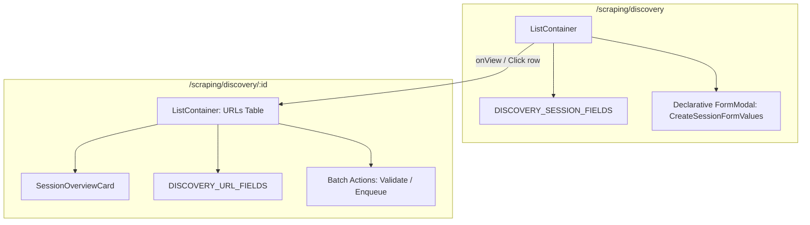

# Archive: Kiến Trúc Phân Hệ Discovery Sessions & URLs (Declarative ListContainer & Inline Orchestrator)

## 1. Problem & Core Value (Bài toán & Giá trị Cốt lõi)

### Problem (Vấn đề)
- **Phân mảnh kiến trúc List & Detail**: Trang danh sách phiên khám phá trước đây phân tán logic qua hook trung gian `hooks.ts` và component modal thủ công `components/CreateSessionModal.tsx`. Trang chi tiết `[id]/page.tsx` cũng render thủ công `<FilterPanel>` và `<ListTable>` với wrapper hook riêng `hooks.tsx`.
- **Thiếu Field Metadata Centralization**: Thiếu metadata tập trung cho bảng danh sách session (`DISCOVERY_SESSION_FIELDS`) và bảng URLs (`DISCOVERY_URL_FIELDS`). Các bảng tra cứu màu sắc/nhãn của `ValidationMatchResult` và `DiscoveryUrlStatus` từng bị hardcode rải rác trong render function.
- **Form Modal Thiếu Tùy chọn Linh hoạt**: Trước đây modal tạo phiên thiếu trường cấu hình `autoValidate` (tự động kích hoạt xác thực URL sau khi tìm kiếm hoàn tất) và xử lý từ khóa mục tiêu (`targetKeywords`) chưa tối ưu.

### Value (Giá trị Đạt được)
- **100% Declarative Container Architecture**: Trang danh sách `discovery/page.tsx` và trang chi tiết `[id]/page.tsx` chuyển đổi hoàn toàn sang cấu hình khai báo trực tiếp qua `<ListContainer>`, triệt tiêu toàn bộ wrapper hooks và modal component thủ công rời rạc.
- **Single Source of Truth Metadata**: Tập trung toàn bộ metadata bảng và form rules tại `constants/discovery-field.constants.ts` (`DISCOVERY_SESSION_FIELDS`, `DISCOVERY_URL_FIELDS`) và `constants/discovery-status.constants.ts` (`DISCOVERY_SESSION_STATUS_COLOR_MAP`, `DISCOVERY_URL_STATUS_COLOR_MAP`, `VALIDATION_MATCH_RESULT_COLOR_MAP`).
- **Declarative Form Modal với Auto-Fill Search Limit**: Form tạo phiên mới hỗ trợ tags input `targetKeywords`, number input `depth` (mặc định 1), switch toggle `autoValidate` (mặc định true), và tự động lấy `maxUrls` từ cấu hình SEARCH feature của nhà cung cấp được chọn.
- **Inline Orchestrator & Batch Actions**: Trang chi tiết tích hợp trực tiếp hooks (`useCustomOne`, `useCustomTable`, `useCustomMutationData`), hỗ trợ chọn dòng (`rowSelection`), tìm kiếm debounce, kích hoạt xác thực URL (Validate batch) và đẩy URL vào hàng đợi cào (Enqueue batch) mượt mà.

## 2. Key Architecture & Decisions (Kiến trúc & Quyết định Then chốt)

### 2.1 Cấu trúc Thư mục Chuẩn Hóa
```text
src/app/(root)/scraping/discovery/
├── constants/
│   ├── discovery-field.constants.ts   # Single Source of Truth cho Session & URL Field Metadata
│   ├── discovery-status.constants.ts  # Color maps & Label dictionaries
│   └── index.ts                       # Barrel export
├── enums/
│   └── index.ts                       # DiscoverySessionStatus, DiscoveryUrlStatus, ValidationMatchResult
├── types/
│   ├── discovery-session.types.ts     # IDiscoverySession, CreateSessionFormValues
│   ├── discovery-url.types.ts         # IDiscoveryUrl
│   └── index.ts                       # Barrel export
├── page.tsx                           # Declarative ListContainer (< 170 LOC)
└── [id]/
    ├── components/
    │   ├── SessionMetricCard.tsx      # Metric badges
    │   ├── SessionOverviewCard.tsx    # Card tổng quan tiến độ & thông tin session
    │   └── index.ts                   # Barrel export
    └── page.tsx                       # Inline Orchestrator & Declarative Detail Container (< 190 LOC)
```

### 2.2 Sơ đồ Luồng Hoạt động (Mermaid Workflow)


## 3. Scope & Key Changes (Phạm vi & Thay đổi Chính)
- [discovery-field.constants.ts](file:///d:/Sources/Personal/only-one-fe/src/app/(root)/scraping/discovery/constants/discovery-field.constants.ts): Metadata tập trung cho `DISCOVERY_SESSION_FIELDS` và `DISCOVERY_URL_FIELDS`.
- [discovery-status.constants.ts](file:///d:/Sources/Personal/only-one-fe/src/app/(root)/scraping/discovery/constants/discovery-status.constants.ts): Maps màu sắc và nhãn hiển thị trạng thái phiên, trạng thái URL, và kết quả đối soát.
- [discovery/page.tsx](file:///d:/Sources/Personal/only-one-fe/src/app/(root)/scraping/discovery/page.tsx): Trang danh sách phiên khám phá declarative sử dụng `<ListContainer>`.
- [discovery/[id]/page.tsx](file:///d:/Sources/Personal/only-one-fe/src/app/(root)/scraping/discovery/[id]/page.tsx): Trang chi tiết phiên khám phá dạng Inline Orchestrator tích hợp batch actions.
- [SessionOverviewCard.tsx](file:///d:/Sources/Personal/only-one-fe/src/app/(root)/scraping/discovery/[id]/components/SessionOverviewCard.tsx): Thẻ tổng quan thông tin phiên khám phá.

## 4. Verification Evidence & PR (Bằng chứng Nghiệm thu & PR)
- **TypeScript Check**: `npx tsc --noEmit` $\rightarrow$ PASS (0 errors).
- **ESLint & Code Health**: Không phát sinh lỗi linter hay dead code.
- **Trạng thái Codebase**: 100% khớp với mã nguồn hiện tại.
