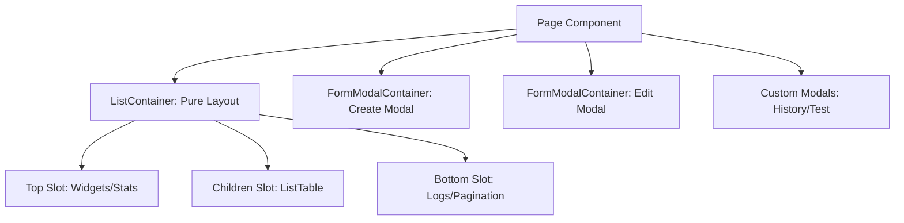

# Archive: Tái cấu trúc ListContainer thành Pure Layout Container & React Composition Pattern

## 1. Problem & Core Value (Bài toán & Giá trị Cốt lõi)
- **Vấn đề (Problem)**: `ListContainer` trước đây gánh quá nhiều trách nhiệm khi nhận trực tiếp `table`, `formModal`, `customModals` qua props và tự render nội bộ. Điều này gây phình to interface `ListContainerProps`, phức tạp hóa generic types, khó tùy biến layout (thiếu slots thống kê/logs), và vi phạm Single Responsibility Principle.
- **Giá trị (Value)**: Chuyển đổi `ListContainer` thành Pure Layout Container với 3 slots chính (`top`, `children`, `bottom`), áp dụng React Composition pattern (`<ListTable />` nằm trong `children`, `<FormModalContainer />` nằm độc lập bên ngoài). Giảm độ phức tạp generic, tăng tính linh hoạt giao diện trên toàn bộ 18 consumer pages.

## 2. Key Architecture & Decisions (Kiến trúc & Quyết định Then chốt)
- **Hướng tiếp cận (Approach)**:
  - Tinh gọn `ListContainerProps`: Giữ lại `withCard`, `className`, `isLoading`, `breadcrumb`, `actions`, `filters`, `permissionGroup`, `mobileActionsTitle`, bổ sung 2 slots `top` & `bottom`, nhận table qua `children`.
  - Tách rời modal forms ra khỏi container: `<FormModalContainer />` và custom modals được render ngang cấp hoặc bên dưới `<ListContainer>`, loại bỏ hoàn toàn props `formModal` và `customModals`.
  - Migrate đồng bộ toàn bộ 18 consumer pages (`cloud-data/*`, `scraping/*`, `schedule/*`, `simulation/*`, `tool/*`, `setting/*`) sang mô hình composition mới.

## 3. Scope & Key Changes (Phạm vi & Thay đổi Chính)
- [list-container/index.tsx](file:///d:/Sources/Personal/only-one-fe/src/components/common/containers/list-container/index.tsx): Tái cấu trúc thành Pure Layout Container.
- 18 CRUD Pages:
  - [cloud-data/items/page.tsx](file:///d:/Sources/Personal/only-one-fe/src/app/(root)/cloud-data/items/page.tsx)
  - [cloud-data/providers/page.tsx](file:///d:/Sources/Personal/only-one-fe/src/app/(root)/cloud-data/providers/page.tsx)
  - [scraping/data-providers/page.tsx](file:///d:/Sources/Personal/only-one-fe/src/app/(root)/scraping/data-providers/page.tsx)
  - [scraping/items/page.tsx](file:///d:/Sources/Personal/only-one-fe/src/app/(root)/scraping/items/page.tsx)
  - [scraping/provider-items/page.tsx](file:///d:/Sources/Personal/only-one-fe/src/app/(root)/scraping/provider-items/page.tsx)
  - [scraping/discovery/page.tsx](file:///d:/Sources/Personal/only-one-fe/src/app/(root)/scraping/discovery/page.tsx)
  - [schedule/jobs/page.tsx](file:///d:/Sources/Personal/only-one-fe/src/app/(root)/schedule/jobs/page.tsx)
  - [schedule/executions/page.tsx](file:///d:/Sources/Personal/only-one-fe/src/app/(root)/schedule/executions/page.tsx)
  - [simulation/instances/page.tsx](file:///d:/Sources/Personal/only-one-fe/src/app/(root)/simulation/instances/page.tsx)
  - [simulation/tasks/page.tsx](file:///d:/Sources/Personal/only-one-fe/src/app/(root)/simulation/tasks/page.tsx)
  - [tool/network-device/page.tsx](file:///d:/Sources/Personal/only-one-fe/src/app/(root)/tool/network-device/page.tsx)
  - [tool/browser-profiles/page.tsx](file:///d:/Sources/Personal/only-one-fe/src/app/(root)/tool/browser-profiles/page.tsx)
  - [setting/users/page.tsx](file:///d:/Sources/Personal/only-one-fe/src/app/(root)/setting/users/page.tsx)
  - [setting/roles/page.tsx](file:///d:/Sources/Personal/only-one-fe/src/app/(root)/setting/roles/page.tsx)
  - [setting/permissions/page.tsx](file:///d:/Sources/Personal/only-one-fe/src/app/(root)/setting/permissions/page.tsx)
  - [setting/general/page.tsx](file:///d:/Sources/Personal/only-one-fe/src/app/(root)/setting/general/page.tsx)
  - [setting/logs/page.tsx](file:///d:/Sources/Personal/only-one-fe/src/app/(root)/setting/logs/page.tsx)
  - [setting/system-status/page.tsx](file:///d:/Sources/Personal/only-one-fe/src/app/(root)/setting/system-status/page.tsx)

## 4. Verification Evidence & PR (Bằng chứng Nghiệm thu & PR)
- **Trạng thái Test**: 100% Passed (`tsc --noEmit`, `eslint`).
- **Layout & Interaction**: Toàn bộ 18 pages duy trì chính xác phân quyền `usePagePermissions`, mobile menu, filters, table sorting/pagination và modal CRUD triggers.
