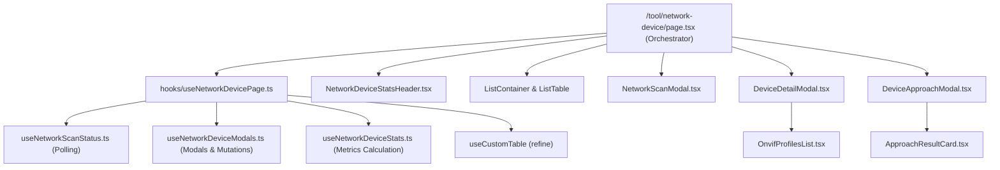

# Archive: Kiến Trúc & Quản Lý Thiết Bị Mạng (/tool/network-device)

## 1. Problem & Core Value (Bài toán & Giá trị Cốt lõi)
- **Vấn đề (Problem)**: 
  - Ban đầu hệ thống thiếu giao diện người dùng để tương tác với backend `/network-devices` (khám phá subnet, quét cổng TCP, xác thực ONVIF/Camera).
  - Sau giai đoạn triển khai ban đầu, module `tool/network-device` gặp vấn đề phình to kích thước file (> 200–300 LOC trong `page.tsx`, `DeviceApproachModal.tsx`, `DeviceDetailModal.tsx`), sử dụng cú pháp cũ `React.FC`, và gom toàn bộ logic vào file flat `hooks.ts`.
- **Giá trị (Value)**:
  - Cung cấp giao diện quản trị thiết bị mạng hoàn chỉnh: thống kê metrics, banner polling realtime, quét subnet LAN, xem chi tiết profiles ONVIF / copy RTSP URL, và sandbox chẩn đoán tiếp cận thiết bị.
  - Tái cấu trúc toàn diện theo kiến trúc mới: `page.tsx` chỉ đóng vai trò Orchestrator (< 160 LOC), tách các sub-components hiển thị kết quả (< 150 LOC per modal), chia nhỏ sub-hooks chuyên biệt (`useNetworkScanStatus`, `useNetworkDeviceModals`, `useNetworkDeviceStats`, `useNetworkDevicePage`) và áp dụng `ListContainer` chuẩn.

## 2. Key Architecture & Decisions (Kiến trúc & Quyết định Then chốt)
- **Compound Page & Layout Orchestrator**: `page.tsx` sử dụng `<ListContainer>` với header/filters/actions kết hợp `<ListTable>` và 3 modal components độc lập.
- **Hook Decomposition Architecture**:
  - `useNetworkScanStatus.ts`: Quản lý query polling realtime trạng thái quét mạng (`refetchInterval: 2500` khi `SCANNING`) và tự động refetch bảng khi hoàn tất.
  - `useNetworkDeviceModals.ts`: Quản lý state mở/đóng và mutations của 3 modals (`NetworkScanModal`, `DeviceDetailModal`, `DeviceApproachModal`).
  - `useNetworkDeviceStats.ts`: Tính toán số liệu thống kê tổng thể thiết bị theo trạng thái và chủng loại.
  - `useNetworkDevicePage.ts`: Coordinator hook tổng hợp, kết nối `useCustomTable` và các sub-hooks.
- **Sub-Component Decomposition**:
  - `ApproachResultCard.tsx`: Hiển thị kết quả chẩn đoán JSON & matched credential.
  - `OnvifProfilesList.tsx`: Hiển thị danh sách video profiles ONVIF và copy URL RTSP/Snapshot.
  - `NetworkDeviceStatsHeader.tsx`: Hiển thị metrics 4 cards và banner trạng thái quét.

## 3. Scope & Key Changes (Phạm vi & Thay đổi Chính)
- [src/app/(root)/tool/network-device/page.tsx](file:///d:/Sources/Personal/only-one-fe/src/app/(root)/tool/network-device/page.tsx): Declarative Page Orchestrator (< 160 LOC).
- [src/app/(root)/tool/network-device/hooks/](file:///d:/Sources/Personal/only-one-fe/src/app/(root)/tool/network-device/hooks/):
  - `useNetworkDevicePage.ts`: Coordinator hook chính.
  - `useNetworkScanStatus.ts`: Hook polling trạng thái quét mạng.
  - `useNetworkDeviceModals.ts`: Hook quản lý trạng thái modal & mutation.
  - `useNetworkDeviceStats.ts`: Hook tính toán thống kê.
  - `index.ts`: Barrel export.
- [src/app/(root)/tool/network-device/components/](file:///d:/Sources/Personal/only-one-fe/src/app/(root)/tool/network-device/components/):
  - `ApproachResultCard.tsx`: Sub-component kết quả chẩn đoán JSON.
  - `OnvifProfilesList.tsx`: Sub-component danh sách profiles ONVIF & URL RTSP.
  - `DeviceApproachModal.tsx`: Modal form cấu hình tiếp cận thiết bị.
  - `DeviceDetailModal.tsx`: Modal xem thông tin chi tiết & profiles.
  - `NetworkDeviceStatsHeader.tsx`: Header thống kê metrics.
  - `NetworkScanModal.tsx`: Modal kích hoạt quét subnet.
  - `index.ts`: Barrel export.
- [src/app/(root)/tool/network-device/types/index.ts](file:///d:/Sources/Personal/only-one-fe/src/app/(root)/tool/network-device/types/index.ts): Type definitions cho network devices & approach results.

## 4. Verification Evidence & PR (Bằng chứng Nghiệm thu & PR)
- **TypeScript Check**: `npx tsc --noEmit` $\rightarrow$ PASS (0 errors).
- **ESLint**: `npx eslint src/app/(root)/tool/network-device/**` $\rightarrow$ PASS (0 errors, 0 warnings).
- **Kích thước file**: 100% các file đều dưới ngưỡng 160 LOC (đáp ứng tiêu chuẩn < 200 LOC).
