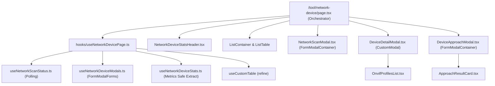

# Archive: Kiến Trúc & Quản Lý Thiết Bị Mạng (/tool/network-device)

## 1. Problem & Core Value (Bài toán & Giá trị Cốt lõi)
- **Vấn đề (Problem)**:
  - Cần một giao diện quản trị thiết bị mạng toàn diện kết nối backend `/api/v1/tools/network-devices` (khám phá subnet, quét cổng TCP, xác thực Camera/ONVIF).
  - Trước đây, module gặp vấn đề phình to kích thước file, các modal quét mạng và tiếp cận thiết bị sử dụng `CustomModal` và `CustomForm` thủ công kèm nhiều biến state phân mảnh (`isScanModalOpen`, `isTriggeringScan`, `selectedDeviceForApproach`, `isExecutingApproach`).
  - `useNetworkDeviceStats` từng gặp lỗi `TypeError: devices.filter is not a function` khi `dataSource` là object phân trang.
- **Giá trị (Value)**:
  - Cung cấp giao diện quản trị mạng hoàn chỉnh: thống kê metrics, banner polling realtime, quét subnet LAN, xem chi tiết profiles ONVIF/RTSP URL, và sandbox chẩn đoán tiếp cận thiết bị.
  - Tái cấu trúc chuẩn Design System: `page.tsx` đóng vai trò Orchestrator (< 160 LOC), 2 modal hành động (`NetworkScanModal`, `DeviceApproachModal`) sử dụng `FormModalContainer` và Refine `useCustomModalForm({ action: 'create' })` với schema `IFormSection[]` phẳng (dùng `visible`), `CustomFormList` cho credentials động.
  - Xử lý trích xuất mảng `devices` an toàn qua `extractTableData` fallback.

## 2. Key Architecture & Decisions (Kiến trúc & Quyết định Then chốt)
- **Compound Page & Layout Orchestrator**: `page.tsx` sử dụng `<ListContainer>` kết hợp `<ListTable>` và 3 modal components độc lập.
- **Hook Decomposition Architecture**:
  - `useNetworkScanStatus.ts`: Polling realtime trạng thái quét mạng (`refetchInterval: 2500` khi `SCANNING`), tự động refetch bảng khi hoàn tất.
  - `useNetworkDeviceModals.ts`: Quản lý 2 instance `useCustomModalForm` (`scanModalForm`, `approachModalForm`) cho các hành động RPC và state modal xem chi tiết (`selectedDeviceForDetail`).
  - `useNetworkDeviceStats.ts`: Tính toán an toàn số liệu thống kê thiết bị từ `tableProps.dataSource`.
  - `useNetworkDevicePage.ts`: Coordinator hook tổng hợp, kết nối `useCustomTable` và các sub-hooks.
- **Sub-Component & Modal Decomposition**:
  - `NetworkScanModal.tsx`: Modal form quét mạng dùng `FormModalContainer` với schema `scanFormSections`.
  - `DeviceApproachModal.tsx`: Modal form chẩn đoán thiết bị dùng `FormModalContainer`, `CustomFormList` và declarative schema với `visible`.
  - `DeviceDetailModal.tsx`: Modal read-only xem thông tin chi tiết & profiles ONVIF.
  - `ApproachResultCard.tsx`: Sub-component hiển thị kết quả chẩn đoán JSON & matched credential.
  - `OnvifProfilesList.tsx`: Sub-component hiển thị danh sách video profiles ONVIF và copy URL RTSP/Snapshot.
  - `NetworkDeviceStatsHeader.tsx`: Header hiển thị metrics 4 cards và banner trạng thái quét.

## 3. Scope & Key Changes (Phạm vi & Thay đổi Chính)
- [`page.tsx`](file:///d:/Sources/Personal/only-one-fe/src/app/(root)/tool/network-device/page.tsx): Declarative Page Orchestrator (< 160 LOC).
- [`useNetworkDeviceModals.ts`](file:///d:/Sources/Personal/only-one-fe/src/app/(root)/tool/network-device/hooks/useNetworkDeviceModals.ts): Quản lý `scanModalForm` và `approachModalForm` qua `useCustomModalForm`.
- [`useNetworkDeviceStats.ts`](file:///d:/Sources/Personal/only-one-fe/src/app/(root)/tool/network-device/hooks/useNetworkDeviceStats.ts): Trích xuất `devices` an toàn từ `dataSource`.
- [`NetworkScanModal.tsx`](file:///d:/Sources/Personal/only-one-fe/src/app/(root)/tool/network-device/components/NetworkScanModal.tsx): `FormModalContainer` với schema-driven fields.
- [`DeviceApproachModal.tsx`](file:///d:/Sources/Personal/only-one-fe/src/app/(root)/tool/network-device/components/DeviceApproachModal.tsx): `FormModalContainer` với `CustomFormList` và `visible` fields.
- [`DeviceDetailModal.tsx`](file:///d:/Sources/Personal/only-one-fe/src/app/(root)/tool/network-device/components/DeviceDetailModal.tsx): Read-only detail modal.

## 4. Verification Evidence & PR (Bằng chứng Nghiệm thu & PR)
- **TypeScript Check**: `npx tsc --noEmit` $\rightarrow$ PASS (0 errors).
- **ESLint**: `npx eslint src/app/(root)/tool/network-device/**` $\rightarrow$ PASS (0 errors, 0 warnings).
- **Kích thước file**: 100% các file đều dưới ngưỡng 160 LOC.
