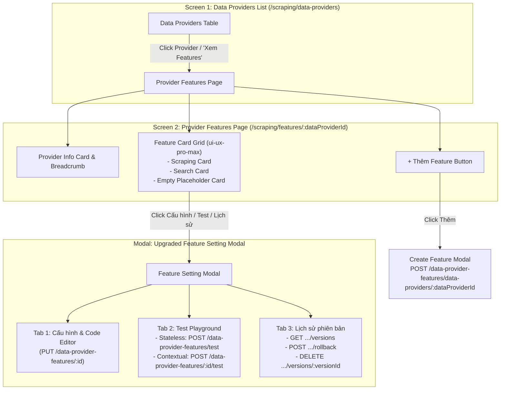

# Technical Proposal: Data Provider Features Dashboard with Interactive Cards & Setting Modals

## 1. Problem Statement & Core Concept

- **Core Business Problem**:
  1. **Lack of Feature Management Overview**: In the current UI at [`/scraping/data-providers`](file:///d:/Sources/Personal/only-one-fe/src/app/(root)/scraping/data-providers/page.tsx), features (Scraping and Search) are represented only as small icon buttons inside the provider list table. There is no dedicated page to view the health status, failure count (`consecutiveFailures`), error logs, and execution timestamps of all features belonging to a specific Data Provider.
  2. **Decoupled Backend Contract**: The backend [`DataProviderFeatureController`](file:///d:/Sources/Personal/only-one-be/src/modules/data-provider/controllers/data-provider-feature.controller.ts) (`/data-provider-features`) treats features as first-class child entities (`DataProviderFeatureEntity`) with independent lifecycles (`ACTIVE`, `INACTIVE`, `TESTING`, `ERROR`, `UNCONFIGURED`), polymorphic version histories, and dual-mode test runners.
  3. **Preserving Modal UX with Modernized Capabilities**: While a dedicated page at `/scraping/features/:dataProviderId` is needed for feature overview and governance per provider, engineers prefer configuring features via rapid, focused **Setting Modals** (retaining the existing modal interaction pattern while upgrading it to support live testing, version diff/rollback, and change descriptions).

- **Core Value & Target Audience**: Scraping Engineers and Administrators can easily navigate into `/scraping/features/:dataProviderId` to inspect active features, monitor errors, toggle statuses on the fly, and open feature-specific Setting Modals to edit configurations, run sandbox tests, and manage version snapshots.

- **Success Metrics (Definition of Done)**:
  - New dedicated Next.js route: `src/app/(root)/scraping/features/[dataProviderId]/page.tsx` displaying the Provider header and its Feature Cards.
  - Seamless navigation from the main Data Providers list (`/scraping/data-providers`) to `/scraping/features/${record.id}`.
  - Integration with all 10 endpoints of [`DataProviderFeatureController`](file:///d:/Sources/Personal/only-one-be/src/modules/data-provider/controllers/data-provider-feature.controller.ts):
    1. `GET /data-providers/:id` (Provider info)
    2. `GET /data-provider-features/data-providers/:dataProviderId/:type` (Feature details)
    3. `POST /data-provider-features/data-providers/:dataProviderId` (Create new feature)
    4. `PUT /data-provider-features/:id` (Update config with change log and service)
    5. `POST /data-provider-features/test` (Stateless sandbox test)
    6. `POST /data-provider-features/:id/test` (Contextual test against provider items)
    7. `PUT /data-provider-features/:id/switch-status/:status` (Instant status toggle)
    8. `GET /data-provider-features/:id/versions` (Version history)
    9. `POST /data-provider-features/:id/versions/:versionId/rollback` (Rollback version)
    10. `DELETE /data-provider-features/:id/versions/:versionId` (Delete inactive version)
  - Interactive Feature Card Grid (`ProviderFeatureCardGrid`) designed with `ui-ux-pro-max` principles.
  - Upgraded Setting Modals featuring:
    - **Config Tab**: Selectors, headers, cookies, and code editor (`functionGenerator`).
    - **Test Tab**: Stateless sandbox runner + Contextual runner with visual results and error logs.
    - **Version Tab**: Version timeline table with rollback and delete triggers.

- **Scope Boundaries**:
  - **In-Scope**:
    - Frontend TypeScript models, interfaces, and enums in [`data-provider.d.ts`](file:///d:/Sources/Personal/only-one-fe/src/interfaces/data-provider.d.ts).
    - Provider Features page at `src/app/(root)/scraping/features/[dataProviderId]/page.tsx`.
    - Upgraded Setting Modals in `src/app/(root)/scraping/features/[dataProviderId]/components/`.
    - Updating main list page [`page.tsx`](file:///d:/Sources/Personal/only-one-fe/src/app/(root)/scraping/data-providers/page.tsx) with navigation triggers.
  - **Explicit Out-of-Scope**:
    - Altering backend controller endpoints or service logic in `only-one-be`.
    - Modifying other unrelated modules (`cloud-data`, `schedule`, `simulation`).

---

## 2. Current Business Logic (As-is Analysis)

### As-is Architecture & Limitations
1. **Coupled List Page** ([`page.tsx`](file:///d:/Sources/Personal/only-one-fe/src/app/(root)/scraping/data-providers/page.tsx)):
   - Lists Data Providers without showing comprehensive feature metadata (failure count, last run times, feature error logs).
2. **Legacy Setting Modals**:
   - [`DataProviderTargetModal.tsx`](file:///d:/Sources/Personal/only-one-fe/src/app/(root)/scraping/data-providers/components/DataProviderTargetModal.tsx) and [`DataProviderSearchModal.tsx`](file:///d:/Sources/Personal/only-one-fe/src/app/(root)/scraping/data-providers/components/DataProviderSearchModal.tsx) call deprecated endpoints.
   - Lacks contextual testing, status switches, version history, rollback, and delete capabilities.

---

## 3. Proposed Solution Alternatives

### Option 1 (Recommended): Provider Features Dashboard (`/scraping/features/:dataProviderId`) with Interactive Cards & Upgraded Setting Modals

- **Solution Overview & Mechanics**:
  - **Navigation Flow**:
    1. **Data Providers List (`/scraping/data-providers`)**: User clicks on a provider row or "Quản lý Features" button $\rightarrow$ navigates to `/scraping/features/${dataProviderId}`.
    2. **Provider Features Page (`/scraping/features/:dataProviderId`)**:
       - **Header**: Data Provider Card (Name, Identifier, Base URL, Created At) + Breadcrumb `Data Providers > [Name] > Features`.
       - **Action Bar**: "Thêm Feature" button (opens quick create modal for unconfigured features).
       - **Feature Card Grid (`ProviderFeatureCardGrid`)**:
         - 2-column responsive layout with cards for `SCRAPING` and `SEARCH`.
         - Header with gradient icon, service engine tag, and live status switch toggle.
         - 2x2 Health metrics grid (Status with pulse, Failure count with red alert if $>0$, Last OK run, Last failed run).
         - Action buttons: ⚙️ **Cấu hình**, 🧪 **Thử nghiệm**, 📜 **Lịch sử phiên bản**.
         - Empty placeholder card with dashed border for uninitialized features.
    3. **Upgraded Feature Setting Modal**:
       - 3 coordinated tabs:
         - **Tab 1: Cấu hình (Config)**: Specialized form fields + Monaco code editor for `functionGenerator`.
         - **Tab 2: Thử nghiệm (Test Playground)**: Dual-mode testing (Stateless sandbox & Contextual live test) with execution output console.
         - **Tab 3: Lịch sử phiên bản (Version History)**: Table of version snapshots with rollback and delete triggers.

- **Architecture Diagram**:

---

## 4. Key Failure Modes & Security Boundaries

- **Exception & Timeout Handling**: Test runner handles syntax errors and network timeouts gracefully with informative error messages.
- **Active Version Protection**: Backend prevents deleting active version; frontend disables delete button with tooltip.
- **Authorization Boundary**: Secured with NextAuth session and Refine `accessControlProvider`.

---

## 5. High-Level Technical Specifications

### File Breakdown & Proposed Changes

1. **TypeScript Interfaces & Enums** ([`data-provider.d.ts`](file:///d:/Sources/Personal/only-one-fe/src/interfaces/data-provider.d.ts)):
   - Add `DataProviderFeatureType`, `DataProviderFeatureStatus`, `IDataProviderFeature`, `IConfigVersion`, and request types.

2. **Dedicated Features Page Route** (`src/app/(root)/scraping/features/[dataProviderId]/`):
   - `page.tsx`: Provider header + Feature Card Grid + Create Feature Trigger.
   - `hooks.ts`: `useDataProviderFeaturesPage` hook for loading provider, fetching features, toggling status (`switchStatus`), and controlling modal states.
   - `types.ts`: Local page and modal contracts.

3. **Feature Setting & Card Components** (`src/app/(root)/scraping/features/[dataProviderId]/components/`):
   - `ProviderFeaturesHeader.tsx`: Provider info header and breadcrumbs.
   - `ProviderFeatureCard.tsx`: Individual Feature Card with metrics and quick switch.
   - `ProviderFeatureCardGrid.tsx`: Responsive Grid layout for cards.
   - `DataProviderFeatureSettingModal.tsx`: Main modal with tabs (Config, Test, Version History).
   - `ScrapingConfigForm.tsx` & `SearchConfigForm.tsx`: Dedicated form controls per feature type.
   - `FeatureTestTab.tsx`: Test runner supporting Stateless and Contextual testing.
   - `FeatureVersionHistoryTab.tsx`: Version history timeline with rollback and delete triggers.
   - `CreateFeatureModal.tsx`: Quick modal to add a new feature type for the provider.

4. **Main List Page Navigation** ([`page.tsx`](file:///d:/Sources/Personal/only-one-fe/src/app/(root)/scraping/data-providers/page.tsx)):
   - Add action/link from each provider row to `/scraping/features/${record.id}`.

---

## 6. Next Steps

- Run `/only-one-plan only-one/tasks/20260820-204100-data-provider-features-page` to generate the 5-section `plan.md`.
- Execute implementation with `/only-one-apply only-one/tasks/20260820-204100-data-provider-features-page`.
- Validate with test runs and archive using `/only-one-archive only-one/tasks/20260820-204100-data-provider-features-page`.
