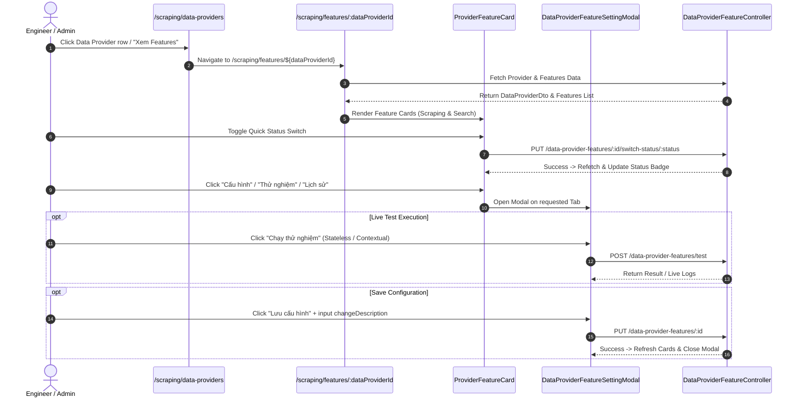

# Implementation Plan: Data Provider Features Dashboard with Interactive Cards & Setting Modals (`/scraping/features/:dataProviderId`)

## Section 1. Current State

### 1.1 Verified Codebase State & Execution Flow
In [`only-one-fe`](file:///d:/Sources/Personal/only-one-fe), Data Provider management UI is currently located at:
1. **Main List Page** ([`page.tsx`](file:///d:/Sources/Personal/only-one-fe/src/app/(root)/scraping/data-providers/page.tsx)):
   - Fetches and displays a table of `DataProviderRecord` via `useCustomTable({ resource: 'data-providers' })`.
   - Uses compact inline action buttons to invoke [`DataProviderSettingModal.tsx`](file:///d:/Sources/Personal/only-one-fe/src/app/(root)/scraping/data-providers/components/DataProviderSettingModal.tsx).
2. **Backend API**:
   - Backend has decoupled all feature configurations into [`DataProviderFeatureController`](file:///d:/Sources/Personal/only-one-be/src/modules/data-provider/controllers/data-provider-feature.controller.ts) under `/data-provider-features`, featuring independent lifecycle statuses (`ACTIVE`, `INACTIVE`, `TESTING`, `ERROR`, `UNCONFIGURED`), dual-mode testing, and full version history per feature.

### 1.2 Core Limitations Being Addressed
- **No Dedicated Features Dashboard**: Navigating to a dedicated page at `/scraping/features/:dataProviderId` allows viewing the health metrics, failure count (`consecutiveFailures`), and status switches of all features belonging to a Data Provider in a modern Card Grid layout.
- **Contract Desynchronization**: Legacy modals invoke deprecated endpoints rather than the 10 RESTful endpoints of `DataProviderFeatureController`.

### 1.3 Behaviors That Must Remain Unchanged
- The main Data Provider list page (`/scraping/data-providers`) must continue supporting search, status filtering, pagination, and provider CRUD modals.
- Setting Modal forms for Scraping and Search configurations must preserve the design tokens and layout conventions of the application.

---

## Section 2. Detailed Design (UI/UX Pro Max Architecture)

### 2.1 UI/UX Intelligence & Design System Guidelines
Applying `ui-ux-pro-max` design intelligence for SaaS / Developer Tool dashboards:
- **Route**: `src/app/(root)/scraping/features/[dataProviderId]/page.tsx` accessible via `/scraping/features/${dataProviderId}`.
- **Card-Based Hierarchy**:
  - Desktop: 2-column responsive grid (`grid grid-cols-1 lg:grid-cols-2 gap-6`).
  - Dark/Light mode support with semantic tokens (`bg-hub-section/40`, `border-hub-border/60`, `hover:border-hub-primary/60`, backdrop-blur, subtle elevation shadows).
- **Visual Signals & State Badges**:
  - **Type Badge & Icon**: `SCRAPING` (Emerald/Cyan gradient icon, `lucide:bot`), `SEARCH` (Violet/Indigo gradient icon, `lucide:search`).
  - **Live Status & Quick Switch**: Pulsing dot indicator for `ACTIVE` (Emerald), `ERROR` (Rose/Red), `TESTING` (Amber), `INACTIVE` (Slate), accompanied by an Ant Design Switch with optimistic feedback.
  - **Health Metrics Mini-Grid**: Clean 2x2 stats block inside each card:
    - *Trạng thái*: Status tag with pulsing animation.
    - *Số lần lỗi liên tiếp*: `0` (Success pill) or `> 0` (Red warning pill with tooltip showing `lastErrorMessage`).
    - *Chạy thành công cuối*: Timestamp formatted with relative time tooltip.
    - *Chạy lỗi cuối*: Timestamp formatted with error badge.
- **Action Toolbar**:
  - ⚙️ **Cấu hình**: Primary action button opening the Config tab in `DataProviderFeatureSettingModal`.
  - 🧪 **Thử nghiệm**: Live playground trigger opening the Test tab.
  - 📜 **Lịch sử phiên bản**: Version count badge and trigger opening the Version History tab.
- **Empty / Add Feature Card**:
  - Dotted placeholder card (`border-dashed border-2 hover:border-hub-primary`) when a feature type (`SCRAPING` or `SEARCH`) is not yet initialized for the provider, offering instant 1-click creation.

### 2.2 ASCII Wireframes

#### 2.2.1 Provider Features Page with Card Grid (`/scraping/features/:dataProviderId`)
```text
+----------------------------------------------------------------------------------------------------+
| < Trở về danh sách Data Providers                                                                  |
|                                                                                                    |
| +-- [Provider Card] Shopee Vietnam --------------------------------------------------------------+ |
| | Mã: shopee-vn  •  Base URL: https://shopee.vn  •  Ngày tạo: 20/08/2026 14:00                     | |
| +------------------------------------------------------------------------------------------------+ |
|                                                                                                    |
| Các tính năng Data Provider (2)                                              [ + Thêm tính năng ]  |
|                                                                                                    |
| +-- [Feature Card: SCRAPING] --------------------+ +-- [Feature Card: SEARCH] --------------------+ |
| | 🤖 SCRAPING FEATURE               [Switch: ON] | | 🔍 SEARCH FEATURE              [Switch: ON] | |
| | Service Engine: generic                        | | Service Engine: generic                        | |
| | ---------------------------------------------- | | ---------------------------------------------- | |
| |  Trạng thái:     ● [ACTIVE]                    | |  Trạng thái:     ● [ERROR]                     | |
| |  Số lần lỗi:     0 (Ổn định)                   | |  Số lần lỗi:     3 (Xem lỗi ⚠️)                | |
| |  Chạy OK cuối:   20/08/2026 15:30              | |  Chạy OK cuối:   19/08/2026 10:15              | |
| |  Chạy lỗi cuối:  Chưa có                       | |  Chạy lỗi cuối:  20/08/2026 14:10              | |
| | ---------------------------------------------- | | ---------------------------------------------- | |
| | [ ⚙️ Cấu hình ]   [ 🧪 Thử nghiệm ]  [ 📜 v3 ] | | [ ⚙️ Cấu hình ]   [ 🧪 Thử nghiệm ]  [ 📜 v1 ] | |
| +------------------------------------------------+ +------------------------------------------------+ |
|                                                                                                    |
| +-- [Empty Feature Placeholder Card (Optional)] -------------------------------------------------+ |
| | + Khởi tạo thêm tính năng cho Data Provider này...                                            | |
| +------------------------------------------------------------------------------------------------+ |
+----------------------------------------------------------------------------------------------------+
```

#### 2.2.2 Upgraded Feature Setting Modal (`DataProviderFeatureSettingModal`)
```text
+----------------------------------------------------------------------------------------------------+
| ⚙️ Cấu hình tính năng: SCRAPING (Shopee Vietnam)                                              [X]  |
+----------------------------------------------------------------------------------------------------+
| [ 📝 Cấu hình ]      [ 🧪 Thử nghiệm Playground ]      [ 📜 Lịch sử phiên bản (3) ]                |
+----------------------------------------------------------------------------------------------------+
| (Tab 1: Cấu hình)                                                                                  |
| Service Engine: [ generic       v ]   Main Selector: [ #product-detail                      ]      |
| Function Generator (JavaScript / Cheerio):                                                         |
| +------------------------------------------------------------------------------------------------+ |
| | const $ = cheerio.load(html);                                                                  | |
| | return { name: $('h1.title').text().trim(), price: $('.price').text() };                       | |
| +------------------------------------------------------------------------------------------------+ |
| Advanced: Query Params, Retry Attempts, Headers, Cookies, Stealth Mode                             |
+----------------------------------------------------------------------------------------------------+
|                                                                    [ Hủy ]   [ 💾 Lưu cấu hình ]   |
+----------------------------------------------------------------------------------------------------+
```

---

## Section 3. Implementation Architecture

### 3.1 Target Directory Tree & Planned File Changes

```text
src/
├── interfaces/
│   └── data-provider.d.ts                                             [MODIFY] (Add feature & version interfaces)
└── app/(root)/scraping/
    ├── data-providers/
    │   └── page.tsx                                                   [MODIFY] (Navigate to /scraping/features/${record.id})
    └── features/
        └── [dataProviderId]/
            ├── page.tsx                                               [NEW] (Main Features Cards View Page)
            ├── hooks.ts                                               [NEW] (useDataProviderFeaturesPage hook)
            ├── types.ts                                               [NEW] (State & Modal contracts)
            └── components/
                ├── index.ts                                           [NEW] (Barrel export)
                ├── ProviderFeaturesHeader.tsx                         [NEW] (Header card & breadcrumbs)
                ├── ProviderFeatureCard.tsx                            [NEW] (Individual Feature Card with Metrics & Switch)
                ├── ProviderFeatureCardGrid.tsx                        [NEW] (Responsive Grid layout for cards)
                ├── CreateFeatureModal.tsx                             [NEW] (Modal to initialize new feature)
                ├── DataProviderFeatureSettingModal.tsx                [NEW] (Main 3-tab setting modal)
                ├── ScrapingConfigForm.tsx                             [NEW] (Form fields for SCRAPING)
                ├── SearchConfigForm.tsx                               [NEW] (Form fields for SEARCH)
                ├── FeatureTestTab.tsx                                 [NEW] (Live test playground runner)
                └── FeatureVersionHistoryTab.tsx                       [NEW] (Version table with rollback & delete)
```

### 3.2 Sequence Flow Diagram



---

## Section 4. Implementation Code Examples

### 4.1 [MODIFY] `src/interfaces/data-provider.d.ts`
- **Summary**: Add interfaces and enums for `DataProviderFeatureType`, `DataProviderFeatureStatus`, `IDataProviderFeature`, `IConfigVersion`, and feature request payloads.

```typescript
export enum DataProviderFeatureType {
    SCRAPING = 'SCRAPING',
    SEARCH = 'SEARCH',
}

export enum DataProviderFeatureStatus {
    ACTIVE = 'ACTIVE',
    INACTIVE = 'INACTIVE',
    TESTING = 'TESTING',
    ERROR = 'ERROR',
    UNCONFIGURED = 'UNCONFIGURED',
}

export declare namespace NDataProvider {
    interface IConfigVersion extends Abstract {
        featureId: string;
        versionNumber: number;
        service: string;
        config: Record<string, any>;
        changeDescription?: string;
        isActive: boolean;
        createdBy?: string;
    }

    interface IDataProviderFeature extends Abstract {
        dataProviderId: string;
        type: DataProviderFeatureType;
        service: string;
        status: DataProviderFeatureStatus;
        config?: Record<string, any>;
        consecutiveFailures: number;
        lastErrorMessage?: string;
        lastErrorType?: string;
        lastFailedRunAt?: Date;
        lastSuccessfulRunAt?: Date;
        versions?: IConfigVersion[];
        dataProvider?: IDataProvider;
    }

    interface CreateDataProviderFeatureRequest {
        type: DataProviderFeatureType;
        service?: string;
        config?: Record<string, any>;
    }

    interface UpdateFeatureConfigRequest {
        config: Record<string, any>;
        service?: string;
        changeDescription?: string;
    }

    interface TestFeatureStatelessRequest {
        type: DataProviderFeatureType;
        service?: string;
        config: Record<string, any>;
        input?: Record<string, any>;
    }

    interface TestFeatureContextualRequest {
        input?: Record<string, any>;
    }
}
```

---

### 4.2 [MODIFY] `src/app/(root)/scraping/data-providers/page.tsx`
- **Summary**: Update columns to navigate directly to `/scraping/features/${record.id}`.

```tsx
// Inside columns definition:
{
    title: 'Tính năng',
    key: 'features',
    align: 'center',
    width: '15%',
    render: (_, record) => (
        <CustomButton
            type="link"
            icon={<Icon icon="lucide:layers" className="w-4 h-4 text-hub-primary" />}
            onClick={() => router.push(`/scraping/features/${record.id}`)}
        >
            Quản lý Features
        </CustomButton>
    ),
},
```

---

### 4.3 [NEW] `src/app/(root)/scraping/features/[dataProviderId]/hooks.ts`
- **Summary**: Custom hook `useDataProviderFeaturesPage` resolving `params?.dataProviderId` and querying features.

```typescript
'use client';

import { useParams, useRouter } from 'next/navigation';
import { useCallback, useState } from 'react';
import { useCustomData, useCustomMutationData } from '@/hooks';
import { MessageType } from '@/enums';
import { DataProviderFeatureStatus, DataProviderFeatureType, type NDataProvider } from '@/interfaces';
import type { FeatureModalState, FeatureModalTab, CreateFeatureModalState } from './types';

export const useDataProviderFeaturesPage = () => {
    const params = useParams();
    const router = useRouter();
    const dataProviderId = params?.dataProviderId as string;

    const [modalState, setModalState] = useState<FeatureModalState>({
        open: false,
        feature: null,
        activeTab: 'config',
    });

    const [createModalState, setCreateModalState] = useState<CreateFeatureModalState>({
        open: false,
        availableTypes: [],
    });

    const { handleCustomMutationData } = useCustomMutationData();

    // Query Data Provider Info
    const { result: providerResult, query: providerQuery } = useCustomData({
        url: `data-providers/${dataProviderId}`,
        enabled: !!dataProviderId,
    });

    // Query Scraping Feature
    const { result: scrapingResult, query: scrapingQuery } = useCustomData({
        url: `data-provider-features/data-providers/${dataProviderId}/${DataProviderFeatureType.SCRAPING}`,
        enabled: !!dataProviderId,
    });

    // Query Search Feature
    const { result: searchResult, query: searchQuery } = useCustomData({
        url: `data-provider-features/data-providers/${dataProviderId}/${DataProviderFeatureType.SEARCH}`,
        enabled: !!dataProviderId,
    });

    const provider = providerResult?.data?.data as NDataProvider.IDataProvider | undefined;
    const scrapingFeature = scrapingResult?.data?.data as NDataProvider.IDataProviderFeature | undefined;
    const searchFeature = searchResult?.data?.data as NDataProvider.IDataProviderFeature | undefined;

    const features: NDataProvider.IDataProviderFeature[] = [
        scrapingFeature,
        searchFeature,
    ].filter(Boolean) as NDataProvider.IDataProviderFeature[];

    const refetchAll = useCallback(async () => {
        await Promise.all([
            providerQuery.refetch(),
            scrapingQuery.refetch(),
            searchQuery.refetch(),
        ]);
    }, [providerQuery, scrapingQuery, searchQuery]);

    const handleSwitchStatus = (featureId: string, currentStatus: DataProviderFeatureStatus) => {
        const nextStatus = currentStatus === DataProviderFeatureStatus.ACTIVE
            ? DataProviderFeatureStatus.INACTIVE
            : DataProviderFeatureStatus.ACTIVE;

        handleCustomMutationData({
            method: 'put',
            url: `data-provider-features/${featureId}/switch-status/${nextStatus}`,
            successNotification: () => {
                refetchAll();
                return {
                    type: MessageType.SUCCESS,
                    message: 'Cập nhật trạng thái thành công',
                };
            },
            errorNotification: (error) => ({
                type: MessageType.ERROR,
                message: 'Cập nhật trạng thái thất bại',
                description: error?.message,
            }),
        });
    };

    const openFeatureModal = (feature: NDataProvider.IDataProviderFeature, tab: FeatureModalTab = 'config') => {
        setModalState({ open: true, feature, activeTab: tab });
    };

    const closeFeatureModal = () => {
        setModalState((prev) => ({ ...prev, open: false }));
    };

    return {
        dataProviderId,
        provider,
        features,
        isLoading: providerQuery.isLoading || scrapingQuery.isLoading || searchQuery.isLoading,
        modalState,
        createModalState,
        openFeatureModal,
        closeFeatureModal,
        setModalState,
        setCreateModalState,
        handleSwitchStatus,
        refetchAll,
        router,
    };
};
```

---

### 4.4 [NEW] `src/app/(root)/scraping/features/[dataProviderId]/page.tsx`
- **Summary**: Page container rendering Header, Feature Card Grid, and Setting Modals.

```tsx
'use client';

import { FC } from 'react';
import { ListWrapper } from '@/components/common';
import { useDataProviderFeaturesPage } from './hooks';
import {
    ProviderFeaturesHeader,
    ProviderFeatureCardGrid,
    DataProviderFeatureSettingModal,
    CreateFeatureModal,
} from './components';

const DataProviderFeaturesPage: FC = () => {
    const {
        provider,
        features,
        isLoading,
        modalState,
        createModalState,
        openFeatureModal,
        closeFeatureModal,
        setModalState,
        setCreateModalState,
        handleSwitchStatus,
        refetchAll,
        dataProviderId,
        router,
    } = useDataProviderFeaturesPage();

    return (
        <ListWrapper isLoading={isLoading}>
            <div className="space-y-6">
                <ProviderFeaturesHeader
                    provider={provider}
                    onBack={() => router.push('/scraping/data-providers')}
                />

                <ProviderFeatureCardGrid
                    features={features}
                    onSwitchStatus={handleSwitchStatus}
                    onOpenModal={openFeatureModal}
                    onAddFeature={() => {
                        const existingTypes = features.map((f) => f.type);
                        const available = ['SCRAPING', 'SEARCH'].filter(
                            (t) => !existingTypes.includes(t as any),
                        ) as any[];
                        setCreateModalState({ open: true, availableTypes: available });
                    }}
                />

                {modalState.open && modalState.feature && (
                    <DataProviderFeatureSettingModal
                        open={modalState.open}
                        feature={modalState.feature}
                        activeTab={modalState.activeTab}
                        onTabChange={(tab) => setModalState((prev) => ({ ...prev, activeTab: tab }))}
                        onClose={closeFeatureModal}
                        onSuccess={refetchAll}
                    />
                )}

                {createModalState.open && (
                    <CreateFeatureModal
                        open={createModalState.open}
                        dataProviderId={dataProviderId}
                        availableTypes={createModalState.availableTypes}
                        onClose={() => setCreateModalState({ open: false, availableTypes: [] })}
                        onSuccess={refetchAll}
                    />
                )}
            </div>
        </ListWrapper>
    );
};

export default DataProviderFeaturesPage;
```

---

## Section 5. Test Cases

### 5.1 Test Cases Matrix

| Test ID | Level | Objective | Precondition | Action | Expected Result | Proposed Test File |
| :--- | :--- | :--- | :--- | :--- | :--- | :--- |
| **TC-01** | Integration | Navigate from Data Providers list to Features page | User is at `/scraping/data-providers` | Click "Quản lý Features" on row | URL updates to `/scraping/features/:dataProviderId` and renders Header + Feature Cards | `data-providers.spec.tsx` |
| **TC-02** | Unit / UI | Render Feature Cards with Metrics | Features query returns `SCRAPING` (ACTIVE) and `SEARCH` (ERROR) | View page | Renders 2 cards; Scraping card shows Active pulse; Search card displays 3 failures with error banner | `ProviderFeatureCard.spec.tsx` |
| **TC-03** | Integration | Quick Status Switch Toggle on Card | Scraping feature is `ACTIVE` | Click Switch toggle on card | Sends `PUT /data-provider-features/:id/switch-status/INACTIVE`, toast success, badge updates | `useDataProviderFeaturesPage.spec.ts` |
| **TC-04** | Integration | Open Setting Modal on specific Tab | User clicks "Thử nghiệm" on Card | Click button | Opens `DataProviderFeatureSettingModal` with Test tab pre-selected | `ProviderFeatureCard.spec.tsx` |
| **TC-05** | Integration | Save Configuration with Change Description | Setting modal open on Config tab | Update code & input changeDescription | Sends `PUT /data-provider-features/:id`, toast success, modal closes, card metrics update | `ScrapingConfigForm.spec.tsx` |
| **TC-06** | Integration | Rollback Version in Version History Tab | Setting modal open on Version tab | Click "Rollback" on Version 1 | Sends `POST /data-provider-features/:id/versions/1/rollback`, toast success, active version switches | `FeatureVersionHistoryTab.spec.tsx` |
| **TC-07** | Integration | Add Missing Feature via Dotted Placeholder Card | Provider has only `SCRAPING` | Click placeholder card -> Select `SEARCH` -> Submit | Sends `POST /data-provider-features/data-providers/:id`, cards grid updates with new `SEARCH` card | `CreateFeatureModal.spec.tsx` |

### 5.2 Verification Commands
```bash
# Linting & Formatting Check
npm run lint

# TypeScript Typecheck
npm run build
```
