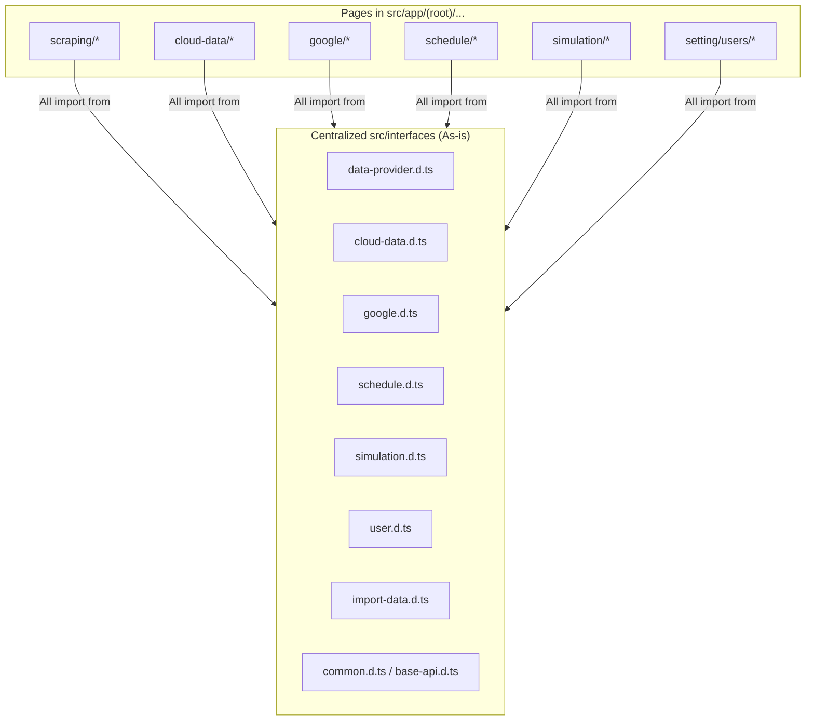
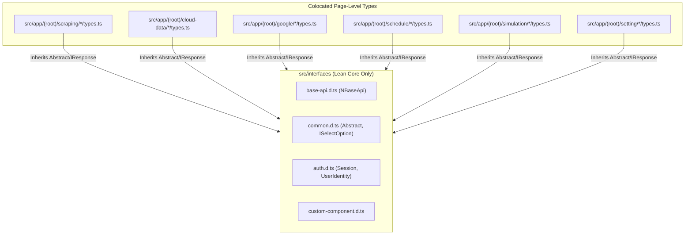

# Technical Proposal: Decompose Monolithic Interfaces to Page-Level Modules

## 1. Problem Statement & Core Concept

- **Core Business Problem**:
  1. **Monolithic Global Types Dump**: The [`src/interfaces`](file:///d:/Sources/Personal/only-one-fe/src/interfaces) folder currently contains monolithic ambient namespaces (`NDataProvider`, `NCloudData`, `NGoogle`, `NSchedule`, `NSimulation`, `NUser`, `NImportData`). These files mix domain entities, page form values, and specialized API request payloads into a single global location.
  2. **Violation of Colocation Principle**: Feature pages (`src/app/(root)/scraping/...`, `cloud-data/...`, `google/...`, `schedule/...`, `simulation/...`, `setting/...`) do not own their own data models. Their local `types.ts` files merely re-alias ambient types (e.g. `export type DataProviderRecord = NDataProvider.IDataProvider;`), creating unnecessary indirection and making it difficult to refactor individual pages without touching global type declarations.
  3. **Cross-Domain Coupling**: Global interface files frequently import one another (e.g. `data-provider.d.ts` importing `cloud-data.d.ts` and `user.d.ts` importing `google.d.ts`), causing tight coupling between otherwise unrelated features.

- **Core Value & Target Audience**: Frontend Developers gain a clean, modular architecture where each page encapsulates its own models, DTOs, and form contracts (`Colocation Principle`), while `src/interfaces` remains lean, holding only truly shared, system-wide core contracts (`base-api`, `common`, `auth`, `custom-component`).

- **Success Metrics (Definition of Done)**:
  - All domain-specific interfaces and DTOs relocated to the `types.ts` file of their respective page/feature directories.
  - Monolithic domain files (`data-provider.d.ts`, `cloud-data.d.ts`, `google.d.ts`, `schedule.d.ts`, `simulation.d.ts`, `user.d.ts`, `import-data.d.ts`) removed from `src/interfaces/`.
  - `src/interfaces/` pruned to contain ONLY:
    - `base-api.d.ts` (`NBaseApi`: `IResponse`, `IPagination`, `IFilter`, `ISort`, `IQueryOption`, etc.)
    - `common.d.ts` (`Abstract`, `IDataOption`, `ISelectOption`, `IKeyValue`, `IFile`, etc.)
    - `auth.d.ts` (NextAuth session, JWT payload, User identity for Refine AuthProvider)
    - `custom-component.d.ts` (`NCustomComponent` shared component contracts)
    - `index.ts` (Clean barrel export of common types)
  - All import paths across `src/app`, `src/components`, `src/hooks`, and `src/libs` updated and verified.
  - Zero TypeScript compile errors (`npx tsc --noEmit` exits with code 0) and zero lint issues (`npm run lint:fix`).

- **Scope Boundaries**:
  - **In-Scope**:
    - Refactoring `src/interfaces/` and page-level `types.ts` files across all feature routes (`scraping`, `cloud-data`, `google`, `schedule`, `simulation`, `setting`).
    - Updating all affected import statements in components, pages, hooks, and helpers.
  - **Explicit Out-of-Scope**:
    - Altering backend API contracts in `only-one-be`.
    - Changing runtime component behavior or UI layout.

---

## 2. Current Business Logic (As-is Analysis)

### As-is Architecture
Currently, all domain data contracts are centralized under `src/interfaces`:
- [`src/interfaces/data-provider.d.ts`](file:///d:/Sources/Personal/only-one-fe/src/interfaces/data-provider.d.ts) $\rightarrow$ Declares `namespace NDataProvider` used by scraping pages.
- [`src/interfaces/cloud-data.d.ts`](file:///d:/Sources/Personal/only-one-fe/src/interfaces/cloud-data.d.ts) $\rightarrow$ Declares `namespace NCloudData` used by cloud-data pages.
- [`src/interfaces/google.d.ts`](file:///d:/Sources/Personal/only-one-fe/src/interfaces/google.d.ts) $\rightarrow$ Declares `namespace NGoogle` used by google drive/sheets pages.
- [`src/interfaces/schedule.d.ts`](file:///d:/Sources/Personal/only-one-fe/src/interfaces/schedule.d.ts) $\rightarrow$ Declares `namespace NSchedule` used by schedule pages.
- [`src/interfaces/simulation.d.ts`](file:///d:/Sources/Personal/only-one-fe/src/interfaces/simulation.d.ts) $\rightarrow$ Declares `namespace NSimulation` used by simulation pages.
- [`src/interfaces/user.d.ts`](file:///d:/Sources/Personal/only-one-fe/src/interfaces/user.d.ts) $\rightarrow$ Declares `namespace NUser` used by user management page.
- [`src/interfaces/import-data.d.ts`](file:///d:/Sources/Personal/only-one-fe/src/interfaces/import-data.d.ts) $\rightarrow$ Declares `namespace NImportData`.

---

## 3. Proposed Solution Alternatives

### Option 1 (Recommended): Direct Colocation into Page-Level `types.ts` & Lean Core Interfaces

- **Solution Overview & Mechanics**:
  1. **Prune `src/interfaces` to Core Only**:
     - Retain `base-api.d.ts`, `common.d.ts`, `auth.d.ts`, `custom-component.d.ts`.
     - Delete `data-provider.d.ts`, `cloud-data.d.ts`, `google.d.ts`, `schedule.d.ts`, `simulation.d.ts`, `user.d.ts`, `import-data.d.ts`.
  2. **Migrate to Dedicated Page Types**:
     - **Scraping Domain**:
       - `src/app/(root)/scraping/data-providers/types.ts`: `IDataProvider`, `ITargetConfig`, `ISearchConfig`, `DataProviderFormValues`.
       - `src/app/(root)/scraping/features/[dataProviderId]/types.ts`: `IDataProviderFeature`, `IConfigVersion`, `FeatureModalState`, `CreateFeatureModalState`.
       - `src/app/(root)/scraping/items/types.ts`: `IItem`, `ItemRecord`, form values.
       - `src/app/(root)/scraping/provider-items/types.ts`: `IDataProviderItem`, `ILocalFolderRegistration`, form values.
       - `src/app/(root)/scraping/scraping-data/types.ts`: `IScrapingData`, `IScrapeDataResponse`, `IScrapeDataRequest`.
     - **Cloud Data Domain**:
       - `src/app/(root)/cloud-data/providers/types.ts`: `ICloudDataProvider`, form values.
       - `src/app/(root)/cloud-data/items/types.ts`: `ICloudDataItem`, form values.
     - **Google Domain**:
       - `src/app/(root)/google/drive/folders/types.ts`: `IGoogleDriveFolder`, sync requests.
       - `src/app/(root)/google/drive/photos/types.ts`: `IGoogleDrivePhoto`, sync requests.
       - `src/app/(root)/google/sheets/types.ts`: `IGoogleSheet`, sheet contracts.
     - **Schedule Domain**:
       - `src/app/(root)/schedule/types.ts`: `ISchedule`, `IScheduleJob`, `IScheduleHistory`.
     - **Simulation Domain**:
       - `src/app/(root)/simulation/types.ts`: `ISimulation`, `ISimulationResult`.
     - **Setting Domain**:
       - `src/app/(root)/setting/users/types.ts`: `IUser`, `CreateUserRequest`, `UpdateUserRequest`.
  3. **Batch Import Updates**:
     - Convert all namespace-based usages (`NDataProvider.IDataProvider`, etc.) to clean, direct imports (`import type { IDataProvider } from '@/app/(root)/scraping/data-providers/types'`).

- **Architecture Diagram**:

- **Pros**:
  - Strict Colocation: types live directly adjacent to the components that use them.
  - Zero dead types: deleting a page automatically deletes all its types without orphan leftovers.
  - Cleaner IntelliSense and faster incremental TypeScript builds.
- **Cons**:
  - Requires updating multiple import statements across the codebase in a systematic, automated pass.
- **Complexity & Risks**: Low - Moderate. Pure type-level refactoring with zero runtime behavior changes.

---

### Option 2 (Alternative): Intermediate Domain Types Directory (`src/types/<domain>/`)

- **Solution Overview & Mechanics**:
  - Move domain types from `src/interfaces/` into a new `src/types/<domain>/` folder instead of placing them directly in `src/app/(root)/.../types.ts`.
- **Pros**:
  - Decouples types from route paths.
- **Cons**:
  - Creates a second parallel directory structure (`src/types/` vs `src/app/`), failing the user's explicit requirement for direct page-level decomposition.
- **Complexity & Risks**: Suboptimal; doesn't satisfy the colocation goal.

---

### Comparison Matrix & Recommendation

| Criteria | Option 1 (Recommended - Page-Level Colocation) | Option 2 (Parallel `src/types/<domain>` Directory) |
| :--- | :--- | :--- |
| **Colocation & Modularity** | ⭐⭐⭐⭐⭐ Types live directly inside page directories | ⭐⭐⭐ Separate directory hierarchy |
| **Maintainability** | ⭐⭐⭐⭐⭐ Deleting a page removes its types automatically | ⭐⭐⭐ Requires syncing two parallel folder trees |
| **Adherence to User Ask** | ⭐⭐⭐⭐⭐ 100% matched to explicit prompt | ⭐⭐ Deviates from requested page decomposition |

- **Conclusion**: Recommend **Option 1**.

---

## 4. High-Level Technical Specifications

### Target Clean-up in `src/interfaces`
1. `base-api.d.ts` [KEEP]
2. `common.d.ts` [KEEP]
3. `auth.d.ts` [KEEP]
4. `custom-component.d.ts` [KEEP]
5. `index.ts` [MODIFY] (Export only the 4 core files above)
6. `data-provider.d.ts` [DELETE]
7. `cloud-data.d.ts` [DELETE]
8. `google.d.ts` [DELETE]
9. `schedule.d.ts` [DELETE]
10. `simulation.d.ts` [DELETE]
11. `user.d.ts` [DELETE]
12. `import-data.d.ts` [DELETE]

---

## 5. Next Steps

- User confirms this technical proposal `concept.md`.
- Run `/only-one-plan only-one/tasks/20260820-210000-decompose-interfaces-to-pages` to generate the 5-section `plan.md`.
- Execute implementation with `/only-one-apply only-one/tasks/20260820-210000-decompose-interfaces-to-pages`.
- Verify with `npx tsc --noEmit` and `npm run lint:fix`.
