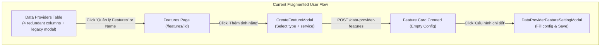
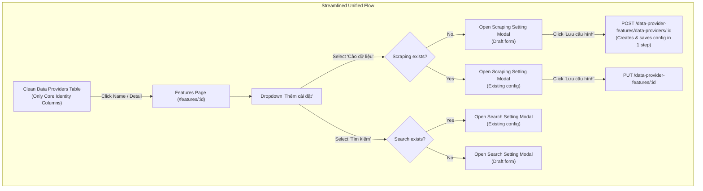

# Technical Proposal: Refactor Data Provider List and Enhance Feature Settings Dropdown UI

## 1. Problem Statement & Core Concept

- **Core Business Problem**:
  1. **Legacy Clutter on Data Providers List Table** ([data-providers/page.tsx](file:///d:/Sources/Personal/only-one-fe/src/app/%28root%29/scraping/data-providers/page.tsx)): The Data Provider list currently displays redundant columns (`features`, `targetConfig`, `searchStatus`, `searchConfig`) and embeds a legacy [`DataProviderSettingModal`](file:///d:/Sources/Personal/only-one-fe/src/app/%28root%29/scraping/data-providers/components/DataProviderSettingModal.tsx). Because the system has decoupled feature configurations into the dedicated `DataProviderFeature` domain at `/scraping/features/[dataProviderId]`, managing configurations in the root table causes UI clutter and architectural inconsistency.
  2. **Multi-Step Friction When Adding / Configuring Features** ([features/[dataProviderId]/page.tsx](file:///d:/Sources/Personal/only-one-fe/src/app/%28root%29/scraping/features/%5BdataProviderId%5D/page.tsx)): Users currently have to go through a separate `CreateFeatureModal` (selecting type and engine first) and then subsequently open `DataProviderFeatureSettingModal` to configure fields. There is no unified, one-click entry point to configure a supported feature directly from a dropdown.

- **Core Value & Target Audience**: 
  - Admin and scrapers gain a clean, streamlined Data Provider management table.
  - Users can configure any supported feature directly via a cohesive "Thêm cài đặt" (Add Configuration) dropdown button in the feature management view, opening the comprehensive configuration modal in a single intuitive step.

- **Success Metrics (Definition of Done)**:
  - [data-providers/page.tsx](file:///d:/Sources/Personal/only-one-fe/src/app/%28root%29/scraping/data-providers/page.tsx) columns pruned of legacy `features`, `targetConfig`, `searchStatus`, and `searchConfig`; [`DataProviderSettingModal`](file:///d:/Sources/Personal/only-one-fe/src/app/%28root%29/scraping/data-providers/components/DataProviderSettingModal.tsx) and associated hook states removed.
  - [features/[dataProviderId]/page.tsx](file:///d:/Sources/Personal/only-one-fe/src/app/%28root%29/scraping/features/%5BdataProviderId%5D/page.tsx) features a Dropdown button "Thêm cài đặt" containing all supported feature types (`Cào dữ liệu (Scraping)`, `Tìm kiếm (Search)`).
  - Selecting an option from "Thêm cài đặt" immediately opens the detailed configuration modal:
    - If the feature already exists, loads existing configuration with full tabs (Config, Test, Version History).
    - If the feature is uninitialized, opens the configuration form directly in draft mode, initializing and creating the feature upon clicking "Lưu cấu hình".

- **Scope Boundaries**:
  - **In-Scope**:
    - Frontend UI & state cleanup in [data-providers/page.tsx](file:///d:/Sources/Personal/only-one-fe/src/app/%28root%29/scraping/data-providers/page.tsx) and [data-providers/hooks.ts](file:///d:/Sources/Personal/only-one-fe/src/app/%28root%29/scraping/data-providers/hooks.ts).
    - Frontend Dropdown component and direct modal trigger in [features/[dataProviderId]/page.tsx](file:///d:/Sources/Personal/only-one-fe/src/app/%28root%29/scraping/features/%5BdataProviderId%5D/page.tsx), [features/[dataProviderId]/hooks.ts](file:///d:/Sources/Personal/only-one-fe/src/app/%28root%29/scraping/features/%5BdataProviderId%5D/hooks.ts), and modal components.
    - Support draft initialization inside [ScrapingConfigForm.tsx](file:///d:/Sources/Personal/only-one-fe/src/app/%28root%29/scraping/features/%5BdataProviderId%5D/components/ScrapingConfigForm.tsx) & [SearchConfigForm.tsx](file:///d:/Sources/Personal/only-one-fe/src/app/%28root%29/scraping/features/%5BdataProviderId%5D/components/SearchConfigForm.tsx) (calling `POST data-provider-features/data-providers/:dataProviderId` when `feature.id` is not yet persisted).
  - **Explicit Out-of-Scope**:
    - Backend schema changes (backend already supports `POST /data-provider-features/data-providers/:dataProviderId` and `PUT /data-provider-features/:id`).
    - Adding new feature types beyond `SCRAPING` and `SEARCH`.

---

## 2. Current Business Logic (As-is Analysis)

1. **Data Provider List Page** ([data-providers/page.tsx](file:///d:/Sources/Personal/only-one-fe/src/app/%28root%29/scraping/data-providers/page.tsx#L88-L139)):
   - Defines columns: `Tính năng` (link to features page), `Cấu hình cào` (link button to target modal), `Trạng thái tìm kiếm`, `Cấu hình tìm kiếm` (link button to search modal).
   - Renders [`DataProviderSettingModal`](file:///d:/Sources/Personal/only-one-fe/src/app/%28root%29/scraping/data-providers/page.tsx#L251-L257) connected to legacy provider columns.
   - Row actions contain redundant items `setting-target-function` and `setting-search-function`.

2. **Feature Management Page** ([features/[dataProviderId]/page.tsx](file:///d:/Sources/Personal/only-one-fe/src/app/%28root%29/scraping/features/%5BdataProviderId%5D/page.tsx#L65-L73)):
   - Shows "Thêm tính năng" button which opens [`CreateFeatureModal`](file:///d:/Sources/Personal/only-one-fe/src/app/%28root%29/scraping/features/%5BdataProviderId%5D/components/CreateFeatureModal.tsx) asking only for `type` and `service`.
   - After creation, user must click "Cấu hình chi tiết" on the newly created card to fill in the actual selectors / headers / query params.

---

## 3. Proposed Solution Alternatives

### Option 1 (Recommended): Dropdown "Thêm cài đặt" with Direct Config Modal & Clean Data Providers Table

- **Solution Overview & Mechanics**:
  1. **Clean Data Provider Table**:
     - Remove columns `features`, `targetConfig`, `searchStatus`, `searchConfig`.
     - Remove `DataProviderSettingModal` component and `openSettingModal`/`settingRecord` from `useDataProviderPage`.
     - Keep clean table with Name (clickable to detail), Identifier, Base URL, Status, Created At, and standard Edit/Delete actions.
  2. **Dropdown "Thêm cài đặt" in Features Page**:
     - Replace "Thêm tính năng" button in `ProviderFeaturesHeader` / Section header with an Ant Design Dropdown menu titled "Thêm cài đặt" (with `lucide:settings-2` or `lucide:plus` icon).
     - Menu lists all supported feature types:
       - `Cào dữ liệu (Scraping)`
       - `Tìm kiếm (Search)`
     - Selecting a type triggers `openConfigModalForType(type)`:
       - If feature already exists: opens `DataProviderFeatureSettingModal` with the existing `feature` record.
       - If feature does not exist yet: opens `DataProviderFeatureSettingModal` with a draft feature object (`id: ''`, `dataProviderId`, `type`, `service: 'generic'`, `config: {}`).
  3. **Seamless Direct Save**:
     - Inside `ScrapingConfigForm` and `SearchConfigForm`:
       - If `feature.id` exists $\rightarrow$ `PUT /data-provider-features/:id`
       - If `feature.id` is empty $\rightarrow$ `POST /data-provider-features/data-providers/:dataProviderId` with `{ type, service, config }`
     - Automatically creates and saves the feature in 1 unified step.

- **Mermaid Flowchart**:

- **Pros**:
  - Eliminates multi-step modal friction (no need for empty `CreateFeatureModal` intermediate step).
  - Unifies entry points: user can add or edit configuration directly from the header dropdown or from the card.
  - Zero disruption to existing features.
- **Cons**:
  - `DataProviderFeatureSettingModal` needs slight adaptation to handle draft mode (disable Version History tab until feature is created).
- **Complexity & Risks**: Low complexity, zero backend risk.

---

### Option 2 (Alternative): Dropdown Opens Create Feature Modal First (2-step modal flow)

- **Solution Overview & Mechanics**:
  - Dropdown "Thêm cài đặt" replaces the button, but selecting an item only opens `CreateFeatureModal` with that type pre-selected.
  - After creating, the card appears and the user must click into it to configure.
- **Pros**: Reuses existing `CreateFeatureModal` without modification.
- **Cons**: Still requires 2 steps and 2 modals to configure a feature. Inferior UX compared to Option 1.
- **Complexity & Risks**: Very low complexity, but misses the core UX optimization requested by user.

---

### Comparison Matrix & Recommendation

| Criteria | Option 1 (Recommended) | Option 2 |
| :--- | :--- | :--- |
| User Experience | Seamless 1-step direct configuration | 2-step disjointed modal flow |
| Code Cleanliness | High (removes redundant modals & legacy columns) | Moderate |
| Extensibility | High (easy to register future feature types) | Moderate |
| Implementation Risk | Very Low | Low |

- **Conclusion**: Recommend **Option 1** because it fulfills the user's explicit preference for direct 1-step configuration upon selecting from the "Thêm cài đặt" dropdown.

---

## 4. Key Failure Modes & Security Boundaries

- **Validation Failure**: Form field validation occurs before API dispatch (`form.validateFields()`), ensuring invalid regex, missing selectors, or malformed JSON are caught client-side.
- **Concurrent Creation**: Backend enforces unique constraint on `(dataProviderId, type)`, preventing duplicate feature generation.
- **Authorization Boundary**: All feature creation and updates are protected under standard JWT authentication (`JwtAuthGuard`).

---

## 5. High-Level Technical Specifications

- **Affected Files (FE)**:
  - [data-providers/page.tsx](file:///d:/Sources/Personal/only-one-fe/src/app/%28root%29/scraping/data-providers/page.tsx): Strip columns `features`, `targetConfig`, `searchStatus`, `searchConfig`, remove `DataProviderSettingModal`.
  - [data-providers/hooks.ts](file:///d:/Sources/Personal/only-one-fe/src/app/%28root%29/scraping/data-providers/hooks.ts): Clean up `settingModalState`, `openSettingModal`, `closeSettingModal`.
  - [features/[dataProviderId]/page.tsx](file:///d:/Sources/Personal/only-one-fe/src/app/%28root%29/scraping/features/%5BdataProviderId%5D/page.tsx): Add "Thêm cài đặt" Dropdown button, remove legacy `CreateFeatureModal` trigger.
  - [features/[dataProviderId]/hooks.ts](file:///d:/Sources/Personal/only-one-fe/src/app/%28root%29/scraping/features/%5BdataProviderId%5D/hooks.ts): Add helper `openConfigByType(type: DataProviderFeatureType)`.
  - [features/[dataProviderId]/components/DataProviderFeatureSettingModal.tsx](file:///d:/Sources/Personal/only-one-fe/src/app/%28root%29/scraping/features/%5BdataProviderId%5D/components/DataProviderFeatureSettingModal.tsx): Support draft mode (disable version history tab when `feature.id` is not present).
  - [ScrapingConfigForm.tsx](file:///d:/Sources/Personal/only-one-fe/src/app/%28root%29/scraping/features/%5BdataProviderId%5D/components/ScrapingConfigForm.tsx) & [SearchConfigForm.tsx](file:///d:/Sources/Personal/only-one-fe/src/app/%28root%29/scraping/features/%5BdataProviderId%5D/components/SearchConfigForm.tsx): Adapt submit logic to call `POST` for unpersisted features and `PUT` for persisted features.

---

## 6. Next Steps

1. User confirms the proposal in `concept.md`.
2. Run `/only-one-plan only-one/tasks/20260820-213600-refactor-data-provider-features-ui` to produce the detailed 5-section `plan.md`.
3. Execute implementation with `/only-one-apply only-one/tasks/20260820-213600-refactor-data-provider-features-ui`.
4. Review and archive with `/only-one-review` and `/only-one-archive`.
