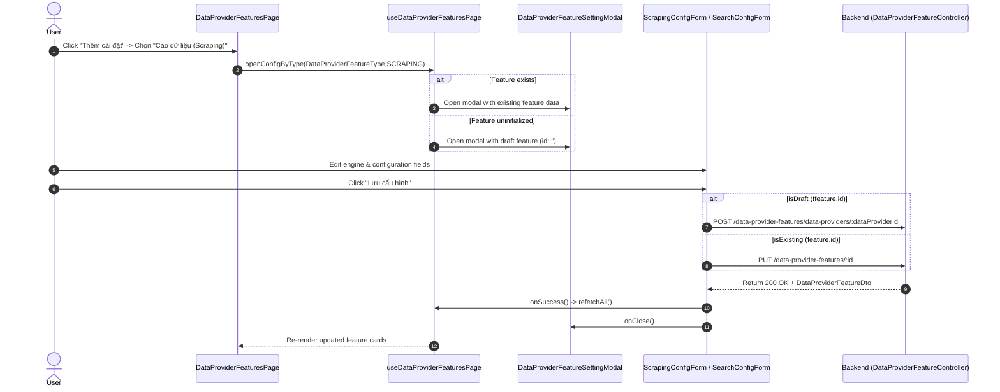

# Implementation Plan: Refactor Data Provider List and Enhance Feature Settings Dropdown UI

## Section 1. Current State

### Current Execution Flow & Codebase Survey
1. **Data Provider List Page** ([data-providers/page.tsx](file:///d:/Sources/Personal/only-one-fe/src/app/%28root%29/scraping/data-providers/page.tsx#L39-L140)):
   - Renders 4 legacy columns: `Tính năng` (line 88), `Cấu hình cào` (line 104), `Trạng thái tìm kiếm` (line 120), `Cấu hình tìm kiếm` (line 127).
   - Renders row actions: `setting-target-function` (line 150) and `setting-search-function` (line 156).
   - Embeds [`DataProviderSettingModal`](file:///d:/Sources/Personal/only-one-fe/src/app/%28root%29/scraping/data-providers/components/DataProviderSettingModal.tsx#L19-L26) connected to `useDataProviderPage` state (`settingRecord`, `settingConfigType`).
2. **Feature Management View** ([features/[dataProviderId]/page.tsx](file:///d:/Sources/Personal/only-one-fe/src/app/%28root%29/scraping/features/%5BdataProviderId%5D/page.tsx#L40-L107)):
   - Renders a "Thêm tính năng" button (line 66) that triggers [`CreateFeatureModal`](file:///d:/Sources/Personal/only-one-fe/src/app/%28root%29/scraping/features/%5BdataProviderId%5D/components/CreateFeatureModal.tsx) asking only for type and service.
   - Once created, user has to locate the card in [`ProviderFeatureCardGrid`](file:///d:/Sources/Personal/only-one-fe/src/app/%28root%29/scraping/features/%5BdataProviderId%5D/components/ProviderFeatureCardGrid.tsx#L31-L64) and click "Cấu hình chi tiết" to open [`DataProviderFeatureSettingModal`](file:///d:/Sources/Personal/only-one-fe/src/app/%28root%29/scraping/features/%5BdataProviderId%5D/components/DataProviderFeatureSettingModal.tsx).
3. **Configuration Submissions** ([ScrapingConfigForm.tsx](file:///d:/Sources/Personal/only-one-fe/src/app/%28root%29/scraping/features/%5BdataProviderId%5D/components/ScrapingConfigForm.tsx#L68-L105) & [SearchConfigForm.tsx](file:///d:/Sources/Personal/only-one-fe/src/app/%28root%29/scraping/features/%5BdataProviderId%5D/components/SearchConfigForm.tsx#L60-L95)):
   - Assumes `feature.id` is always present and issues only `PUT data-provider-features/${feature.id}`.

### Core Problems Addressed
- **UI Inconsistency**: Data provider list table is overloaded with obsolete feature columns that bypass the dedicated feature architecture.
- **Friction in Configuration Flow**: Adding a new feature configuration requires 2 separate modals across 2 disconnected steps.

### Explicit Unchanged Behaviors (Regression Prevention)
- Core Data Provider table columns (`Tên`, `Mã`, `URL cơ sở`, `Trạng thái`, `Ngày tạo`) and modal create/edit actions remain fully functional.
- Clicking on the Data Provider name continues navigating to `/scraping/features/${record.id}`.
- Feature card status toggling (`handleSwitchStatus`), contextual testing, and rollback operations remain fully operational.

---

## Section 2. Detailed Design

### Architectural Design & Flow
1. **Streamlined Data Providers Table**:
   - Strip all 4 legacy columns and 2 legacy row actions from [data-providers/page.tsx](file:///d:/Sources/Personal/only-one-fe/src/app/%28root%29/scraping/data-providers/page.tsx).
   - Remove [`DataProviderSettingModal`](file:///d:/Sources/Personal/only-one-fe/src/app/%28root%29/scraping/data-providers/components/DataProviderSettingModal.tsx) and clean up `settingRecord`, `settingConfigType`, `openSettingModal`, `closeSettingModal` from [data-providers/hooks.ts](file:///d:/Sources/Personal/only-one-fe/src/app/%28root%29/scraping/data-providers/hooks.ts).
2. **Direct Configuration Dropdown ("Thêm cài đặt")**:
   - In [features/[dataProviderId]/page.tsx](file:///d:/Sources/Personal/only-one-fe/src/app/%28root%29/scraping/features/%5BdataProviderId%5D/page.tsx), provide a `CustomDropdown` button labeled **"Thêm cài đặt"** displaying all supported types (`Cào dữ liệu (Scraping)` and `Tìm kiếm (Search)`).
   - The dropdown items provide visual badges indicating status (`Đã cấu hình` vs `Chưa cấu hình`).
   - Triggering a feature type invokes `openConfigByType(type)`:
     - **If feature exists**: Opens [`DataProviderFeatureSettingModal`](file:///d:/Sources/Personal/only-one-fe/src/app/%28root%29/scraping/features/%5BdataProviderId%5D/components/DataProviderFeatureSettingModal.tsx) with active configuration.
     - **If feature does not exist**: Constructs a draft `IDataProviderFeature` object (`id: ''`, `dataProviderId`, `type`, `service: 'generic'`, `config: {}`) and immediately opens the modal in draft mode.
3. **Unified Single-Step Persistence**:
   - [ScrapingConfigForm.tsx](file:///d:/Sources/Personal/only-one-fe/src/app/%28root%29/scraping/features/%5BdataProviderId%5D/components/ScrapingConfigForm.tsx) and [SearchConfigForm.tsx](file:///d:/Sources/Personal/only-one-fe/src/app/%28root%29/scraping/features/%5BdataProviderId%5D/components/SearchConfigForm.tsx) inspect `feature.id`:
     - If `feature.id` is present $\rightarrow$ `PUT data-provider-features/${feature.id}` with `UpdateFeatureConfigRequest`.
     - If `feature.id` is empty $\rightarrow$ `POST data-provider-features/data-providers/${feature.dataProviderId}` with `CreateDataProviderFeatureRequest` (`type`, `service`, `config`).
   - Upon save success, triggers `refetchAll()`, closes the modal, and refreshes the card grid.

### ASCII Wireframe & Component State Flow

```text
+-----------------------------------------------------------------------------------------------+
|  <- Danh sách nhà cung cấp / Shoplus Provider                                                 |
|  [ Database Icon ]  Shoplus Provider (SHOPLUS)           Created At: 20/08/2026              |
|                     https://shoplus.net [->]                                                  |
+-----------------------------------------------------------------------------------------------+
|  Các tính năng hoạt động                                                                      |
|  Quản lý trạng thái, cấu hình và lịch sử...                  [ Thêm cài đặt [v] ]             |
|                                                              +------------------------------+ |
|                                                              | [*] Cào dữ liệu (Scraping)   | |
|                                                              |     Đã khởi tạo • Chỉnh sửa  | |
|                                                              |------------------------------| |
|                                                              | [?] Tìm kiếm (Search)        | |
|                                                              |     Chưa khởi tạo • Thiết lập| |
|                                                              +------------------------------+ |
+-----------------------------------------------------------------------------------------------+
| +-----------------------------------------+   +---------------------------------------------+ |
| | [Card: Cào dữ liệu]           [Active]  |   | [Dashed Card: Khởi tạo tính năng mới]       | |
| | Service: generic                        |   |                                             | |
| | Last run: 20/08/2026                    |   |     (+) Thêm tính năng Cào hoặc Tìm kiếm    | |
| |                                         |   |                                             | |
| | [ Thử nghiệm ]   [ Cấu hình chi tiết ]  |   |     (Click mở trực tiếp form cấu hình)      | |
| +-----------------------------------------+   +---------------------------------------------+ |
+-----------------------------------------------------------------------------------------------+
```

### Red-Team Check (Doubt-Driven Reconcile)
- **Claim**: Removing `CreateFeatureModal` will break the ability to select the engine (`generic`, `puppeteer`, `playwright`).
- **Doubt**: How will users specify the engine when creating a new feature?
- **Reconcile**: Both `ScrapingConfigForm` and `SearchConfigForm` already have a prominent `Service Engine` select input (`ScraperServiceEnum.API`, `GENERIC`, `LOCAL`, etc.) at the very top of their forms. Saving the form saves both the engine and config simultaneously.

---

## Section 3. Implementation Architecture

### Target Directory & File Changes

```text
only-one-fe/src/app/(root)/scraping/
├── data-providers/
│   ├── components/
│   │   ├── DataProviderFormModal.tsx
│   │   ├── DataProviderSettingModal.tsx           [DELETE] (obsolete legacy modal wrapper)
│   │   ├── DataProviderTargetModal.tsx            [DELETE] (migrated to ScrapingConfigForm)
│   │   ├── DataProviderSearchModal.tsx            [DELETE] (migrated to SearchConfigForm)
│   │   └── index.ts                               [MODIFY] (clean up exports)
│   ├── hooks.ts                                   [MODIFY] (remove setting modal states)
│   ├── page.tsx                                   [MODIFY] (remove legacy columns & modal)
│   └── types.ts                                   [MODIFY] (clean up unused types)
└── features/[dataProviderId]/
    ├── components/
    │   ├── CreateFeatureModal.tsx                 [DELETE] (superseded by direct config modal)
    │   ├── DataProviderFeatureSettingModal.tsx    [MODIFY] (support draft mode / tab guards)
    │   ├── ProviderFeatureCardGrid.tsx            [MODIFY] (connect placeholder card to direct open)
    │   ├── ScrapingConfigForm.tsx                 [MODIFY] (support POST create & PUT update)
    │   ├── SearchConfigForm.tsx                   [MODIFY] (support POST create & PUT update)
    │   └── index.ts                               [MODIFY] (remove CreateFeatureModal export)
    ├── hooks.ts                                   [MODIFY] (add openConfigByType helper)
    └── page.tsx                                   [MODIFY] (add Dropdown "Thêm cài đặt")
```

### Mermaid Architecture Diagram



---

## Section 4. Implementation Code Examples

### 1. [MODIFY] [data-providers/page.tsx](file:///d:/Sources/Personal/only-one-fe/src/app/%28root%29/scraping/data-providers/page.tsx)
- **Summary**: Strip legacy feature/scraping/search columns, row actions, and modal rendering.
- **Symbols Modified**: `columns`, `customRowActions`, remove `DataProviderSettingModal`.
- **Code Snippet**:

```tsx
const columns: ColumnsType<DataProviderRecord> = [
    {
        title: 'Tên',
        dataIndex: 'name',
        key: 'name',
        ellipsis: true,
        sorter: true,
        width: '25%',
        render: (name: string, record) => (
            <CustomButton
                type="link"
                className="p-0 font-medium text-hub-primary hover:underline"
                onClick={() => router.push(`/scraping/features/${record.id}`)}
            >
                {name}
            </CustomButton>
        ),
    },
    {
        title: 'Mã',
        dataIndex: 'identifier',
        key: 'identifier',
        ellipsis: true,
        sorter: true,
        width: '15%',
    },
    {
        title: 'URL cơ sở',
        dataIndex: 'baseUrl',
        key: 'baseUrl',
        ellipsis: true,
        sorter: true,
        width: '30%',
    },
    {
        key: 'status',
        title: 'Trạng thái',
        dataIndex: 'status',
        render: (status: DataProviderStatus) => <StatusTag status={status} />,
        width: '15%',
    },
    {
        title: 'Ngày tạo',
        dataIndex: 'createdAt',
        key: 'createdAt',
        sorter: true,
        render: (createdAt: Date) => formatDate(createdAt),
        width: '15%',
    },
];

const customRowActions: TableCustomAction<DataProviderRecord>[] = [
    {
        key: 'manage-features',
        icon: <Icon icon="lucide:layers" />,
        tooltip: 'Quản lý tính năng',
        onClick: (record) => router.push(`/scraping/features/${record.id}`),
    },
];
```

---

### 2. [MODIFY] [data-providers/hooks.ts](file:///d:/Sources/Personal/only-one-fe/src/app/%28root%29/scraping/data-providers/hooks.ts)
- **Summary**: Remove `settingModalState`, `openSettingModal`, `closeSettingModal` and obsolete return properties.

---

### 3. [MODIFY] [features/[dataProviderId]/hooks.ts](file:///d:/Sources/Personal/only-one-fe/src/app/%28root%29/scraping/features/%5BdataProviderId%5D/hooks.ts)
- **Summary**: Add `openConfigByType(type: DataProviderFeatureType)` handling both existing features and draft creation.
- **Code Snippet**:

```tsx
const openConfigByType = (type: DataProviderFeatureType): void => {
    const existing = features.find((f) => f.type === type);
    if (existing) {
        setModalState({ open: true, feature: existing, activeTab: 'config' });
        return;
    }

    const draftFeature: IDataProviderFeature = {
        id: '',
        dataProviderId,
        type,
        service: 'generic',
        status: DataProviderFeatureStatus.UNCONFIGURED,
        consecutiveFailures: 0,
        config: {},
        createdAt: new Date(),
        updatedAt: new Date(),
        deletedAt: null,
        dataProvider: provider,
    };
    setModalState({ open: true, feature: draftFeature, activeTab: 'config' });
};
```

---

### 4. [MODIFY] [features/[dataProviderId]/page.tsx](file:///d:/Sources/Personal/only-one-fe/src/app/%28root%29/scraping/features/%5BdataProviderId%5D/page.tsx)
- **Summary**: Replace "Thêm tính năng" button with `CustomDropdown` "Thêm cài đặt".
- **Code Snippet**:

```tsx
const settingMenuItems = [
    {
        key: DataProviderFeatureType.SCRAPING,
        label: (
            <div className="flex items-center gap-2.5 py-1">
                <Icon icon="lucide:file-code" className="text-hub-primary text-base shrink-0" />
                <div>
                    <div className="font-medium text-hub-title">Cào dữ liệu (Scraping)</div>
                    <div className="text-[11px] text-hub-subtitle">
                        {features.some((f) => f.type === DataProviderFeatureType.SCRAPING)
                            ? 'Đã khởi tạo • Chỉnh sửa cấu hình'
                            : 'Chưa khởi tạo • Bấm để thiết lập'}
                    </div>
                </div>
            </div>
        ),
        onClick: () => openConfigByType(DataProviderFeatureType.SCRAPING),
    },
    {
        key: DataProviderFeatureType.SEARCH,
        label: (
            <div className="flex items-center gap-2.5 py-1">
                <Icon icon="lucide:search" className="text-hub-primary text-base shrink-0" />
                <div>
                    <div className="font-medium text-hub-title">Tìm kiếm (Search)</div>
                    <div className="text-[11px] text-hub-subtitle">
                        {features.some((f) => f.type === DataProviderFeatureType.SEARCH)
                            ? 'Đã khởi tạo • Chỉnh sửa cấu hình'
                            : 'Chưa khởi tạo • Bấm để thiết lập'}
                    </div>
                </div>
            </div>
        ),
        onClick: () => openConfigByType(DataProviderFeatureType.SEARCH),
    },
];

// In JSX Header Action:
<CustomDropdown menu={{ items: settingMenuItems }} trigger={['click']} placement="bottomRight">
    <CustomButton type="primary" icon={<Icon icon="lucide:settings-2" className="text-base" />}>
        Thêm cài đặt <Icon icon="lucide:chevron-down" className="ml-1 text-xs" />
    </CustomButton>
</CustomDropdown>
```

---

### 5. [MODIFY] [ScrapingConfigForm.tsx](file:///d:/Sources/Personal/only-one-fe/src/app/%28root%29/scraping/features/%5BdataProviderId%5D/components/ScrapingConfigForm.tsx) & [SearchConfigForm.tsx](file:///d:/Sources/Personal/only-one-fe/src/app/%28root%29/scraping/features/%5BdataProviderId%5D/components/SearchConfigForm.tsx)
- **Summary**: Support dynamic persistence branching (`POST` for unpersisted features, `PUT` for persisted features).
- **Code Snippet**:

```tsx
const handleSave = async (): Promise<void> => {
    try {
        const values = await form.validateFields();
        setIsSaving(true);

        const { service, changeDescription, ...configValues } = values;
        const isDraft = !feature.id;

        handleCustomMutationData({
            method: isDraft ? 'post' : 'put',
            url: isDraft
                ? `data-provider-features/data-providers/${feature.dataProviderId}`
                : `data-provider-features/${feature.id}`,
            values: isDraft
                ? {
                      type: feature.type,
                      service: service || 'generic',
                      config: configValues,
                  }
                : {
                      service,
                      changeDescription: changeDescription || 'Cập nhật cấu hình cào',
                      config: configValues,
                  },
            successNotification: () => {
                setIsSaving(false);
                onSuccess();
                onClose();
                return {
                    type: MessageType.SUCCESS,
                    message: isDraft
                        ? 'Khởi tạo và lưu cấu hình thành công'
                        : 'Lưu cấu hình cào thành công',
                };
            },
            errorNotification: (error) => {
                setIsSaving(false);
                return {
                    type: MessageType.ERROR,
                    message: 'Lưu cấu hình thất bại',
                    description: error?.message,
                };
            },
        });
    } catch (error) {
        setIsSaving(false);
        console.error('Save config error:', error);
    }
};
```

---

### 6. [MODIFY] [DataProviderFeatureSettingModal.tsx](file:///d:/Sources/Personal/only-one-fe/src/app/%28root%29/scraping/features/%5BdataProviderId%5D/components/DataProviderFeatureSettingModal.tsx)
- **Summary**: Conditionally guard test and version tabs when `!feature.id` (draft mode).
- **Code Snippet**:

```tsx
const isDraft = !feature.id;
const tabItems = [
    {
        key: 'config',
        label: (
            <span className="flex items-center gap-2">
                <Icon icon="lucide:settings" className="w-4 h-4" />
                Cấu hình
            </span>
        ),
        children: isScraping ? (
            <ScrapingConfigForm feature={feature} onSuccess={onSuccess} onClose={onClose} />
        ) : (
            <SearchConfigForm feature={feature} onSuccess={onSuccess} onClose={onClose} />
        ),
    },
    ...(!isDraft
        ? [
              {
                  key: 'test',
                  label: (
                      <span className="flex items-center gap-2">
                          <Icon icon="lucide:flask-conical" className="w-4 h-4" />
                          Thử nghiệm
                      </span>
                  ),
                  children: <FeatureTestTab feature={feature} />,
              },
              {
                  key: 'versions',
                  label: (
                      <span className="flex items-center gap-2">
                          <Icon icon="lucide:history" className="w-4 h-4" />
                          Lịch sử phiên bản
                      </span>
                  ),
                  children: (
                      <FeatureVersionHistoryTab
                          feature={feature}
                          onRollbackSuccess={() => {
                              onSuccess();
                              onClose();
                          }}
                      />
                  ),
              },
          ]
        : []),
];
```

---

### 7. [MODIFY] [ProviderFeatureCardGrid.tsx](file:///d:/Sources/Personal/only-one-fe/src/app/%28root%29/scraping/features/%5BdataProviderId%5D/components/ProviderFeatureCardGrid.tsx)
- **Summary**: Connect missing feature card click directly to `onOpenModalForType` or `onAddFeature`.

---

## Section 5. Test Cases

### Acceptance Test Scenarios

#### Scenario 1: Clean Data Provider Table
- **Objective**: Verify Data Provider list table displays only core identity columns and no modal error occurs.
- **Precondition**: Navigated to `/scraping/data-providers`.
- **Action**: Inspect table headers and row actions.
- **Expected Result**: Table displays `Tên`, `Mã`, `URL cơ sở`, `Trạng thái`, `Ngày tạo`. Legacy columns (`Tính năng`, `Cấu hình cào`, `Trạng thái tìm kiếm`, `Cấu hình tìm kiếm`) and legacy modal are absent.

```gherkin
Scenario: Data Provider Table is clean of legacy feature columns
  Given the user is on "/scraping/data-providers"
  Then the table should only display "Tên", "Mã", "URL cơ sở", "Trạng thái", "Ngày tạo"
  And clicking a provider's name should navigate to "/scraping/features/[id]"
```

#### Scenario 2: Direct Setup via "Thêm cài đặt" Dropdown
- **Objective**: Verify dropdown opens the draft configuration modal for uninitialized feature and saves successfully.
- **Precondition**: Provider has no existing `SEARCH` feature. User is on `/scraping/features/:id`.
- **Action**: Click "Thêm cài đặt" -> Select "Tìm kiếm (Search)" -> Fill config -> Click "Lưu cấu hình".
- **Expected Result**: Modal opens directly to Search config form. Submitting issues `POST` request, creates the feature record, refetches grid, and renders Search card.

```gherkin
Scenario: Create and configure uninitialized feature in 1 step
  Given provider has no SEARCH feature
  When user clicks "Thêm cài đặt" and selects "Tìm kiếm (Search)"
  Then the configuration modal opens in draft mode
  When user fills search parameters and clicks "Lưu cấu hình"
  Then a POST request is sent to "data-provider-features/data-providers/:dataProviderId"
  And the search feature card appears in the grid
```

#### Scenario 3: Direct Edit of Existing Feature via Dropdown
- **Objective**: Verify dropdown opens existing feature configuration with all 3 tabs enabled.
- **Precondition**: Provider already has `SCRAPING` feature initialized.
- **Action**: Click "Thêm cài đặt" -> Select "Cào dữ liệu (Scraping)".
- **Expected Result**: Modal opens with active scraping config, with "Cấu hình", "Thử nghiệm", and "Lịch sử phiên bản" tabs active and accessible.

---

### Verification Commands
```bash
# Frontend Typecheck & Build Validation
cd d:\Sources\Personal\only-one-fe
npm run build
```
