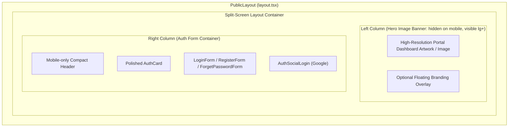
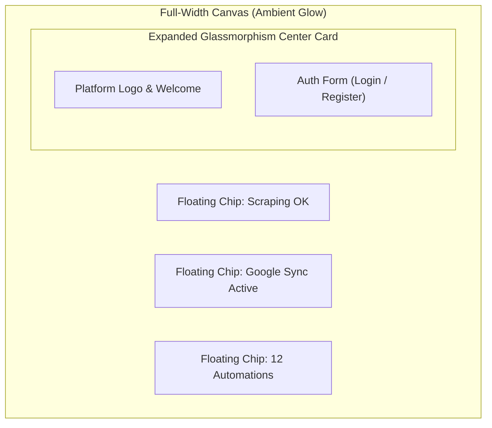

# Technical Proposal: Public Auth Portal Redesign (Split-Screen Modern Hub Showcase)

## 1. Problem Statement & Core Concept

- **Core Business Problem**: The current authentication pages ([`login/page.tsx`](file:///Users/kiem/Sources/Personal/only-one-fe/src/app/%28public%29/login/page.tsx), [`register/page.tsx`](file:///Users/kiem/Sources/Personal/only-one-fe/src/app/%28public%29/register/page.tsx), [`forget-password/page.tsx`](file:///Users/kiem/Sources/Personal/only-one-fe/src/app/%28public%29/forget-password/page.tsx)) utilize a minimal centered single-card layout ([`AuthCard.tsx`](file:///Users/kiem/Sources/Personal/only-one-fe/src/app/%28public%29/_components/auth/AuthCard.tsx) inside [`AuthLayout.tsx`](file:///Users/kiem/Sources/Personal/only-one-fe/src/app/%28public%29/_components/auth/AuthLayout.tsx)). This simplistic layout fails to communicate the identity, power, and rich multi-module capabilities of **Only One Hub** as a centralized operations portal (Data Scraping, Cloud Storage, Google Workspace Sync, Task Automation, and Simulation Engine).
- **Core Value & Target Audience**: Provides users and administrators with an engaging, modern, high-tech split-screen authentication experience that boosts brand trust and visually showcases platform features before logging in.
- **Success Metrics (Definition of Done)**:
    - 100% responsive two-column split layout on desktop (`>= lg`) and graceful collapsible single-column layout on mobile/tablet (`< lg`).
    - Visual Hero Showcase featuring high-fidelity interactive/animated portal ecosystem preview cards (Scraping Provider Metrics, Cloud Data Hub, Task Scheduler, Google Sync).
    - Polished Auth Form cards with smooth micro-interactions, subtle glassmorphism/gradient borders, and consistent design token compliance (`--hub-primary`, `--hub-bg`, `--hub-surface`, `--hub-border-card`).
    - Zero breaking changes to existing authentication logic ([`useLoginPage`](file:///Users/kiem/Sources/Personal/only-one-fe/src/app/%28public%29/login/hooks.ts), [`useRegisterPage`](file:///Users/kiem/Sources/Personal/only-one-fe/src/app/%28public%29/register/hooks.ts), [`useForgetPasswordPage`](file:///Users/kiem/Sources/Personal/only-one-fe/src/app/%28public%29/forget-password/hooks.ts)).
- **Scope Boundaries**:
    - **In-Scope**:
        - Refactoring [`AuthLayout.tsx`](file:///Users/kiem/Sources/Personal/only-one-fe/src/app/%28public%29/_components/auth/AuthLayout.tsx) to support a modular Split-Screen architecture.
        - Building a dedicated [`AuthHeroShowcase.tsx`](file:///Users/kiem/Sources/Personal/only-one-fe/src/app/%28public%29/_components/auth/AuthHeroShowcase.tsx) component with tech badges, animated background gradients, and feature widget cards.
        - Upgrading [`AuthCard.tsx`](file:///Users/kiem/Sources/Personal/only-one-fe/src/app/%28public%29/_components/auth/AuthCard.tsx) and [`AuthSocialLogin.tsx`](file:///Users/kiem/Sources/Personal/only-one-fe/src/app/%28public%29/_components/auth/AuthSocialLogin.tsx) with modernized styling, subtitle badges, and smooth hover effects.
        - Updating layout integration across `/login`, `/register`, and `/forget-password`.
    - **Explicit Out-of-Scope**:
        - Backend API modifications or NextAuth route handler logic changes.
        - Modifying internal dashboard routes or private layout shells (`src/app/(dashboard)/*`).

---

## 2. Current Business Logic (As-is Analysis)

- **Execution Flow**:
    1. User navigates to any public route (`/login`, `/register`, or `/forget-password`).
    2. [`PublicLayout`](file:///Users/kiem/Sources/Personal/only-one-fe/src/app/%28public%29/layout.tsx) wraps the route in `<MainProvider isPublic>` and renders [`AuthLayout`](file:///Users/kiem/Sources/Personal/only-one-fe/src/app/%28public%29/_components/auth/AuthLayout.tsx).
    3. [`AuthLayout`](file:///Users/kiem/Sources/Personal/only-one-fe/src/app/%28public%29/_components/auth/AuthLayout.tsx) renders a single centered container with a maximum width of `440px` (`max-w-[420px] lg:max-w-[440px]`).
    4. Each page renders [`AuthCard`](file:///Users/kiem/Sources/Personal/only-one-fe/src/app/%28public%29/_components/auth/AuthCard.tsx), displaying a static [`Logo`](file:///Users/kiem/Sources/Personal/only-one-fe/src/components/common/display/logo/index.tsx), title/subtitle, the respective form (`LoginForm`, `RegisterForm`, or `ForgetPasswordForm`), and social login buttons ([`AuthSocialLogin`](file:///Users/kiem/Sources/Personal/only-one-fe/src/app/%28public%29/_components/auth/AuthSocialLogin.tsx)).
- **Identified Limitations**:
    - **Monotonous Visuals**: A single white/dark card in an empty screen lacks energy and looks like a generic starter template.
    - **Missing Product Identity**: No visual presentation of what "Only One Hub" actually does.
    - **Sub-optimal Screen Space Utilization**: On desktop monitors (1920x1080 and above), >80% of screen real estate remains unused.

---

## 3. Proposed Solution Alternatives

### Option 1 (Recommended): Asymmetric Two-Column Split Layout with Visual Portal Hero Image Banner

- **Solution Overview & Mechanics**:
    - Divide the viewport on `lg` breakpoints into two columns (50% Hero Image Banner / 50% Auth Card Container or 55%/45% balanced ratio).
    - **Left Column (Hero Image Banner)**:
        - A vibrant, modern, high-resolution visual image/artwork representing a centralized operations portal and technology dashboard (sleek futuristic 3D/glassmorphism UI elements, dark gradient palette, dynamic tech vibes).
        - Embedded with rounded corners or full-bleed bleed edge, optional subtle branding overlay (Logo & Tagline) floating on top of the image banner.
    - **Right Column (Auth Form Area)**:
        - Centered card with clean inputs, subtle gradient border accents, and polished micro-interactions.
        - Mobile-responsive: on screens `< lg`, the left image collapses gracefully into a compact branded header badge above the form.

- **Architecture / Layout Diagram**:

- **Pros**:
    - Delivers a state-of-the-art SaaS portal impression instantly upon landing.
    - Highlights actual modules existing in Only One Hub (`/scraping`, `/cloud-data`, `/schedule`).
    - Highly extensible and cleanly separated into isolated components.
- **Cons**:
    - Requires maintaining showcase preview items when adding major new platform modules.
- **Complexity & Risks**:
    - Low-to-moderate complexity; zero risk to auth backend flows.

---

### Option 2 (Alternative): Full-width Ambient Mesh Canvas with Central Floating Glassmorphism Portal

- **Solution Overview & Mechanics**:
    - Retain a single-card flow but expand the central card into a wider landscape modal (e.g. `max-w-4xl`) with floating auxiliary widget chips hovering in 3D perspective around the main card.
    - Uses heavy CSS backdrop blur, floating micro-chips, and ambient background light rings.

- **Architecture / Layout Diagram**:

- **Pros**:
    - Keeps forms strictly centered while adding visual flair.
- **Cons**:
    - Floating chips often clip on medium screens (tablets, 13" laptops).
    - Provides less space for coherent feature descriptions compared to a true 2-column split.
- **Complexity & Risks**:
    - Higher CSS tuning risk for responsive positioning across varying aspect ratios.

---

### Comparison Matrix & Recommendation

| Evaluation Criteria | Option 1: Split-Screen Showcase (Recommended) | Option 2: Ambient Floating Canvas |
| :--- | :--- | :--- |
| **Visual Wow Factor** | High (Modern Enterprise SaaS Portal aesthetic) | Moderate-High (Creative, but can feel cluttered) |
| **Product Communication** | Excellent (Clear feature modules & live stats) | Fair (Scattered floating chips) |
| **Responsive Adaptability** | Seamless (Clean column stacking / collapse) | Fragile (Complex coordinate breakpoints) |
| **Implementation Risk** | Very Low | Moderate |
| **Theme Token Integration** | Native Tailwind & Hub Design System | Requires custom complex CSS transforms |

- **Conclusion**: **Option 1 (Split-Screen Showcase)** is recommended as it adheres to modern portal standards (e.g., Stripe, Supabase, Linear) and delivers an optimal balance between visual excellence and rock-solid responsiveness.

---

## 4. Key Failure Modes & Security Boundaries

- **Responsive Viewport Degradation**: On small viewports (`< 1024px`), showcase cards must not cause horizontal scrollbars or push the form below the viewport fold; the hero section cleanly collapses into a compact top header.
- **Theme Consistency**: All showcase cards and form components must strictly use CSS variables (`--hub-primary`, `--hub-surface`, `--hub-border-card`, `--hub-text`, `--hub-muted`) to ensure pristine contrast in both light and dark modes.
- **Authentication Security Boundary**: All credential handling, validation rules, token exchanges, and redirect hooks remain untouched inside isolated form components.

---

## 5. High-Level Technical Specifications

- **Target Files & Components**:
    - `[NEW]` [`src/app/(public)/_components/auth/AuthHeroShowcase.tsx`](file:///Users/kiem/Sources/Personal/only-one-fe/src/app/%28public%29/_components/auth/AuthHeroShowcase.tsx): Hero panel with gradient background, platform intro, and modular preview widgets.
    - `[MODIFY]` [`src/app/(public)/_components/auth/AuthLayout.tsx`](file:///Users/kiem/Sources/Personal/only-one-fe/src/app/%28public%29/_components/auth/AuthLayout.tsx): Refactored to split-screen grid container (`grid grid-cols-1 lg:grid-cols-12 min-h-screen`).
    - `[MODIFY]` [`src/app/(public)/_components/auth/AuthCard.tsx`](file:///Users/kiem/Sources/Personal/only-one-fe/src/app/%28public%29/_components/auth/AuthCard.tsx): Enhanced card styling with modern typography, subtle borders, and smooth transitions.
    - `[MODIFY]` [`src/app/(public)/_components/auth/AuthSocialLogin.tsx`](file:///Users/kiem/Sources/Personal/only-one-fe/src/app/%28public%29/_components/auth/AuthSocialLogin.tsx): Polished button styling and hover states.
    - `[MODIFY]` [`src/app/(public)/_components/auth/index.ts`](file:///Users/kiem/Sources/Personal/only-one-fe/src/app/%28public%29/_components/auth/index.ts): Export new showcase and layout components.

---

## 6. Next Steps

1. User reviews and approves this technical proposal (`concept.md`).
2. Run `/only-one-plan only-one/tasks/20260821-150731-public-auth-split-portal-ui` to formulate the detailed 5-section implementation plan (`plan.md`).
3. Run `/only-one-apply only-one/tasks/20260821-150731-public-auth-split-portal-ui` to execute the changes with live verification.
4. Verify visually via browser and finalize with `/only-one-review` & `/only-one-archive`.
