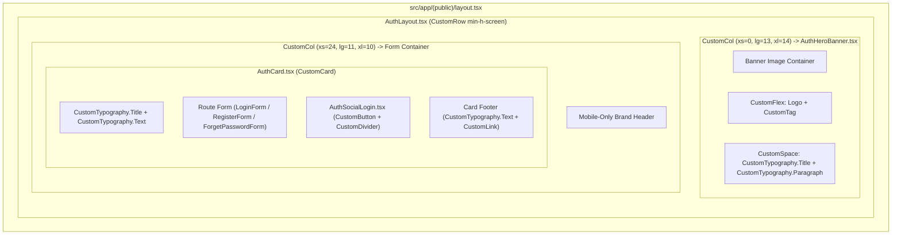

# Implementation Plan: Public Auth Portal Redesign (Ant Design Component Architecture with Hero Image)

## Section 1. Current State

### 1.1 Verified Current Behavior & Execution Flow

1. **Routing & Provider Hierarchy**:
   - When a user accesses `/login`, `/register`, or `/forget-password`, Next.js App Router renders [`PublicLayout`](file:///Users/kiem/Sources/Personal/only-one-fe/src/app/%28public%29/layout.tsx#L10-L16).
   - [`PublicLayout`](file:///Users/kiem/Sources/Personal/only-one-fe/src/app/%28public%29/layout.tsx#L12-L14) wraps its children with `<MainProvider isPublic>` and [`AuthLayout`](file:///Users/kiem/Sources/Personal/only-one-fe/src/app/%28public%29/_components/auth/AuthLayout.tsx#L4-L18).
2. **Current Layout Geometry**:
   - [`AuthLayout.tsx`](file:///Users/kiem/Sources/Personal/only-one-fe/src/app/%28public%29/_components/auth/AuthLayout.tsx#L6-L15) establishes a single vertical column (`flex min-h-screen w-full flex-col items-center justify-center px-4 py-8`) centered in the viewport, constrained to a maximum width of `440px` (`max-w-[420px] lg:max-w-[440px]`).
3. **Card & Form Rendering**:
   - Individual route pages ([`login/page.tsx`](file:///Users/kiem/Sources/Personal/only-one-fe/src/app/%28public%29/login/page.tsx#L8-L22), [`register/page.tsx`](file:///Users/kiem/Sources/Personal/only-one-fe/src/app/%28public%29/register/page.tsx#L8-L22), [`forget-password/page.tsx`](file:///Users/kiem/Sources/Personal/only-one-fe/src/app/%28public%29/forget-password/page.tsx#L8-L22)) instantiate [`AuthCard`](file:///Users/kiem/Sources/Personal/only-one-fe/src/app/%28public%29/_components/auth/AuthCard.tsx#L13-L32).
   - [`AuthCard`](file:///Users/kiem/Sources/Personal/only-one-fe/src/app/%28public%29/_components/auth/AuthCard.tsx#L19-L27) renders the platform [`Logo`](file:///Users/kiem/Sources/Personal/only-one-fe/src/components/common/display/logo/index.tsx#L10-L18), subtitle text, the child form (`LoginForm`, `RegisterForm`, or `ForgetPasswordForm`), and [`AuthSocialLogin`](file:///Users/kiem/Sources/Personal/only-one-fe/src/app/%28public%29/_components/auth/AuthSocialLogin.tsx#L10-L24).

### 1.2 Participating Files & Dependencies

- [`src/app/(public)/layout.tsx`](file:///Users/kiem/Sources/Personal/only-one-fe/src/app/%28public%29/layout.tsx): Server Component providing public layout boundaries.
- [`src/app/(public)/_components/auth/AuthLayout.tsx`](file:///Users/kiem/Sources/Personal/only-one-fe/src/app/%28public%29/_components/auth/AuthLayout.tsx): Layout wrapper managing page container width and background.
- [`src/app/(public)/_components/auth/AuthCard.tsx`](file:///Users/kiem/Sources/Personal/only-one-fe/src/app/%28public%29/_components/auth/AuthCard.tsx): Auth card container wrapping headers, forms, and footers.
- [`src/app/(public)/_components/auth/AuthSocialLogin.tsx`](file:///Users/kiem/Sources/Personal/only-one-fe/src/app/%28public%29/_components/auth/AuthSocialLogin.tsx): Google OAuth login trigger button with divider.
- [`src/app/(public)/login/components/LoginForm.tsx`](file:///Users/kiem/Sources/Personal/only-one-fe/src/app/%28public%29/login/components/LoginForm.tsx): Credentials input form.
- [`src/app/(public)/register/components/RegisterForm.tsx`](file:///Users/kiem/Sources/Personal/only-one-fe/src/app/%28public%29/register/components/RegisterForm.tsx): Account registration form.
- [`src/app/(public)/forget-password/components/ForgetPasswordForm.tsx`](file:///Users/kiem/Sources/Personal/only-one-fe/src/app/%28public%29/forget-password/components/ForgetPasswordForm.tsx): Password recovery form.

### 1.3 Core Problem & Limitations

- **Underutilized Desktop Space**: On monitors (`lg` breakpoint and up), the 440px centered card leaves massive empty margins on both sides without visual energy or context.
- **Absence of Visual Identity**: First-time visitors and team members see only generic form fields without an inspiring visual backdrop for the Only One Hub portal.

### 1.4 Invariant Behaviors (Must NOT Change)

- **Authentication Logic & State**:
  - [`useLoginPage`](file:///Users/kiem/Sources/Personal/only-one-fe/src/app/%28public%29/login/hooks.ts), [`useRegisterPage`](file:///Users/kiem/Sources/Personal/only-one-fe/src/app/%28public%29/register/hooks.ts), and [`useForgetPasswordPage`](file:///Users/kiem/Sources/Personal/only-one-fe/src/app/%28public%29/forget-password/hooks.ts) hooks must remain functionally intact.
  - NextAuth OAuth token exchanges and callback redirection flows must not be disrupted.
- **Component Contracts & Design Tokens**:
  - Strict adherence to the `custom-antd` component library (`CustomRow`, `CustomCol`, `CustomFlex`, `CustomSpace`, `CustomTypography`, `CustomCard`, `CustomButton`, etc.).
  - Compliance with existing CSS variables (`--hub-primary`, `--hub-bg`, `--hub-surface`, `--hub-border-card`, `--hub-text`, `--hub-muted`).

---

## Section 2. Detailed Design

### 2.1 Split-Screen Architecture with Ant Design Grid (`CustomRow` & `CustomCol`)

The redesign structures the page using Ant Design grid primitives:
- **`CustomRow` Container**: Full viewport height (`min-h-screen`).
- **Left Column (`CustomCol xs={0} lg={13} xl={14}`)**:
  - Hosts [`AuthHeroBanner.tsx`](file:///Users/kiem/Sources/Personal/only-one-fe/src/app/%28public%29/_components/auth/AuthHeroBanner.tsx).
  - Displays a high-resolution portal dashboard artwork / banner image (`/images/auth-banner.webp`) in an elegant card container.
  - Uses `CustomFlex` and `CustomTypography` for floating branding badges and taglines.
- **Right Column (`CustomCol xs={24} lg={11} xl={10}`)**:
  - Hosts the centered Auth Form container wrapped in `CustomFlex` (`align="center" justify="center"`).
  - Contains [`AuthCard.tsx`](file:///Users/kiem/Sources/Personal/only-one-fe/src/app/%28public%29/_components/auth/AuthCard.tsx) with refined Ant Design typography and styling.
- **Mobile/Tablet Viewports (`xs={24}`)**:
  - Left column automatically unmounts/hides (`xs={0}`).
  - Right column occupies 100% width with clean margins.

### 2.2 Ant Design Component Hierarchy & Directives

To maintain clean code and avoid raw HTML tags:
1. **Layout**: Use `<CustomRow>`, `<CustomCol>`, `<CustomFlex>`, `<CustomSpace>`.
2. **Typography**: Use `<CustomTypography.Title>`, `<CustomTypography.Paragraph>`, `<CustomTypography.Text>`.
3. **Cards & Badges**: Use `<CustomCard>`, `<CustomTag>`, `<CustomBadge>`.
4. **Interactive**: Use `<CustomButton>`, `<CustomDivider>`, `<CustomInput>`, `<CustomLink>`.

### 2.3 UI/UX Layout Wireframe (ASCII)

```text
+---------------------------------------------------------------------------------------------+
|                                    CustomRow (min-h-screen)                                 |
+-------------------------------------------------------------+-------------------------------+
|  CustomCol (xs=0, lg=13, xl=14)                             | CustomCol (xs=24, lg=11, xl=10|
|  [AuthHeroBanner]                                           | [AuthCard & Form Container]   |
|                                                             |                               |
|  +-------------------------------------------------------+  |   CustomFlex (justify=center) |
|  | CustomFlex (Overlay Header: Logo + Version Tag)       |  |                               |
|  |                                                       |  |   +-----------------------+   |
|  |                                                       |  |   | [Logo] (Mobile Only)  |   |
|  |                                                       |  |   |                       |   |
|  |             [ HIGH RESOLUTION ARTWORK /               |  |   | CustomTypography.Title|
|  |               DASHBOARD PORTAL IMAGE ]                |  |   | CustomTypography.Text |   |
|  |                                                       |  |   |                       |   |
|  |                                                       |  |   | [ CustomInput.Email ] |   |
|  |                                                       |  |   |                       |   |
|  |  --------------------------------------------------   |  |   | [ CustomInput.Password|   |
|  |  CustomTypography.Title ("Only One Hub")             |  |   |                       |   |
|  |  CustomTypography.Paragraph (Tagline & Value Prop)   |  |   | [v] Ghi nhớ    Quên?  |   |
|  +-------------------------------------------------------+  |   |                       |   |
|                                                             |   | [  CustomButton CTA  ]|   |
|                                                             |   |                       |   |
|                                                             |   | --- CustomDivider --- |   |
|                                                             |   |                       |   |
|                                                             |   | [ G Đăng nhập Google] |   |
|                                                             |   |                       |   |
|                                                             |   | Chưa có tài khoản?... |   |
+-------------------------------------------------------------+---+-----------------------+---+
```

---

## Section 3. Implementation Architecture

### 3.1 Directory Scaffold & Planned File Changes

```text
src/app/(public)/
├── _components/
│   └── auth/
│       ├── AuthCard.tsx           [MODIFY] Refactored with CustomTypography and CustomFlex
│       ├── AuthHeroBanner.tsx     [NEW]    Left-column image banner utilizing CustomFlex/CustomTypography
│       ├── AuthLayout.tsx         [MODIFY] Split-screen layout powered by CustomRow & CustomCol
│       ├── AuthSocialLogin.tsx    [MODIFY] Upgraded with CustomButton, CustomDivider & CustomFlex
│       └── index.ts               [MODIFY] Export AuthHeroBanner and updated components
├── forget-password/
│   └── page.tsx                   [MODIFY] Synchronized subtitle & link micro-copy
├── login/
│   └── page.tsx                   [MODIFY] Synchronized subtitle & link micro-copy
└── register/
    └── page.tsx                   [MODIFY] Synchronized subtitle & link micro-copy
public/
└── images/
    └── auth-banner.webp           [NEW]    High-resolution modern portal artwork
```

### 3.2 File Responsibilities

| File Path | Change Type | Responsibility |
| :--- | :--- | :--- |
| [`public/images/auth-banner.webp`](file:///Users/kiem/Sources/Personal/only-one-fe/public/images/auth-banner.webp) | `[NEW]` | High-resolution visual banner image representing modern centralized portal & dashboard technology. |
| [`src/app/(public)/_components/auth/AuthHeroBanner.tsx`](file:///Users/kiem/Sources/Personal/only-one-fe/src/app/%28public%29/_components/auth/AuthHeroBanner.tsx) | `[NEW]` | Left-column component rendering the visual hero image with floating branding overlay using `CustomFlex` and `CustomTypography`. |
| [`src/app/(public)/_components/auth/AuthLayout.tsx`](file:///Users/kiem/Sources/Personal/only-one-fe/src/app/%28public%29/_components/auth/AuthLayout.tsx) | `[MODIFY]` | Full-height Split-Screen grid wrapper using `CustomRow` & `CustomCol`. |
| [`src/app/(public)/_components/auth/AuthCard.tsx`](file:///Users/kiem/Sources/Personal/only-one-fe/src/app/%28public%29/_components/auth/AuthCard.tsx) | `[MODIFY]` | Modernized card container using `CustomCard`, `CustomTypography`, and `CustomSpace`. |
| [`src/app/(public)/_components/auth/AuthSocialLogin.tsx`](file:///Users/kiem/Sources/Personal/only-one-fe/src/app/%28public%29/_components/auth/AuthSocialLogin.tsx) | `[MODIFY]` | Modernized social login section using `CustomButton`, `CustomDivider`, and `CustomFlex`. |
| [`src/app/(public)/_components/auth/index.ts`](file:///Users/kiem/Sources/Personal/only-one-fe/src/app/%28public%29/_components/auth/index.ts) | `[MODIFY]` | Barrel export aggregating all public auth components. |
| [`src/app/(public)/login/page.tsx`](file:///Users/kiem/Sources/Personal/only-one-fe/src/app/%28public%29/login/page.tsx) | `[MODIFY]` | Auth card wrapper for the login route. |
| [`src/app/(public)/register/page.tsx`](file:///Users/kiem/Sources/Personal/only-one-fe/src/app/%28public%29/register/page.tsx) | `[MODIFY]` | Auth card wrapper for the registration route. |
| [`src/app/(public)/forget-password/page.tsx`](file:///Users/kiem/Sources/Personal/only-one-fe/src/app/%28public%29/forget-password/page.tsx) | `[MODIFY]` | Auth card wrapper for the password recovery route. |

### 3.3 Mermaid Layout & Component Hierarchy



---

## Section 4. Implementation Code Examples

### 4.1 `[NEW]` [`src/app/(public)/_components/auth/AuthHeroBanner.tsx`](file:///Users/kiem/Sources/Personal/only-one-fe/src/app/%28public%29/_components/auth/AuthHeroBanner.tsx)

*Responsibility*: Renders the visual hero image with `CustomFlex`, `CustomSpace`, `CustomTag`, and `CustomTypography`.

```tsx
'use client';

import React from 'react';
import Image from 'next/image';
import { Logo } from '@/components/common';
import { CustomFlex, CustomSpace, CustomTag, CustomTypography } from '@/components/custom-antd';
import { Icon } from '@iconify/react';

export const AuthHeroBanner = () => {
    return (
        <div className="relative h-full w-full p-4 lg:p-6">
            {/* Image Shell */}
            <div className="relative h-full w-full overflow-hidden rounded-2xl border border-hub-border-card bg-hub-surface shadow-2xl">
                {/* Background Image */}
                <Image
                    src="/images/auth-banner.webp"
                    alt="Only One Hub Portal Showcase"
                    fill
                    priority
                    sizes="(max-width: 1024px) 0vw, 60vw"
                    className="object-cover object-center transition-transform duration-700 hover:scale-105"
                />

                {/* Ambient Dark Gradient */}
                <div className="absolute inset-0 bg-gradient-to-t from-black/85 via-black/40 to-black/30" />

                {/* Top Overlay Badge using CustomFlex */}
                <div className="absolute left-6 top-6 z-10">
                    <CustomFlex
                        align="center"
                        gap={10}
                        className="rounded-full border border-white/20 bg-black/40 px-4 py-1.5 backdrop-blur-md"
                    >
                        <Logo iconSize="lg" textSize="lg" />
                        <CustomTag color="cyan" className="m-0 border-none font-medium">
                            Enterprise Hub
                        </CustomTag>
                    </CustomFlex>
                </div>

                {/* Bottom Overlay Content using CustomSpace & CustomTypography */}
                <div className="absolute bottom-8 left-8 right-8 z-10">
                    <CustomSpace orientation="vertical" size="small" className="w-full">
                        <CustomFlex orientation="horizontal" align="center" gap={6}>
                            <Icon icon="lucide:sparkles" className="text-amber-300 text-sm" />
                            <CustomTypography.Text className="text-xs font-semibold text-amber-200 uppercase tracking-wider">
                                Centralized Operations & Automation Hub
                            </CustomTypography.Text>
                        </CustomFlex>

                        <CustomTypography.Title
                            level={2}
                            className="!m-0 !text-white !font-extrabold !text-2xl sm:!text-3xl xl:!text-4xl leading-tight"
                        >
                            Khởi động không gian làm việc <br />
                            <span className="text-hub-cta">tập trung & thông minh</span>
                        </CustomTypography.Title>

                        <CustomTypography.Paragraph className="!m-0 max-w-lg !text-gray-300 text-xs sm:text-sm">
                            Quản lý dữ liệu đa nguồn, tự động hoá quy trình và đồng bộ đám mây toàn diện trong một nền tảng duy nhất.
                        </CustomTypography.Paragraph>
                    </CustomSpace>
                </div>
            </div>
        </div>
    );
};
```

---

### 4.2 `[MODIFY]` [`src/app/(public)/_components/auth/AuthLayout.tsx`](file:///Users/kiem/Sources/Personal/only-one-fe/src/app/%28public%29/_components/auth/AuthLayout.tsx)

*Responsibility*: Hosts the split-screen layout grid using `CustomRow`, `CustomCol`, and `CustomFlex`.

```tsx
import { PropsWithChildren } from 'react';
import { CustomCol, CustomFlex, CustomRow } from '@/components/custom-antd';
import { AuthHeroBanner } from './AuthHeroBanner';

export const AuthLayout = ({ children }: PropsWithChildren) => {
    return (
        <main className="relative min-h-screen w-full overflow-x-hidden bg-hub-bg">
            <CustomRow className="min-h-screen w-full" gutter={0}>
                {/* Left Column: Hero Image Banner (Desktop) */}
                <CustomCol xs={0} lg={13} xl={14} className="min-h-screen">
                    <AuthHeroBanner />
                </CustomCol>

                {/* Right Column: Form Container (Responsive) */}
                <CustomCol xs={24} lg={11} xl={10} className="min-h-screen">
                    <CustomFlex
                        align="center"
                        justify="center"
                        className="min-h-screen w-full p-4 sm:p-6 lg:p-8 xl:p-12"
                    >
                        <div className="w-full min-w-0 max-w-[420px] sm:max-w-[440px]">
                            {children}
                        </div>
                    </CustomFlex>
                </CustomCol>
            </CustomRow>
        </main>
    );
};
```

---

### 4.3 `[MODIFY]` [`src/app/(public)/_components/auth/AuthCard.tsx`](file:///Users/kiem/Sources/Personal/only-one-fe/src/app/%28public%29/_components/auth/AuthCard.tsx)

*Responsibility*: Renders the form card using `CustomCard`, `CustomFlex`, `CustomSpace`, and `CustomTypography`.

```tsx
'use client';

import { Logo } from '@/components/common';
import { CustomCard, CustomFlex, CustomSpace, CustomTypography } from '@/components/custom-antd';
import { ReactNode } from 'react';

type AuthCardProps = {
    children: ReactNode;
    subtitle: string;
    footer?: ReactNode;
};

export const AuthCard = ({ children, footer, subtitle }: AuthCardProps) => {
    return (
        <CustomCard
            footer={footer}
            paddingSize="responsive"
            className="border border-hub-border-card shadow-lg backdrop-blur-sm transition-all duration-200"
            header={
                <CustomFlex orientation="vertical" align="center" gap={4} className="pb-2 text-center">
                    {/* Mobile-only logo presentation */}
                    <div className="flex justify-center text-hub-title lg:hidden mb-2">
                        <Logo iconSize="2xl" textSize="xl" />
                    </div>
                    <CustomTypography.Title level={3} className="!m-0 !font-bold !text-hub-title !text-xl sm:!text-2xl">
                        Only One Hub
                    </CustomTypography.Title>
                    <CustomTypography.Text className="text-xs text-hub-muted sm:text-sm">
                        {subtitle}
                    </CustomTypography.Text>
                </CustomFlex>
            }
        >
            {children}
        </CustomCard>
    );
};
```

---

### 4.4 `[MODIFY]` [`src/app/(public)/_components/auth/AuthSocialLogin.tsx`](file:///Users/kiem/Sources/Personal/only-one-fe/src/app/%28public%29/_components/auth/AuthSocialLogin.tsx)

*Responsibility*: Renders modern Google login button with `CustomButton`, `CustomDivider`, and `CustomFlex`.

```tsx
'use client';

import { CustomButton, CustomDivider, CustomFlex } from '@/components/custom-antd';
import { Icon } from '@iconify/react';

type AuthSocialLoginProps = {
    googleLabel: string;
};

export const AuthSocialLogin = ({ googleLabel }: AuthSocialLoginProps) => {
    return (
        <div className="mt-6 space-y-4">
            <CustomDivider label="Hoặc tiếp tục với" />
            <CustomButton
                block
                size="large"
                className="flex items-center justify-center border border-hub-border bg-hub-surface text-hub-text font-medium transition-all duration-200 hover:border-hub-primary/40 hover:bg-hub-section"
            >
                <CustomFlex align="center" justify="center" gap={8}>
                    <Icon icon="logos:google-icon" className="text-lg" />
                    <span>{googleLabel}</span>
                </CustomFlex>
            </CustomButton>
        </div>
    );
};
```

---

### 4.5 `[MODIFY]` [`src/app/(public)/_components/auth/index.ts`](file:///Users/kiem/Sources/Personal/only-one-fe/src/app/%28public%29/_components/auth/index.ts)

```ts
export * from './AuthCard';
export * from './AuthHeroBanner';
export * from './AuthLayout';
export * from './AuthSocialLogin';
```

---

## Section 5. Test Cases

### 5.1 Acceptance Criteria (BDD Scenarios)

#### Scenario 1: Desktop Split-Screen Presentation with Antd Grid (Happy Path)
- **Objective**: Verify that desktop monitors (`>= 1024px`) render the visual Hero Image Banner on `CustomCol lg={13}` and the Auth Card on `CustomCol lg={11}`.
- **GIVEN**: A user opens `/login` on a screen with width `>= 1024px`.
- **WHEN**: The page finishes rendering.
- **THEN**:
  - The left Hero Banner image displays cleanly with rounded border, overlay logo badge, and tagline.
  - The right column displays the LoginForm card.
  - No horizontal scrollbars or layout clipping occur.

#### Scenario 2: Mobile Viewport Responsive Fallback (Responsive Case)
- **Objective**: Verify that mobile devices (`< 1024px`) collapse the left image hero (`xs={0}`) cleanly and display the form centered with top logo.
- **GIVEN**: A user opens `/login` or `/register` in a mobile viewport (e.g. 375px width).
- **WHEN**: The page renders.
- **THEN**:
  - The left image hero is hidden (`xs={0}`).
  - The Auth Card displays a compact Logo header on top.
  - All form inputs and CTA buttons fit comfortably within screen margins.

#### Scenario 3: Form Interaction & Navigation Integrity (Regression Case)
- **Objective**: Verify that login, registration, and forget-password form submissions and cross-links remain fully functional.
- **GIVEN**: A user is on `/login`.
- **WHEN**: The user clicks "Đăng ký ngay".
- **THEN**: The browser navigates smoothly to `/register`.
- **WHEN**: The user enters invalid credentials and clicks "Đăng nhập".
- **THEN**: Form validation errors display inline correctly without crashing or shifting the layout.

---

### 5.2 Verification Commands

```bash
# 1. Typecheck and lint validation
npm run lint

# 2. Next.js production build verification
npm run build
```
