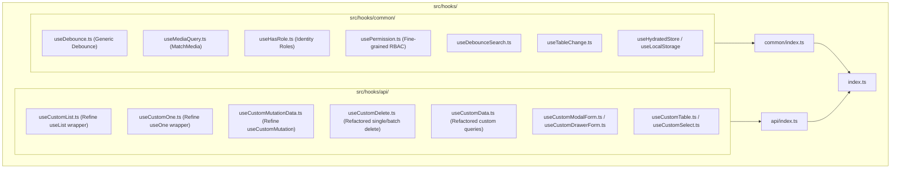
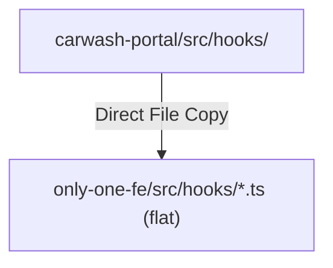

# Technical Proposal: Porting and Standardizing Reusable React Hooks from Carwash Portal to Only One FE

## 1. Problem Statement & Core Concept

- **Core Business Problem**: 
  The frontend project `only-one-fe` currently lacks several essential React and Refine utility hooks that exist in `carwash-portal` (e.g., generic `useDebounce`, `useMediaQuery`, `useHasRole`, `usePermission`, `useCustomList`, `useCustomOne`), while some existing hooks (`useCustomMutationData`, `useCustomDelete`, `useCustomData`) have incomplete typing, missing single/batch deletion parity, or lack standardized error/success notification handling. This forces feature developers to repeatedly write ad-hoc logic for responsive queries, debounce state, entity fetching, and permission checks.

- **Core Value & Target Audience**: 
  Frontend engineers developing features, tables, forms, responsive layouts, and permission-guarded views in `only-one-fe`. Provides a robust, fully-typed, and uniform developer experience across all modules.

- **Success Metrics (Definition of Done)**:
  - 100% TypeScript type safety with generics across all ported and upgraded hooks.
  - Complete barrel export integration in `src/hooks/common/index.ts`, `src/hooks/api/index.ts`, and root `src/hooks/index.ts`.
  - Zero TypeScript errors (`npx tsc --noEmit` clean).
  - Adherence to `only-one-fe` architecture conventions (camelCase file names, `common` vs `api` categorization, `custom-antd` token integration, and unified `getErrorNotification`/`getSuccessNotification` integration).

- **Scope Boundaries**:
  - **In-Scope**:
    - Port `useDebounce<T>` (generic value debounce) into `src/hooks/common/useDebounce.ts`.
    - Port `useMediaQuery` (CSS media query watcher) into `src/hooks/common/useMediaQuery.ts`.
    - Port `useHasRole` (identity role check) and `usePermission` (granular rights check) into `src/hooks/common/`.
    - Port `useCustomList` (Refine `useList` wrapper with default pagination, sorters, notifications) into `src/hooks/api/useCustomList.ts`.
    - Port `useCustomOne` (Refine `useOne` wrapper with notifications and conditional execution) into `src/hooks/api/useCustomOne.ts`.
    - Extract and enhance `useCustomMutationData` into its own dedicated file `src/hooks/api/useCustomMutationData.ts` with HTTP verbs, typed async execution, and notifications.
    - Refactor and enhance `useCustomDelete` to support single ID, multiple IDs, async execution, and uniform notifications.
    - Update `src/hooks/common/index.ts`, `src/hooks/api/index.ts`, and `src/hooks/index.ts`.
  - **Explicit Out-of-Scope**:
    - Wash247 domain-specific QR download (`useDownloadQr`) — wash machine QR generator endpoint is specific to wash247 hardware.
    - Modification of existing business page components unless testing backwards compatibility.

---

## 2. Current Business Logic (As-is Analysis)

In `only-one-fe`, the current `src/hooks` structure is partitioned into:
- [src/hooks/common](file:///Users/kiem/Sources/Personal/only-one-fe/src/hooks/common):
  - [useDebounceSearch.ts](file:///Users/kiem/Sources/Personal/only-one-fe/src/hooks/common/useDebounceSearch.ts): Debounces Refine search filter triggers, but does not provide generic `useDebounce<T>` for values.
  - [useHydratedStore.ts](file:///Users/kiem/Sources/Personal/only-one-fe/src/hooks/common/useHydratedStore.ts), [useLocalStorage.ts](file:///Users/kiem/Sources/Personal/only-one-fe/src/hooks/common/useLocalStorage.ts), [useMessage.ts](file:///Users/kiem/Sources/Personal/only-one-fe/src/hooks/common/useMessage.ts), [usePagePermissions.ts](file:///Users/kiem/Sources/Personal/only-one-fe/src/hooks/common/usePagePermissions.ts), [useSearchParamsString.ts](file:///Users/kiem/Sources/Personal/only-one-fe/src/hooks/common/useSearchParamsString.ts), [useSocket.ts](file:///Users/kiem/Sources/Personal/only-one-fe/src/hooks/common/useSocket.ts), [useTableChange.ts](file:///Users/kiem/Sources/Personal/only-one-fe/src/hooks/common/useTableChange.ts).
- [src/hooks/api](file:///Users/kiem/Sources/Personal/only-one-fe/src/hooks/api):
  - [useCustomData.ts](file:///Users/kiem/Sources/Personal/only-one-fe/src/hooks/api/useCustomData.ts): Bundles both `useCustomData` and a basic `useCustomMutationData` together, lacking generic payload/response typing and error notification builders.
  - [useCustomDelete.ts](file:///Users/kiem/Sources/Personal/only-one-fe/src/hooks/api/useCustomDelete.ts): Only accepts `ids: string[]`, lacks async promise returns and single entity deletion capability.
  - [useCustomDrawerForm.ts](file:///Users/kiem/Sources/Personal/only-one-fe/src/hooks/api/useCustomDrawerForm.ts), [useCustomModal.ts](file:///Users/kiem/Sources/Personal/only-one-fe/src/hooks/api/useCustomModal.ts), [useCustomModalForm.ts](file:///Users/kiem/Sources/Personal/only-one-fe/src/hooks/api/useCustomModalForm.ts), [useCustomSelect.ts](file:///Users/kiem/Sources/Personal/only-one-fe/src/hooks/api/useCustomSelect.ts), [useCustomTable.ts](file:///Users/kiem/Sources/Personal/only-one-fe/src/hooks/api/useCustomTable.ts), [useTableContainer.ts](file:///Users/kiem/Sources/Personal/only-one-fe/src/hooks/api/useTableContainer.ts).

### Identified Limitations:
1. Missing general utility hooks (`useDebounce`, `useMediaQuery`, `useHasRole`, `usePermission`).
2. Missing standard CRUD data query hooks (`useCustomList`, `useCustomOne`) with built-in notification handling.
3. Incomplete mutation/delete ergonomics (`useCustomMutationData`, `useCustomDelete`).

---

## 3. Proposed Solution Alternatives

### Option 1 (Recommended): Categorized & Typed Porting with Codebase Convention Alignment

- **Solution Overview & Mechanics**:
  Port all reusable hooks from `carwash-portal` into `only-one-fe`, converting file naming to `camelCase` and placing them cleanly into `src/hooks/common/` and `src/hooks/api/`. Integrate with `only-one-fe`'s `notification.ts` utilities (`getErrorNotification`, `getSuccessNotification`, `NotificationAction`) and export everything through barrel indices.
- **Mermaid Diagram**:

- **Pros**:
  - Consistent architecture matching `only-one-fe` rules and conventions (camelCase files, clean domain folders).
  - Maximum reusability and complete type safety.
  - Seamless notification integration with existing `src/utilities/notification.ts`.
- **Cons**:
  - Slight refactoring of existing `useCustomData.ts` and `useCustomDelete.ts` callers (non-breaking if aliases are retained).
- **Complexity & Risks**: Low.

---

### Option 2: Direct 1-to-1 Mirror without Categorization (Flat Kebab-Case)

- **Solution Overview & Mechanics**:
  Copy files verbatim from `carwash-portal/src/hooks` into `only-one-fe/src/hooks` using kebab-case filenames in the root `src/hooks/` folder.
- **Mermaid Diagram**:

- **Pros**:
  - Fastest copy-paste path.
- **Cons**:
  - Violates `only-one-fe` conventions where hooks are strictly grouped under `common/` and `api/` in camelCase.
  - Causes inconsistency across the codebase.
- **Complexity & Risks**: Moderate maintenance friction.

---

### Comparison Matrix & Recommendation

| Criteria        | Option 1 (Recommended) | Option 2    |
| :-------------- | :--------------------- | :---------- |
| Clean Architecture | Excellent              | Poor        |
| Codebase Consistency | 100% Matching          | Inconsistent |
| Type Safety     | High                   | Moderate    |
| Risk Level      | Low                    | Low         |

- **Conclusion**: Recommend **Option 1** for complete alignment with `only-one-fe` standards and clean architectural segregation.

---

## 4. Key Failure Modes & Security Boundaries

- **SSR / Window Undefined Safety**: `useMediaQuery` safely checks for `typeof window !== 'undefined'` to avoid Next.js hydration mismatch or server-side rendering crashes.
- **Identity Fallback**: `useHasRole` and `usePermission` gracefully handle `undefined` user identity during loading/unauthenticated states.
- **Notification Safety**: Fallbacks to generic error messages when server error structures are omitted or non-standard.

---

## 5. High-Level Technical Specifications

### New / Enhanced Hook Specifications:
1. **`src/hooks/common/useDebounce.ts`**:
   - Signature: `useDebounce<T>(value: T, delay?: number): T`
2. **`src/hooks/common/useMediaQuery.ts`**:
   - Signature: `useMediaQuery(query: string): boolean`
3. **`src/hooks/common/useHasRole.ts`**:
   - Signature: `useHasRole(roles: string[]): boolean`
4. **`src/hooks/common/usePermission.ts`**:
   - Signature: `usePermission(): { can, canMap, canAny, isLoading }`
5. **`src/hooks/api/useCustomList.ts`**:
   - Signature: `useCustomList<TData>(options: UseCustomListRequest<TData>): UseListReturnType`
6. **`src/hooks/api/useCustomOne.ts`**:
   - Signature: `useCustomOne<TData>(options: UseCustomOneRequest<TData>): UseOneReturnType`
7. **`src/hooks/api/useCustomMutationData.ts`**:
   - Signature: `useCustomMutationData<TData, TPayload>(options?: UseCustomMutationDataRequest): UseCustomMutationDataResponse`
8. **`src/hooks/api/useCustomDelete.ts` (Upgrade)**:
   - Signature: `useCustomDelete<TData>(options: UseCustomDeleteRequest): UseCustomDeleteResponse`

---

## 6. Next Steps

- User reviews and confirms `concept.md`.
- Run `/only-one-plan only-one/tasks/20260821-160600-port-carwash-hooks-to-only-one-fe` to generate `plan.md`.
- Execute implementation with `/only-one-apply only-one/tasks/20260821-160600-port-carwash-hooks-to-only-one-fe`.
- Archive and distill with `/only-one-archive`.
