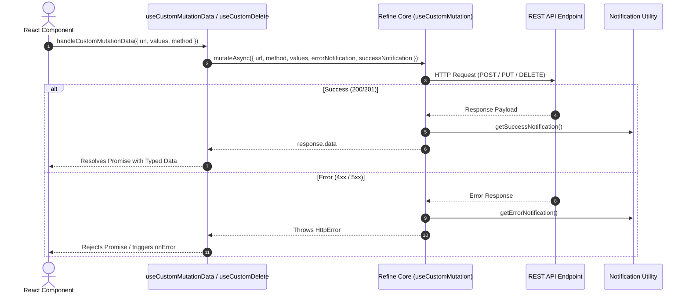

# Implementation Plan: Porting and Standardizing Reusable React Hooks from Carwash Portal to Only One FE

Transitioning from the approved proposal in [concept.md](file:///Users/kiem/Sources/Personal/only-one-fe/only-one/tasks/20260821-160600-port-carwash-hooks-to-only-one-fe/concept.md), this implementation plan outlines the concrete, step-by-step file changes to introduce missing hooks and enhance existing API/common hooks in `only-one-fe`.

---

## Section 1. Current State

### 1.1 Verified Current Behavior & Files
- In `only-one-fe`, hooks are separated into [src/hooks/common](file:///Users/kiem/Sources/Personal/only-one-fe/src/hooks/common) and [src/hooks/api](file:///Users/kiem/Sources/Personal/only-one-fe/src/hooks/api).
- Currently existing common hooks:
  - [`useDebounceSearch`](file:///Users/kiem/Sources/Personal/only-one-fe/src/hooks/common/useDebounceSearch.ts#L4): Binds debounce directly to Refine `setFilters` / `setCurrentPage`, but there is no generic `useDebounce<T>` hook for debouncing arbitrary state values.
  - [`usePagePermissions`](file:///Users/kiem/Sources/Personal/only-one-fe/src/hooks/common/usePagePermissions.ts#L12): Uses Refine `useCan`, but lacks quick identity-based role checks (`useHasRole`) or fine-grained RBAC action mapping (`usePermission` with `can`, `canMap`, `canAny`).
  - No media query hook exists in `src/hooks/common/` for responsive conditional rendering.
- Currently existing API hooks:
  - [`useCustomData`](file:///Users/kiem/Sources/Personal/only-one-fe/src/hooks/api/useCustomData.ts#L48): Houses both `useCustomData` and `useCustomMutationData` in one file without generic response typing, unwrapped payloads, or integrated notification builders.
  - [`useCustomDelete`](file:///Users/kiem/Sources/Personal/only-one-fe/src/hooks/api/useCustomDelete.ts#L24): Accepts only an array `ids: string[]` without single ID support, does not return a Promise from `handleDelete`, and lacks integration with `getErrorNotification`/`getSuccessNotification`.
  - No standardized `useCustomList` or `useCustomOne` wrapper hooks exist for querying entity lists and detail views with default pagination/sorters and error notifications.

### 1.2 Core Limitations Addressed
1. Boilerplate repetition across views for debouncing primitives, checking media queries, and inspecting user roles/permissions.
2. Inconsistent notification and error handling across ad-hoc custom mutations and data fetches.
3. Lack of unified single and batch delete support in `useCustomDelete`.

### 1.3 Behaviors That Must Remain Unchanged (Zero Regressions)
- Existing callers of `useCustomMutationData().handleCustomMutationData({ url, values, method })` in:
  - [src/components/layout/index.tsx](file:///Users/kiem/Sources/Personal/only-one-fe/src/components/layout/index.tsx#L27)
  - [src/app/(root)/scraping/features/[dataProviderId]/hooks.ts](file:///Users/kiem/Sources/Personal/only-one-fe/src/app/(root)/scraping/features/[dataProviderId]/hooks.ts#L27)
  - [src/app/(root)/google/drive/photos/components/SyncGoogleDrive.tsx](file:///Users/kiem/Sources/Personal/only-one-fe/src/app/(root)/google/drive/photos/components/SyncGoogleDrive.tsx#L96)
  must continue to function without breaking changes.
- Existing callers of `useCustomDelete().handleDelete(ids)` in [src/components/common/containers/list-table/index.tsx](file:///Users/kiem/Sources/Personal/only-one-fe/src/components/common/containers/list-table/index.tsx#L117) and [src/app/(root)/scraping/scraping-data/page.tsx](file:///Users/kiem/Sources/Personal/only-one-fe/src/app/(root)/scraping/scraping-data/page.tsx#L188) must remain 100% compatible.

---

## Section 2. Detailed Design

### 2.1 Architectural Decisions & Hook Responsibilities
1. **`useDebounce<T>(value: T, delay = 500): T`**
   - Implements standard `setTimeout` / `clearTimeout` effect lifecycle with TypeScript generics.
2. **`useMediaQuery(query: string): boolean`**
   - SSR-safe: Uses lazy state initialization with `typeof window !== 'undefined'` guard.
   - Attaches `change` listener to `window.matchMedia(query)` and properly cleans up on unmount.
3. **`useHasRole(roles: string[]): boolean`**
   - Consumes `@refinedev/core`'s `useGetIdentity` to safely check if the authenticated user has any of the requested roles.
4. **`usePermission()`**
   - Computes `rights` set from user identity and provides memoized helper functions: `can(group, action)`, `canMap(group, actions)`, `canAny(...checks)`.
5. **`useCustomList<TData>(options)`**
   - Wraps Refine's `useList<TData, HttpError>` with default pagination (`DEFAULT_PAGE_SIZE = 10`, `DEFAULT_PAGE_INDEX = 1`), default sorting, and automatic `getErrorNotification` with `NotificationAction.Load`.
6. **`useCustomOne<TData>(options)`**
   - Wraps Refine's `useOne<TData, HttpError>` with automatic `enabled: enabled ?? Boolean(id)` handling and standardized `getErrorNotification`.
7. **`useCustomMutationData<TData, TPayload>(options?)`**
   - Dedicated file providing `handleCustomMutationData` that returns `Promise<TData>`, supports method mapping to `NotificationAction` (`post` $\rightarrow$ `Create`, `delete` $\rightarrow$ `Delete`, others $\rightarrow$ `Update`), and supports both hook-level and call-level options.
8. **`useCustomDelete<TData>(options)`**
   - Upgraded to support polymorphic invocation: `handleDelete(ids: string[])` or `handleDelete({ id, ids, ... })`. Automatically dispatches `mutateAsync` with `NotificationAction.Delete` notifications.

### 2.2 UI State Transitions & Control Flow

```text
+-----------------------------------------------------------------------------------+
|                            Component Hook Flow Matrix                             |
+-----------------------------------------------------------------------------------+
|  useMediaQuery        --> [ SSR: false ] --> [ Client: matchMedia.matches ]       |
|  useDebounce          --> [ Value Change ] -> [ Timer: 500ms ] -> [ Emit Value ]  |
|  useHasRole/Perm      --> [ useGetIdentity ] -> [ Memo Set(rights) ] -> [ can() ]|
|  useCustomList/One    --> [ useList/useOne ] -> [ Auto Notification on Error ]    |
|  useCustomMutationData--> [ mutateAsync ]    -> [ getSuccessNotification / Error ]|
|  useCustomDelete      --> [ Single / Batch ] -> [ getDeleteNotification ]         |
+-----------------------------------------------------------------------------------+
```

---

## Section 3. Implementation Architecture

### 3.1 Target Directory Tree
```text
only-one-fe/src/
├── constants/
│   └── common.constant.ts                    [MODIFY] (Export DEFAULT_PAGE_INDEX, DEFAULT_PAGE_SIZE, DEFAULT_SORTERS)
├── hooks/
│   ├── index.ts                              [MODIFY] (Re-export common and api)
│   ├── common/
│   │   ├── index.ts                          [MODIFY] (Barrel exports for common hooks)
│   │   ├── useDebounce.ts                    [NEW]    (Generic value debounce)
│   │   ├── useMediaQuery.ts                  [NEW]    (SSR-safe matchMedia listener)
│   │   ├── useHasRole.ts                     [NEW]    (Identity role checking hook)
│   │   └── usePermission.ts                  [NEW]    (Fine-grained RBAC permission checking)
│   └── api/
│       ├── index.ts                          [MODIFY] (Barrel exports for api hooks)
│       ├── useCustomList.ts                  [NEW]    (Refine useList standardized wrapper)
│       ├── useCustomOne.ts                   [NEW]    (Refine useOne standardized wrapper)
│       ├── useCustomMutationData.ts          [NEW]    (Dedicated custom mutation hook)
│       ├── useCustomData.ts                  [MODIFY] (Refactor custom GET query & re-export)
│       └── useCustomDelete.ts                [MODIFY] (Polymorphic single/batch delete hook)
```

### 3.2 Sequence Diagram: Custom Mutation & Delete Flow



---

## Section 4. Implementation Code Examples

### 1. `[MODIFY] src/constants/common.constant.ts`
- **Summary**: Add default pagination and sorter constants used by `useCustomList`, `useCustomTable`, etc.
- **Snippet**:
```typescript
export const DEFAULT_PAGE_INDEX = 1;
export const DEFAULT_PAGE_SIZE = 10;
export const DEFAULT_SORTERS = [{ field: 'createdAt', order: 'desc' as const }];
```

---

### 2. `[NEW] src/hooks/common/useDebounce.ts`
- **Summary**: Generic debounce value hook.
- **Design pattern**: React Hook with Effect Cleanup.
- **Snippet**:
```typescript
import { useEffect, useState } from 'react';

export function useDebounce<T>(value: T, delay: number = 500): T {
    const [debouncedValue, setDebouncedValue] = useState<T>(value);

    useEffect(() => {
        const handler = setTimeout(() => {
            setDebouncedValue(value);
        }, delay);

        return () => {
            clearTimeout(handler);
        };
    }, [value, delay]);

    return debouncedValue;
}
```

---

### 3. `[NEW] src/hooks/common/useMediaQuery.ts`
- **Summary**: Responsive breakpoint listener safe for SSR.
- **Snippet**:
```typescript
import { useEffect, useState } from 'react';

export const useMediaQuery = (query: string): boolean => {
    const [matches, setMatches] = useState<boolean>(() => {
        if (typeof window === 'undefined') return false;
        return window.matchMedia(query).matches;
    });

    useEffect(() => {
        if (typeof window === 'undefined') return;

        const mediaQuery = window.matchMedia(query);
        const updateMatches = () => setMatches(mediaQuery.matches);

        updateMatches();
        mediaQuery.addEventListener('change', updateMatches);

        return () => {
            mediaQuery.removeEventListener('change', updateMatches);
        };
    }, [query]);

    return matches;
};
```

---

### 4. `[NEW] src/hooks/common/useHasRole.ts`
- **Summary**: Inspects current user identity for specified roles.
- **Snippet**:
```typescript
import { useGetIdentity } from '@refinedev/core';

export interface CurrentUserIdentity {
    id?: string;
    email?: string;
    role?: string;
    roles?: string[];
    rights?: string[];
}

export const useHasRole = (roles: string[]): boolean => {
    const { data: currentUser } = useGetIdentity<CurrentUserIdentity>();

    if (!roles?.length || !currentUser) return false;

    const userRoles = currentUser.roles ?? (currentUser.role ? [currentUser.role] : []);
    if (!userRoles.length) return false;

    return roles.some((role) => userRoles.includes(role));
};
```

---

### 5. `[NEW] src/hooks/common/usePermission.ts`
- **Summary**: Provides granular permission checks (`can`, `canMap`, `canAny`) based on user rights.
- **Snippet**:
```typescript
import { useGetIdentity } from '@refinedev/core';
import fromPairs from 'lodash/fromPairs';
import map from 'lodash/map';
import some from 'lodash/some';
import { useCallback, useMemo } from 'react';
import type { CurrentUserIdentity } from './useHasRole';

export const usePermission = () => {
    const { data: currentUser, isLoading } = useGetIdentity<CurrentUserIdentity>();

    const rights = useMemo(() => new Set(currentUser?.rights ?? []), [currentUser?.rights]);

    const can = useCallback(
        (group: string, action: string): boolean => rights.has(`${group}_${action}`),
        [rights],
    );

    const canMap = useCallback(
        <TAction extends string>(group: string, actions: readonly TAction[]): Record<TAction, boolean> =>
            fromPairs(map(actions, (action) => [action, rights.has(`${group}_${action}`)])) as Record<
                TAction,
                boolean
            >,
        [rights],
    );

    const canAny = useCallback(
        (...checks: Array<[string, string]>): boolean =>
            some(checks, ([group, action]) => can(group, action)),
        [can],
    );

    return { can, canAny, canMap, isLoading };
};
```

---

### 6. `[NEW] src/hooks/api/useCustomList.ts`
- **Summary**: Refine `useList` wrapper with default pagination, default sorters, and error notification.
- **Snippet**:
```typescript
import { DEFAULT_PAGE_INDEX, DEFAULT_PAGE_SIZE, DEFAULT_SORTERS } from '@/constants';
import { getErrorNotification, NotificationAction } from '@/utilities';
import type { BaseRecord, HttpError } from '@refinedev/core';
import { useList } from '@refinedev/core';

type RefineUseListRequest<TData extends BaseRecord> = NonNullable<
    Parameters<typeof useList<TData, HttpError>>[0]
>;

export type UseCustomListRequest<TData extends BaseRecord> = Omit<
    RefineUseListRequest<TData>,
    'resource'
> & {
    resource: string;
    errorMessage?: string;
    successMessage?: string;
};

export const useCustomList = <TData extends BaseRecord>({
    resource,
    errorMessage,
    pagination,
    sorters,
    errorNotification,
    successNotification = false,
    ...rest
}: UseCustomListRequest<TData>) => {
    return useList<TData, HttpError>({
        ...rest,
        resource,
        pagination: pagination ?? {
            pageSize: DEFAULT_PAGE_SIZE,
            currentPage: DEFAULT_PAGE_INDEX,
        },
        sorters: sorters ?? DEFAULT_SORTERS,
        errorNotification: getErrorNotification({
            resource,
            errorNotification,
            message: errorMessage,
            action: NotificationAction.Load,
        }),
        successNotification,
    });
};
```

---

### 7. `[NEW] src/hooks/api/useCustomOne.ts`
- **Summary**: Refine `useOne` wrapper with automatic `enabled: Boolean(id)` handling.
- **Snippet**:
```typescript
import { getErrorNotification, NotificationAction } from '@/utilities';
import type { BaseRecord, HttpError } from '@refinedev/core';
import { useOne } from '@refinedev/core';

type RefineUseOneRequest<TData extends BaseRecord> = Parameters<
    typeof useOne<TData, HttpError>
>[0];

export type UseCustomOneRequest<TData extends BaseRecord> = Omit<
    RefineUseOneRequest<TData>,
    'id' | 'queryOptions' | 'resource'
> & {
    resource: string;
    id?: RefineUseOneRequest<TData>['id'] | null;
    enabled?: boolean;
    errorMessage?: string;
    queryOptions?: RefineUseOneRequest<TData>['queryOptions'];
    successMessage?: string;
};

export const useCustomOne = <TData extends BaseRecord>({
    id,
    resource,
    enabled,
    errorMessage,
    queryOptions,
    errorNotification,
    successNotification = false,
    ...rest
}: UseCustomOneRequest<TData>) => {
    return useOne<TData, HttpError>({
        ...rest,
        resource,
        id: id ?? '',
        errorNotification: getErrorNotification({
            resource,
            errorNotification,
            message: errorMessage,
            action: NotificationAction.Load,
        }),
        successNotification,
        queryOptions: {
            ...queryOptions,
            enabled: enabled ?? queryOptions?.enabled ?? Boolean(id),
        },
    });
};
```

---

### 8. `[NEW] src/hooks/api/useCustomMutationData.ts`
- **Summary**: Dedicated hook for custom mutating endpoints with method mapping and typed returns.
- **Snippet**:
```typescript
import { getErrorNotification, getSuccessNotification, NotificationAction } from '@/utilities';
import type { BaseRecord, HttpError, OpenNotificationParams } from '@refinedev/core';
import { useApiUrl, useCustomMutation } from '@refinedev/core';

export type CustomMutationMethod = 'post' | 'put' | 'delete' | 'patch';

export interface CustomMutationDataRequest<
    TPayload = any,
    TData extends BaseRecord = BaseRecord,
> {
    url: string;
    errorMessage?: string;
    errorNotification?: OpenNotificationParams | false;
    method?: CustomMutationMethod;
    successMessage?: string;
    successNotification?: OpenNotificationParams | false;
    values?: TPayload;
    onSuccess?: (data: TData) => void | Promise<void>;
    onError?: (error: HttpError) => void | Promise<void>;
}

export interface UseCustomMutationDataRequest<
    TData extends BaseRecord = BaseRecord,
> {
    errorMessage?: string;
    errorNotification?: OpenNotificationParams | false;
    method?: CustomMutationMethod;
    resource?: string;
    successMessage?: string;
    successNotification?: OpenNotificationParams | false;
    onSuccess?: (data: TData) => void | Promise<void>;
    onError?: (error: HttpError) => void | Promise<void>;
}

export interface UseCustomMutationDataResponse<
    TData extends BaseRecord,
    TPayload,
> {
    apiUrl: string;
    handleCustomMutationData: (
        request: CustomMutationDataRequest<TPayload, TData>,
    ) => Promise<TData>;
    mutation: ReturnType<typeof useCustomMutation<TData, HttpError, TPayload>>;
}

const getNotificationAction = (method: CustomMutationMethod): NotificationAction => {
    switch (method) {
        case 'post':
            return NotificationAction.Create;
        case 'delete':
            return NotificationAction.Delete;
        default:
            return NotificationAction.Update;
    }
};

export const useCustomMutationData = <
    TData extends BaseRecord = any,
    TPayload = Record<string, any>,
>({
    resource,
    method: defaultMethod = 'post',
    errorMessage,
    errorNotification,
    successMessage,
    successNotification,
    onSuccess,
    onError,
}: UseCustomMutationDataRequest<TData> = {}): UseCustomMutationDataResponse<
    TData,
    TPayload
> => {
    const apiUrl = useApiUrl();
    const mutation = useCustomMutation<TData, HttpError, TPayload>();

    const handleCustomMutationData = async ({
        url,
        values,
        method = defaultMethod,
        errorMessage: requestErrorMessage,
        errorNotification: requestErrorNotification,
        successMessage: requestSuccessMessage,
        successNotification: requestSuccessNotification,
        onSuccess: requestOnSuccess,
        onError: requestOnError,
    }: CustomMutationDataRequest<TPayload, TData>): Promise<TData> => {
        try {
            const targetUrl = url.startsWith('http') || url.startsWith('/') ? url : `${apiUrl}/${url}`;
            const response = await mutation.mutateAsync({
                url: targetUrl,
                method,
                values: values ?? ({} as TPayload),
                errorNotification: getErrorNotification({
                    resource,
                    action: getNotificationAction(method),
                    message: requestErrorMessage ?? errorMessage,
                    errorNotification: requestErrorNotification ?? errorNotification,
                }),
                successNotification: getSuccessNotification({
                    resource,
                    action: getNotificationAction(method),
                    message: requestSuccessMessage ?? successMessage,
                    successNotification: requestSuccessNotification ?? successNotification,
                }),
            });

            await (requestOnSuccess ?? onSuccess)?.(response.data);
            return response.data;
        } catch (error) {
            await (requestOnError ?? onError)?.(error as HttpError);
            throw error;
        }
    };

    return {
        apiUrl,
        mutation,
        handleCustomMutationData,
    };
};
```

---

### 9. `[MODIFY] src/hooks/api/useCustomDelete.ts`
- **Summary**: Refactor `useCustomDelete` to support both `handleDelete(ids: string[])` and `handleDelete({ id, ids, ... })` with async promise returns and notifications.
- **Snippet**:
```typescript
import { getErrorNotification, getSuccessNotification, NotificationAction } from '@/utilities';
import type { BaseKey, BaseRecord, HttpError, OpenNotificationParams } from '@refinedev/core';
import { useApiUrl, useCustomMutation } from '@refinedev/core';

export interface CustomDeleteVariables {
    id?: BaseKey;
    ids?: BaseKey[];
}

export interface HandleCustomDeleteRequest<TData extends BaseRecord = BaseRecord> {
    id?: BaseKey;
    ids?: BaseKey[];
    errorMessage?: string;
    successMessage?: string;
    errorNotification?: OpenNotificationParams | false;
    successNotification?: OpenNotificationParams | false;
    onSuccess?: (data: TData) => void | Promise<void>;
    onError?: (error: HttpError) => void | Promise<void>;
}

export interface UseCustomDeleteRequest<TData extends BaseRecord = BaseRecord> {
    resource?: string;
    errorMessage?: string;
    successMessage?: string;
    errorNotification?: OpenNotificationParams | false;
    successNotification?: OpenNotificationParams | false;
    onSuccess?: (data: TData) => void | Promise<void>;
    onError?: (error: HttpError) => void | Promise<void>;
}

export interface UseCustomDeleteResponse<TData extends BaseRecord = BaseRecord> {
    handleDelete: (
        requestOrIds: HandleCustomDeleteRequest<TData> | (string | number)[],
    ) => Promise<TData | void>;
    mutation: ReturnType<typeof useCustomMutation<TData, HttpError, CustomDeleteVariables>>;
}

export const useCustomDelete = <TData extends BaseRecord = BaseRecord>({
    resource,
    errorMessage,
    errorNotification,
    successMessage,
    successNotification,
    onError,
    onSuccess,
}: UseCustomDeleteRequest<TData> = {}): UseCustomDeleteResponse<TData> => {
    const apiUrl = useApiUrl();
    const mutation = useCustomMutation<TData, HttpError, CustomDeleteVariables>();

    const handleDelete = async (
        requestOrIds: HandleCustomDeleteRequest<TData> | (string | number)[],
    ): Promise<TData | void> => {
        const isArrayIds = Array.isArray(requestOrIds);
        const req: HandleCustomDeleteRequest<TData> = isArrayIds
            ? { ids: requestOrIds as BaseKey[] }
            : requestOrIds;

        const {
            id,
            ids,
            errorMessage: requestErrorMessage,
            successMessage: requestSuccessMessage,
            errorNotification: requestErrorNotification,
            successNotification: requestSuccessNotification,
            onError: requestOnError,
            onSuccess: requestOnSuccess,
        } = req;

        const url = id ? `${apiUrl}/${resource}/${id}` : `${apiUrl}/${resource ?? ''}`;

        try {
            const response = await mutation.mutateAsync({
                method: 'delete',
                values: ids?.length ? { ids } : {},
                url,
                errorNotification: getErrorNotification({
                    resource,
                    action: NotificationAction.Delete,
                    message: requestErrorMessage ?? errorMessage,
                    errorNotification: requestErrorNotification ?? errorNotification,
                }),
                successNotification: getSuccessNotification({
                    resource,
                    action: NotificationAction.Delete,
                    message: requestSuccessMessage ?? successMessage,
                    successNotification: requestSuccessNotification ?? successNotification,
                }),
            });

            await (requestOnSuccess ?? onSuccess)?.(response.data);
            return response.data;
        } catch (error) {
            await (requestOnError ?? onError)?.(error as HttpError);
            if (!isArrayIds) throw error;
        }
    };

    return {
        mutation,
        handleDelete,
    };
};
```

---

### 10. `[MODIFY] src/hooks/api/useCustomData.ts`
- **Summary**: Refactor `useCustomData` to unwrap `result.data`, improve TypeScript generics, and re-export `useCustomMutationData` for backwards compatibility.

---

### 11. `[MODIFY] src/hooks/common/index.ts` & `src/hooks/api/index.ts`
- **Summary**: Update barrel export files.

---

## Section 5. Test Cases

### 5.1 Unit & Integration Test Matrix

#### TC-01: `useDebounce` Value Debouncing
- **Objective**: Verify that `useDebounce` delays value update until specified milliseconds elapse.
- **Precondition / Setup**: Render hook with `initialValue = "test"`, `delay = 300`.
- **Action**: Change value to `"updated"`. Advance timer by 100ms, then 300ms.
- **Expected result**: At 100ms, debounced value remains `"test"`. At 300ms, debounced value becomes `"updated"`.

#### TC-02: `useMediaQuery` SSR Safety & Matching
- **Objective**: Verify `useMediaQuery` does not throw in SSR and reflects `window.matchMedia` state.
- **Precondition / Setup**: Mock `window.matchMedia`.
- **Action**: Invoke `useMediaQuery('(min-width: 768px)')`.
- **Expected result**: Returns boolean match accurately and cleans up event listener upon unmount.

#### TC-03: `useHasRole` & `usePermission` Identity Checks
- **Objective**: Verify permission and role evaluation from identity data.
- **Precondition / Setup**: Mock `useGetIdentity` returning `{ role: 'admin', rights: ['SCRAPING_READ', 'SCRAPING_WRITE'] }`.
- **Action**: Check `useHasRole(['admin'])`, `can('SCRAPING', 'READ')`, `can('SCRAPING', 'DELETE')`.
- **Expected result**: `useHasRole` returns `true`, `can(READ)` returns `true`, `can(DELETE)` returns `false`.

#### TC-04: `useCustomList` Default Pagination & Notifications
- **Objective**: Verify `useCustomList` attaches default page index 1, size 10, and sorters.
- **Precondition / Setup**: Mock `@refinedev/core`'s `useList`.
- **Action**: Call `useCustomList({ resource: 'data-providers' })`.
- **Expected result**: Calls `useList` with `pagination: { pageSize: 10, currentPage: 1 }` and `errorNotification` enabled.

#### TC-05: `useCustomDelete` Backward & Forward Compatibility
- **Objective**: Verify `handleDelete` functions with array of IDs `handleDelete(['1', '2'])` and object `{ id: '1' }`.
- **Precondition / Setup**: Mock `useCustomMutation`.
- **Action**: 
  1. Call `handleDelete(['id-1'])`.
  2. Call `handleDelete({ id: 'id-1', successMessage: 'Custom success' })`.
- **Expected result**: Both invocation styles successfully trigger mutation with correct URL and parameters.

### 5.2 Verification Commands
```bash
# Typecheck
npx tsc --noEmit

# Lint
npm run lint
```
