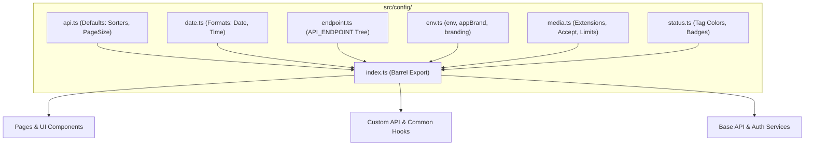
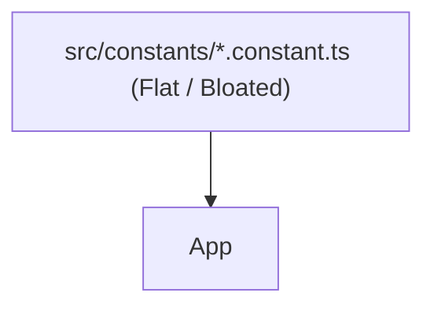

# Technical Proposal: Standardizing System Configuration Architecture in Only One FE

## 1. Problem Statement & Core Concept

- **Core Business Problem**: 
  Currently, `only-one-fe` scatters system configurations, API endpoint strings, environment variable reads (`process.env.NEXT_PUBLIC_*`), date formats, and status tag color mappings across disparate files in `src/constants/`, `src/libs/`, and direct inline strings within UI components and hooks (e.g. `'data-providers'`, `'scraping-data'`, `process.env.NEXT_PUBLIC_API_URL`). Unlike `carwash-portal` which has a cohesive, type-safe, and unified `src/config/` module, `only-one-fe` lacks a single source of truth for runtime environment parameters, endpoint trees, media constraints, and status presentation colors.

- **Core Value & Target Audience**: 
  Frontend engineers building and maintaining pages, hooks, forms, tables, and API services in `only-one-fe`. Provides a centralized, typed, autocomplete-friendly configuration layer that prevents typos, decouples URLs, and streamlines environment management across Next.js SSR and Client components.

- **Success Metrics (Definition of Done)**:
  - 100% single source of truth for API endpoints via `API_ENDPOINT`.
  - Type-safe `env` helper with runtime fallbacks and Next.js public environment mapping.
  - Zero hardcoded magic strings for status badge colors, date formats, and media constraints.
  - Complete barrel export at `src/config/index.ts` with clean `@/config` alias path resolution.
  - 0 TypeScript compiler errors (`npx tsc --noEmit` clean).

- **Scope Boundaries**:
  - **In-Scope**:
    - Create `src/config/` structure modeled after `carwash-portal`:
      - `src/config/api.ts` (API pagination, sorting defaults)
      - `src/config/date.ts` (Standard date/time format constants)
      - `src/config/endpoint.ts` (Centralized `API_ENDPOINT` constant covering all backend modules)
      - `src/config/env.ts` (Next.js environment reader, `env`, `appBrand`, `applyDocumentBranding`)
      - `src/config/media.ts` (Image/video extensions, mime types, accept filters, size limits)
      - `src/config/status.ts` (Ant Design Tag color mappings for boolean, active, schedule, execution states)
      - `src/config/index.ts` (Barrel export)
    - Re-export or link necessary constants for backward compatibility.
  - **Explicit Out-of-Scope**:
    - Replacing all legacy constants in unrelated features in one massive sweep (can be incrementally adopted).
    - Modifying server-only credentials inside `.env`.

---

## 2. Current Business Logic (As-is Analysis)

In `only-one-fe`, configurations are currently fragmented:
- [src/constants/common.constant.ts](file:///Users/kiem/Sources/Personal/only-one-fe/src/constants/common.constant.ts): Contains mixed constants (slideshow delays, image dimensions, storage keys).
- Inline strings for API routes in hooks:
  - `resource: 'data-providers'` in [data-providers/hooks.ts](file:///Users/kiem/Sources/Personal/only-one-fe/src/app/(root)/scraping/data-providers/hooks.ts#L9)
  - `resource: 'scraping-data'` in [scraping-data/hooks.ts](file:///Users/kiem/Sources/Personal/only-one-fe/src/app/(root)/scraping/scraping-data/hooks.ts#L32)
  - `resource: 'schedules'` in [executions/hooks.ts](file:///Users/kiem/Sources/Personal/only-one-fe/src/app/(root)/schedule/executions/hooks.ts#L29)
  - `resource: 'simulation-contexts'` in [contexts/hooks.ts](file:///Users/kiem/Sources/Personal/only-one-fe/src/app/(root)/simulation/contexts/hooks.ts#L14)
- Direct `process.env.NEXT_PUBLIC_*` access across [src/libs/googleapis.ts](file:///Users/kiem/Sources/Personal/only-one-fe/src/libs/googleapis.ts#L24), [src/libs/api-url-helper.ts](file:///Users/kiem/Sources/Personal/only-one-fe/src/libs/api-url-helper.ts#L7), and [src/contexts/RefineContext.tsx](file:///Users/kiem/Sources/Personal/only-one-fe/src/contexts/RefineContext.tsx#L33).

### Identified Limitations:
1. No centralized endpoint registry leads to copy-paste typos and difficulty refactoring backend URLs.
2. Inconsistent fallback handling when environment variables are missing or misconfigured.
3. Inconsistent UI tag colors for active/inactive and success/failed states across different tables.

---

## 3. Proposed Solution Alternatives

### Option 1 (Recommended): Modular Next.js-Optimized `src/config/` Architecture

- **Solution Overview & Mechanics**:
  Adopt the clean 7-module structure from `carwash-portal`, tailored specifically for Next.js App Router (`process.env.NEXT_PUBLIC_*` handling, SSR-safe `window` guards, and `only-one-be` API endpoints).
- **Mermaid Diagram**:

- **Pros**:
  - Direct structural parity with `carwash-portal`.
  - Full TypeScript type definitions and IntelliSense support.
  - Safe Next.js environment resolution with fallback defaults.
  - Clean `@/config` import path.
- **Cons**:
  - Requires maintaining the endpoint dictionary as backend evolves (standard practice).
- **Complexity & Risks**: Low.

---

### Option 2: Retain Flat `src/constants/` and Append Config Objects

- **Solution Overview & Mechanics**:
  Keep everything inside `src/constants/` without introducing `src/config/`.
- **Mermaid Diagram**:

- **Pros**:
  - No new top-level folder.
- **Cons**:
  - Blurs the boundary between domain business constants (e.g. `DEFAULT_PARSER_FUNCTION_GENERATOR`) and system runtime infrastructure config (e.g. `API_ENDPOINT`, `env`, `statusColors`).
  - Diverges from `carwash-portal` established architecture.
- **Complexity & Risks**: Low architectural quality.

---

### Comparison Matrix & Recommendation

| Criteria        | Option 1 (Recommended) | Option 2    |
| :-------------- | :--------------------- | :---------- |
| Maintainability | High                   | Moderate    |
| Autocomplete & Discoverability | Excellent | Average |
| Codebase Parity with Carwash | 100% Matching | Divergent |
| Risk Level      | Low                    | Low         |

- **Conclusion**: Recommend **Option 1** to establish standard architecture in `only-one-fe`.

---

## 4. Key Failure Modes & Security Boundaries

- **Secret Leakage Prevention**: `src/config/env.ts` only exposes public client configuration (`NEXT_PUBLIC_*`). Server secrets (`GOOGLE_CLIENT_SECRET`, `NEXTAUTH_SECRET`) remain restricted to server routes.
- **URL Normalization**: `trimTrailingSlash` sanitizes `API_URL` to prevent double slashes in generated request URLs.
- **SSR Window Guard**: `applyDocumentBranding` checks `typeof document !== 'undefined'` to avoid Next.js SSR crashes.

---

## 5. High-Level Technical Specifications

### Module Breakdown:
1. **`src/config/api.ts`**:
   - `DEFAULT_ORDER_BY = 'createdAt'`, `DEFAULT_PAGE_INDEX = 1`, `DEFAULT_PAGE_SIZE = 10`, `DEFAULT_SORTERS: CrudSorting`.
2. **`src/config/date.ts`**:
   - `DEFAULT_DATE_FORMAT = 'DD/MM/YYYY'`, `DEFAULT_TIME_FORMAT = 'DD/MM/YYYY HH:mm:ss'`.
3. **`src/config/endpoint.ts`**:
   - `API_ENDPOINT`:
     - `AUTH`: `LOGIN`, `REGISTER`, `REFRESH`, `ME`, `FORGET_PASSWORD`
     - `DATA_PROVIDERS`: `BASE`, `ALL`, `DETAIL(id)`
     - `DATA_PROVIDER_FEATURES`: `BASE`, `BY_PROVIDER(providerId)`, `DETAIL(id)`, `TEST`, `ROLLBACK(id)`
     - `DATA_PROVIDER_ITEMS`: `BASE`, `ALL`, `DETAIL(id)`
     - `ITEMS`: `BASE`, `ALL`, `DETAIL(id)`, `IMPORT`
     - `SCRAPING_DATA`: `BASE`, `DETAIL(id)`, `PROCESS`
     - `SCHEDULES`: `BASE`, `DETAIL(id)`, `TRIGGER(id)`, `JOBS(scheduleId)`
     - `SCHEDULE_JOBS`: `BASE`, `DETAIL(id)`
     - `SCHEDULE_JOB_EVENTS`: `BASE`, `DETAIL(id)`
     - `GOOGLE_DRIVE`: `FOLDERS`, `FILES`, `SYNC`, `EXCHANGE_TOKEN`
     - `SIMULATION`: `CONTEXTS`, `ITEMS`
     - `USERS`: `BASE`, `DETAIL(id)`
     - `NOTIFICATIONS`: `BASE`, `READ(id)`, `MARK_ALL_READ`
     - `SETTINGS`: `BASE`
4. **`src/config/env.ts`**:
   - `env`: `apiUrl`, `appName`, `notificationUrl`, `googleClientId`, `googleRedirectUri`, `isDevelopment`, `isProduction`.
   - `appBrand`: `appName`, `brandName`, `description`, `documentTitleSuffix`.
5. **`src/config/media.ts`**:
   - `MEDIA_VIDEO_EXTENSIONS`, `MEDIA_IMAGE_EXTENSIONS`, `MEDIA_ACCEPT`, `MEDIA_IMAGE_FALLBACK`, `MEDIA_MAX_SIZE_MB`.
6. **`src/config/status.ts`**:
   - `ACTIVE_STATUS_COLORS`, `BOOLEAN_TAG_COLORS`, `EXECUTION_STATUS_COLORS`, `JOB_STATUS_COLORS`.
7. **`src/config/index.ts`**:
   - Re-exports all modules.

---

## 6. Next Steps

- User confirms the technical proposal in `concept.md`.
- Run `/only-one-plan only-one/tasks/20260821-161300-build-config-module` to generate `plan.md`.
- Execute implementation with `/only-one-apply only-one/tasks/20260821-161300-build-config-module/plan.md`.
- Distill and clean up with `/only-one-archive`.
